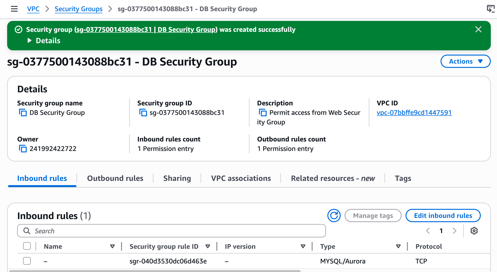
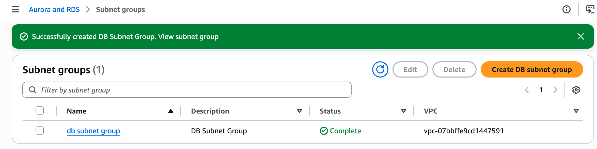
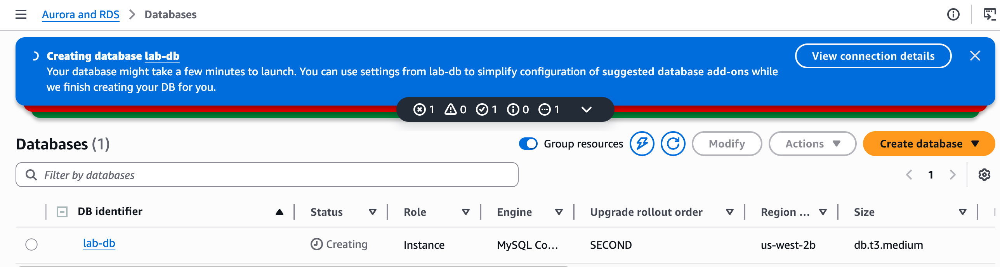
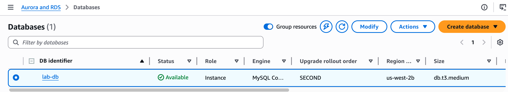
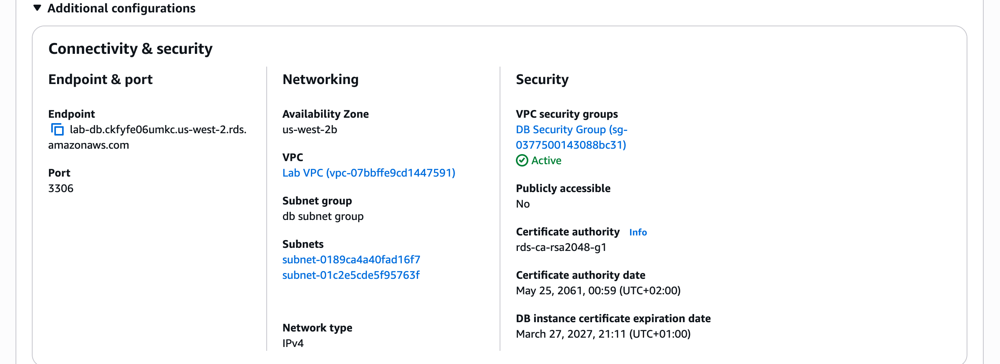

# LAB 160 — Build Your DB Server and Interact With Your DB Using an App

## About This Lab

This lab covers setting up a managed relational database on AWS using Amazon RDS and connecting it to a running web application. Rather than managing a database on a self-hosted EC2 instance — which requires manual installation, patching, backup configuration, and failover planning — Amazon RDS handles all of that automatically. The lab demonstrates how to configure network access controls, provision a Multi-AZ database for high availability, and connect an existing web application to it with nothing more than an endpoint URL and credentials.

The AWS services used are Amazon RDS (MySQL engine), Amazon VPC (security groups and subnet groups), and an EC2 web server provided by the lab environment. For a recruiter reviewing this portfolio: this lab shows I can set up a production-grade cloud database with proper network isolation, high availability across two data centres, and application connectivity — the kind of database infrastructure that underpins almost every cloud-hosted application.

## What I Did

The lab environment came with a pre-configured VPC containing public and private subnets across two Availability Zones, and a web server already running in one of the public subnets. I created the network security configuration from scratch, provisioned a Multi-AZ RDS MySQL instance into the private subnets, then connected a pre-built Address Book web application to it by providing the RDS endpoint. The entire lab — from security group to running application — took approximately 45 minutes.

## Task 1: Create a Security Group for the RDS DB Instance

I created a security group named **DB Security Group** with a single inbound rule allowing MySQL/Aurora traffic on port 3306 from the **Web Security Group**. This means only EC2 instances attached to the Web Security Group can reach the database — the database has no public internet exposure.



## Task 2: Create a DB Subnet Group

I created a DB Subnet Group pointing at the two private subnets in the Lab VPC: `10.0.1.0/24` and `10.0.3.0/24`, one in each Availability Zone. RDS requires this subnet group to know where it can place the primary and standby database instances.



## Task 3: Create an Amazon RDS DB Instance

I launched a Multi-AZ RDS instance with the following configuration:

```
Engine:              MySQL (latest)
Template:            Dev/Test
Availability:        Multi-AZ DB Instance
DB Instance ID:      lab-db
Master username:     main
Master password:     lab-password
DB instance class:   db.t3.medium (Burstable)
Storage type:        General Purpose SSD
VPC:                 Lab VPC
Security group:      DB Security Group
Initial database:    lab
Automated backups:   Disabled (to speed up lab provisioning)
```



After approximately 4–8 minutes the instance reached Available status.



I copied the endpoint from the Connectivity & Security section.



## Task 4: Interact with Your Database

I opened the web server's IP address in a browser, navigated to the RDS link in the web application, and entered the RDS endpoint, database name (`lab`), username (`main`), and password. After submitting the form, the application connected to the database and populated it with sample data.


The Address Book application loaded and I tested it by adding, editing, and removing contacts. Each change persists in the RDS database and is automatically replicated to the standby instance in the second Availability Zone.


## Challenges I Had

When configuring the RDS instance, the VPC field defaulted to **Default VPC** instead of **Lab VPC**. This placed the database in a completely separate network from the web server, making it unreachable regardless of security group settings. The error in the web application was a generic "Unable to Establish Connection" with no further detail — which made the root cause hard to identify by looking at the application alone. The fix was to delete the incorrectly configured instance, return to Task 3, and select Lab VPC explicitly in the Connectivity section before creating the database. Task 4 (connecting the web application) was not completed within the lab session time — the infrastructure was correctly provisioned and the lab environment was confirmed healthy, but the web application connection could not be established before the session ended.

## What I Learned

- **Security groups work as dynamic source references, not static IP lists.** By setting the source of the DB Security Group's inbound rule to the Web Security Group (rather than a CIDR range), any EC2 instance that is later added to the Web Security Group automatically gains database access — and any instance removed from that group loses it. This is how you scale access control in AWS without touching individual IP addresses.

- **Multi-AZ RDS creates a fully synchronous standby in a separate Availability Zone.** The standby is not a read replica — it cannot serve read traffic. Its sole purpose is automatic failover: if the primary instance fails, RDS promotes the standby with no application configuration changes needed (only a brief DNS propagation delay). Enabling Multi-AZ is the difference between a database that survives an AZ outage automatically and one that requires manual intervention.

- **DB Subnet Groups decouple database placement from application logic.** By defining which subnets RDS can use at the infrastructure level, I ensure the database always lands in private subnets regardless of how the instance is configured — the application tier never needs to know where the database physically lives.

- **RDS endpoint URLs are stable across failovers.** Because the application connects to a DNS endpoint (not an IP address), RDS can transparently redirect connections to the new primary after a failover. The application only experiences a brief connection interruption, not a reconfiguration requirement.

- **Separating the web tier and data tier into different security groups is fundamental to defence-in-depth.** The database is unreachable from the internet — the only path to it is through the web server's security group. If the web server is compromised, an attacker still cannot reach the database from outside AWS without also obtaining valid credentials.

## Resource Names Reference

| Resource / Parameter | Value |
|---|---|
| Security Group Name | DB Security Group |
| Security Group Description | Permit access from Web Security Group |
| Inbound Rule | MySQL/Aurora, port 3306, source: Web Security Group |
| VPC | Lab VPC |
| DB Subnet Group Name | DB Subnet Group |
| Private Subnet 1 | 10.0.1.0/24 |
| Private Subnet 2 | 10.0.3.0/24 |
| DB Engine | MySQL (latest version) |
| DB Template | Dev/Test |
| Availability Mode | Multi-AZ DB Instance |
| DB Instance Identifier | lab-db |
| Master Username | main |
| Master Password | lab-password |
| DB Instance Class | db.t3.medium (Burstable) |
| Storage Type | General Purpose SSD |
| Initial Database Name | lab |
| RDS Endpoint | lab-db.ckfyfe06umkc.us-west-2.rds.amazonaws.com |
| WebServer IP | [recorded from AWS Details panel during lab] |
| Local Repo Path | ~/Desktop/AWS-reStart-Journey/Labs/Databases/lab-160-build-db-server |
| Screenshots Folder | ~/Desktop/AWS-reStart-Journey/Labs/Databases/lab-160-build-db-server/screenshots/ |
| GitHub Repository | https://github.com/svitlana-dekhtiar/aws-restart-journey |

## Commands Reference

All commands run during this lab are saved in [commands.sh](commands.sh).
