# Lab 162 — Challenge Lab: Build Your DB Server and Interact With Your DB

## About This Lab

This challenge lab covers Amazon RDS — AWS's managed relational database service. Instead of installing and maintaining a database engine yourself, RDS handles patching, backups, and availability, so you can focus on the data itself. The lab uses Amazon Aurora (MySQL 8.0.42-compatible, engine version 3.10.3) deployed inside a VPC, with a security group controlling which resources can connect on port 3306.

The practical skill this demonstrates is the full workflow a cloud engineer uses when standing up a database tier: provisioning the instance with production-appropriate settings, connecting from a compute layer via SSH and a MySQL client, designing a schema, loading data, and writing a JOIN across two related tables. A recruiter reviewing this lab can see that I understand both the infrastructure setup in AWS and the SQL work that happens inside it.

## What I Did

The lab environment provided a pre-built VPC (Lab VPC, vpc-082dce302a25927e1) and a LinuxServer EC2 instance at 44.246.227.45. I launched an Aurora MySQL 3.10.3 cluster (lab162-cluster) inside that VPC, downloaded the SSH key, connected to the LinuxServer, and connected from there to the RDS instance endpoint using the MySQL client. The server confirmed version 8.0.42. I then created two tables in the `restart_db` database, inserted sample rows, and performed an inner join across both tables.

## Task 1 — Launch the RDS DB Instance

I navigated to RDS → Create database and configured the instance using Full configuration. Below are the exact settings used across each section of the form.

### Engine & Version

| Field | Value selected |
|---|---|
| Engine type | Aurora (MySQL Compatible) |
| Cluster scalability | Provisioned |
| Template | Dev/Test |
| Instance class | db.t3.medium (Burstable) |
| Engine version | Aurora MySQL 3.10.3 (compatible with MySQL 8.0.42) |
| DB cluster identifier | lab162-cluster |

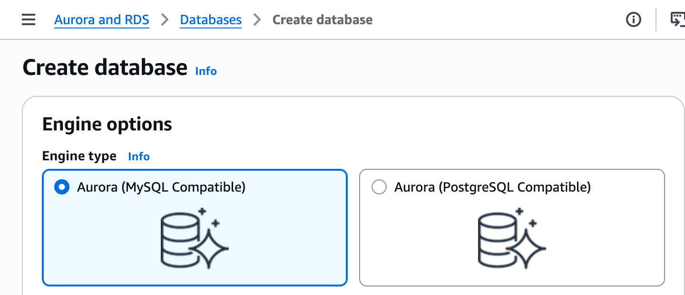

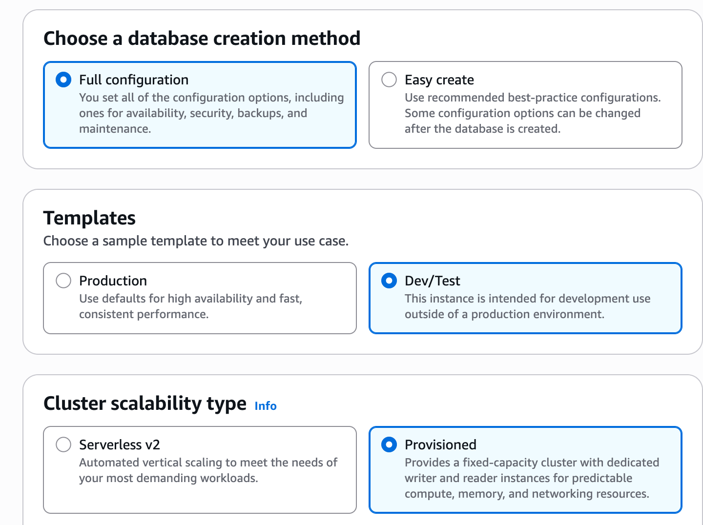

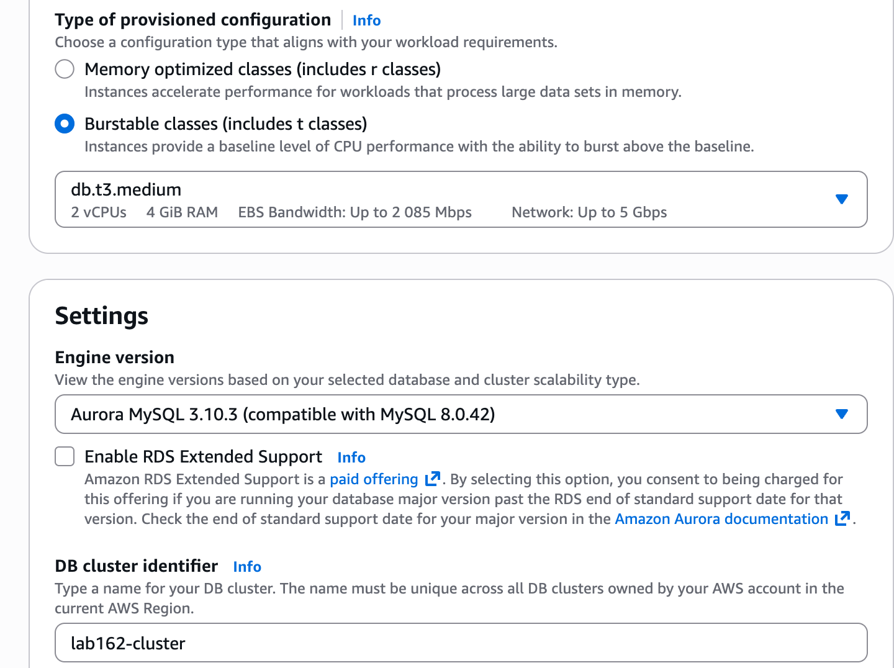

### Credentials

| Field | Value selected |
|---|---|
| Master username | admin |
| Credential management | Self managed |
| Auto generate password | Unchecked |
| Master password | Challenge123 |

> **Why Self managed?** Managed in AWS Secrets Manager generates and rotates a password automatically via Secrets Manager. Self managed means I set the password directly — simpler for a lab where secret rotation is not needed.

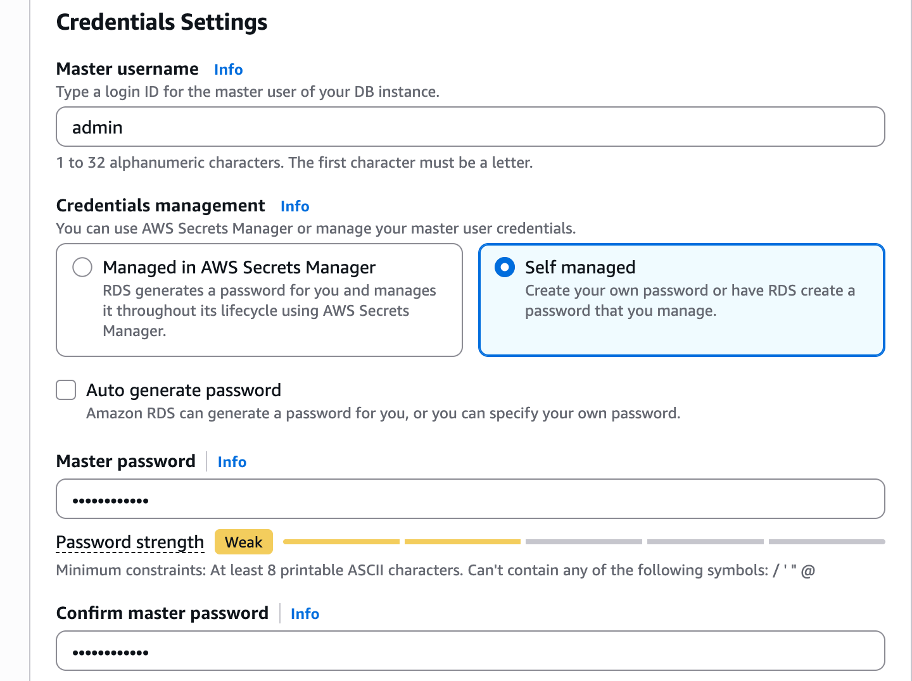

### Storage

| Field | Value selected |
|---|---|
| Cluster storage configuration | Aurora Standard |
| Database authentication | Password only (IAM and Kerberos unchecked) |

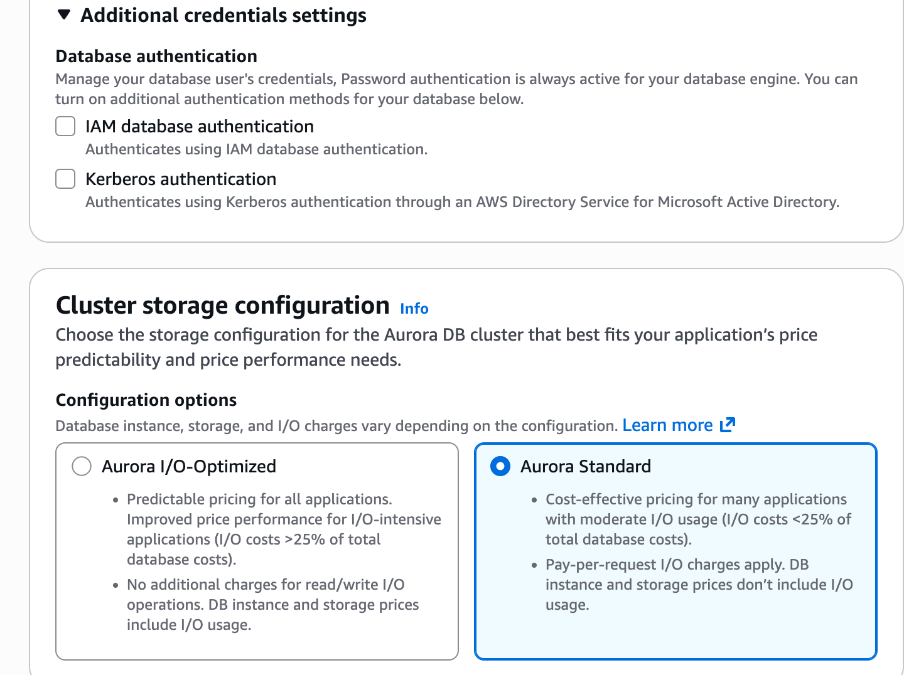

### Availability & Durability

| Field | Value selected |
|---|---|
| Multi-AZ deployment | Don't create an Aurora Replica |
| Compute resource | Don't connect to an EC2 compute resource |
| Network type | IPv4 |

> **Why no replica?** The lab restricts standby instances. In production, a Multi-AZ replica provides automatic failover, but for a lab a single instance is sufficient.

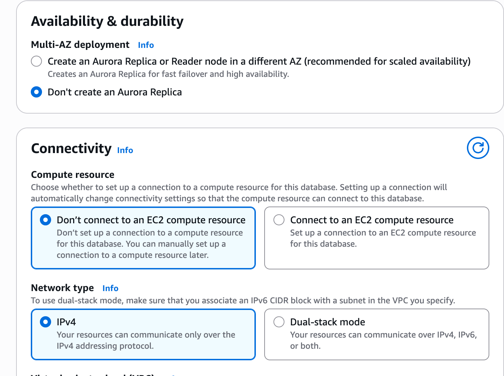

### Connectivity

| Field | Value selected |
|---|---|
| VPC | Lab VPC (vpc-082dce302a25927e1) |
| DB subnet group | Create new DB Subnet Group |
| Public access | No |

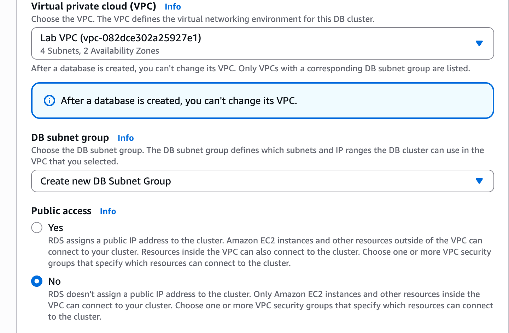

| Field | Value selected |
|---|---|
| VPC security group | Create new → lab-db-sg |
| Availability Zone | No preference |
| RDS Proxy | Unchecked |
| Certificate authority | Default |

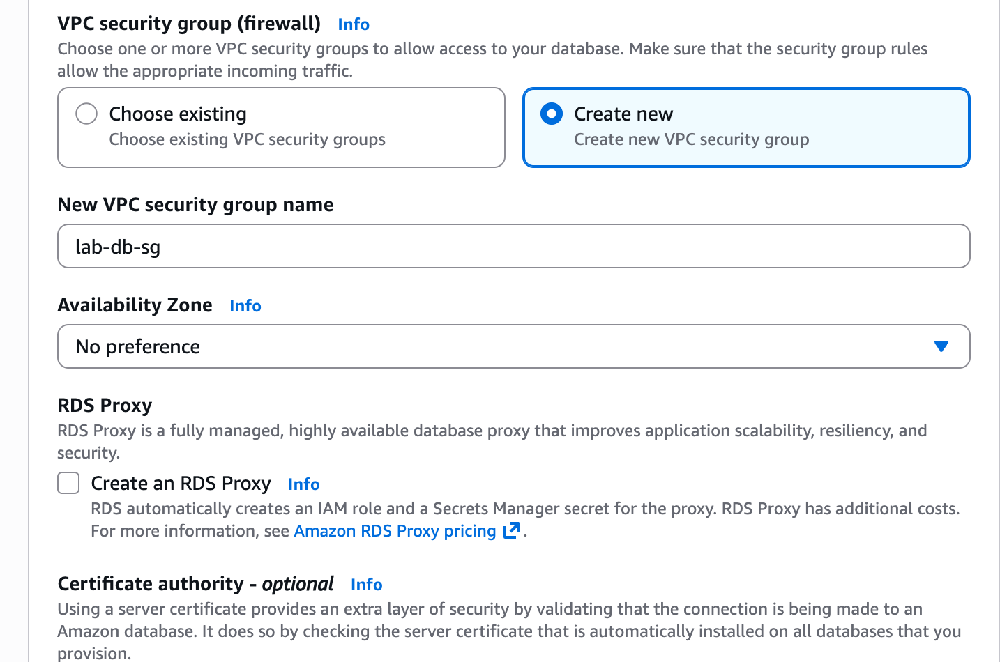

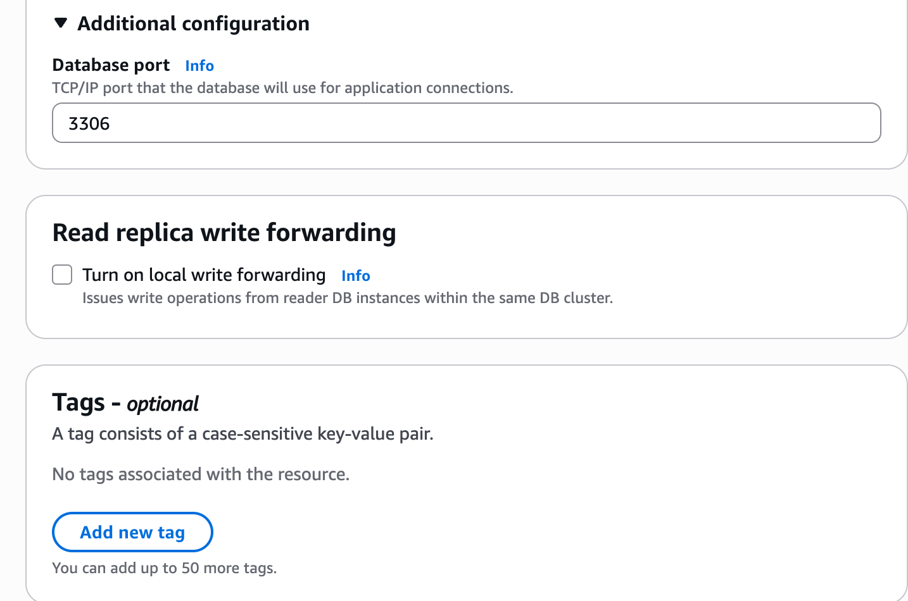

### Monitoring

| Field | Value selected |
|---|---|
| Database Insights | Standard |
| Performance Insights | Disabled (unchecked) |
| Enhanced Monitoring | Disabled (unchecked) |
| Log exports | All unchecked |

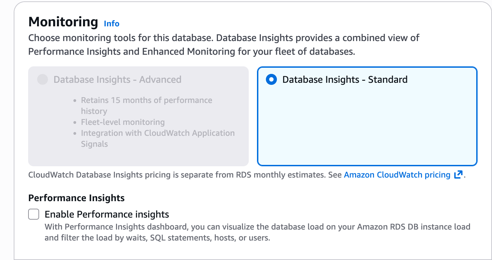

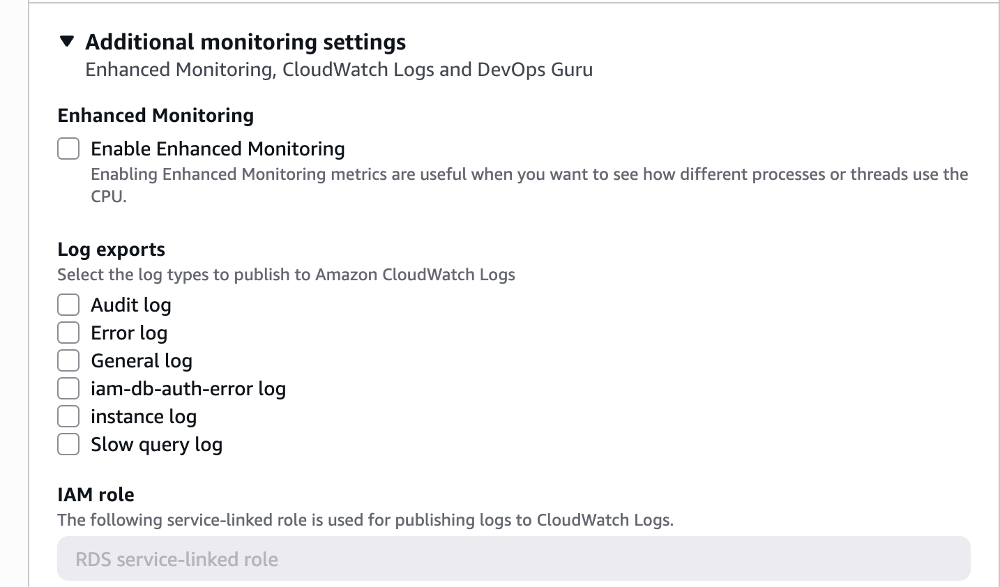

### Additional Configuration

| Field | Value selected |
|---|---|
| Initial database name | restart_db |
| DB cluster parameter group | default.aurora-mysql8.0 |
| DB parameter group | default.aurora-mysql8.0 |
| Failover priority | No preference |

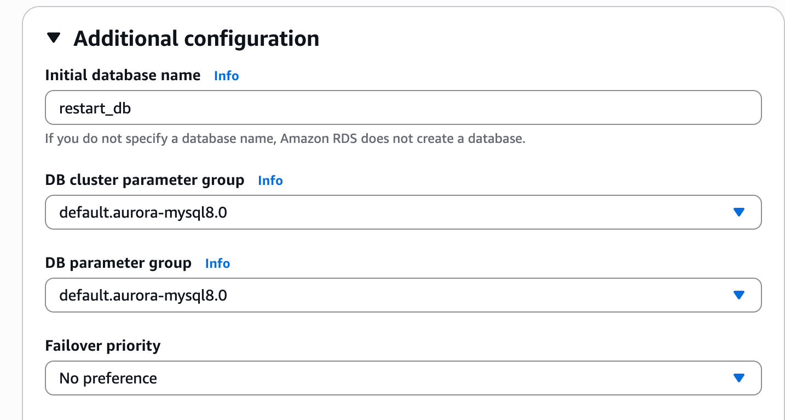

| Field | Value selected |
|---|---|
| Backup retention | 7 days |
| Backup window | No preference |
| Copy tags to snapshots | Checked |
| Encryption key | AWS owned KMS key (SSE-RDS) |

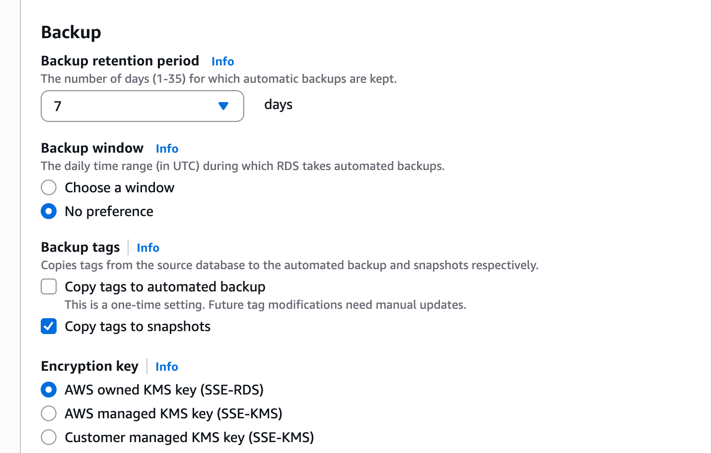

| Field | Value selected |
|---|---|
| Backtrack | Unchecked |
| Auto minor version upgrade | Enabled |
| Maintenance window | No preference |
| Deletion protection | Unchecked (disabled) |

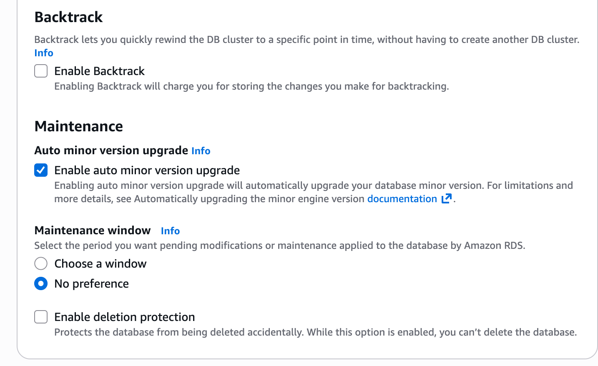

## Task 2 — Get the SSH Key and LinuxServer Address

From the lab panel I clicked Details → Show, downloaded the PEM key (`labsuser.pem`), and noted the LinuxServer address: `44.246.227.45`.

## Task 3 — Connect to the LinuxServer via SSH

```bash
chmod 400 ~/Downloads/labsuser.pem
ssh -i ~/Downloads/labsuser.pem ec2-user@44.246.227.45
```

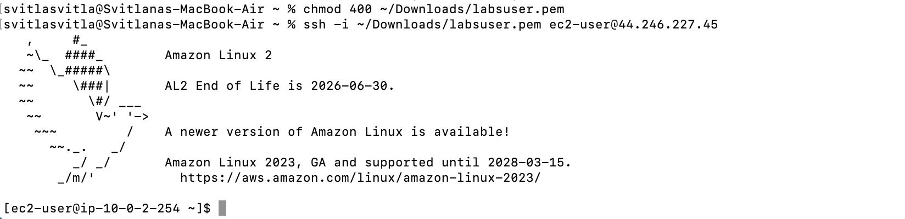

## Task 4 — Install the MySQL Client and Connect to RDS

```bash
sudo yum install -y mysql
mysql -h lab162-cluster-instance-1.cc4wsbuoc2jx.us-west-2.rds.amazonaws.com -u admin -p
```

After entering the password the server responded with version `8.0.42 6252a59a` and the `MySQL [(none)]>` prompt confirmed a successful connection.

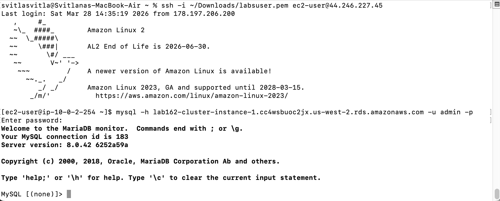

## Task 5 — Create the RESTART Table

Because I set `restart_db` as the Initial database name in Task 1, it was already created at launch — only `USE restart_db;` was needed.

```sql
USE restart_db;

CREATE TABLE RESTART (
  StudentID      INT PRIMARY KEY,
  StudentName    VARCHAR(100),
  RestartCity    VARCHAR(100),
  GraduationDate DATETIME
);
```

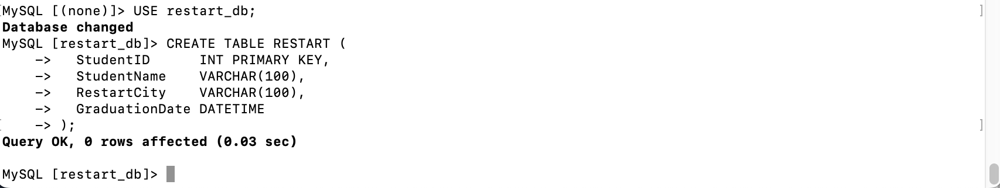

## Task 6 — Insert 10 Sample Rows into RESTART

```sql
INSERT INTO RESTART VALUES
(1,  'Alice Brown',   'London',    '2024-06-15 09:00:00'),
(2,  'Bob Smith',     'Dublin',    '2024-06-15 09:00:00'),
(3,  'Clara Jones',   'Berlin',    '2024-07-20 09:00:00'),
(4,  'David Lee',     'Paris',     '2024-07-20 09:00:00'),
(5,  'Emma Wilson',   'Amsterdam', '2024-08-10 09:00:00'),
(6,  'Frank Taylor',  'Warsaw',    '2024-08-10 09:00:00'),
(7,  'Grace Martin',  'Madrid',    '2024-09-01 09:00:00'),
(8,  'Henry Clark',   'Rome',      '2024-09-01 09:00:00'),
(9,  'Isla Anderson', 'Vienna',    '2024-10-05 09:00:00'),
(10, 'Jack Thompson', 'Zurich',    '2024-10-05 09:00:00');
```

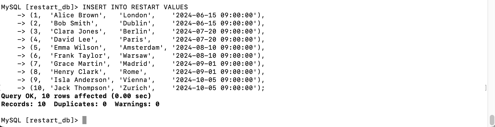

## Task 7 — Select All Rows from RESTART

```sql
SELECT * FROM RESTART;
```

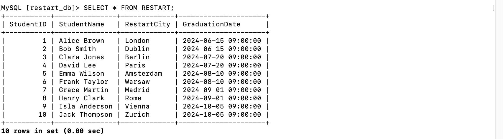

## Task 8 — Create the CLOUD_PRACTITIONER Table

```sql
CREATE TABLE CLOUD_PRACTITIONER (
  StudentID         INT PRIMARY KEY,
  CertificationDate DATETIME
);
```

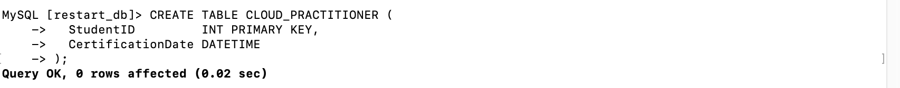

## Task 9 — Insert 5 Sample Rows into CLOUD_PRACTITIONER

```sql
INSERT INTO CLOUD_PRACTITIONER VALUES
(1, '2024-09-10 10:00:00'),
(3, '2024-10-01 10:00:00'),
(5, '2024-10-15 10:00:00'),
(7, '2024-11-05 10:00:00'),
(9, '2024-11-20 10:00:00');
```

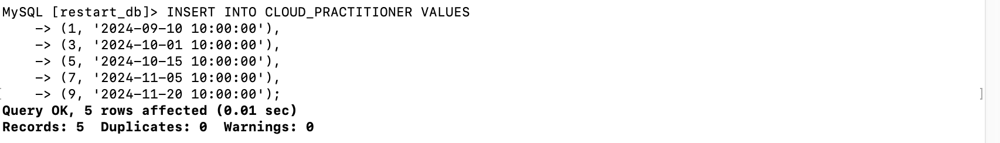

## Task 10 — Select All Rows from CLOUD_PRACTITIONER

```sql
SELECT * FROM CLOUD_PRACTITIONER;
```


## Task 11 — Inner Join: Student ID, Name, and Certification Date

```sql
SELECT r.StudentID, r.StudentName, cp.CertificationDate
FROM RESTART r
INNER JOIN CLOUD_PRACTITIONER cp
  ON r.StudentID = cp.StudentID;
```

The join returned 5 rows — only students whose ID appears in both tables. Students 2, 4, 6, 8, and 10 are excluded because they have no certification record.

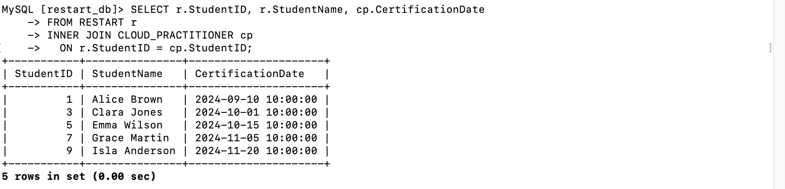

## Challenges I Had

**ERROR: UNPROTECTED PRIVATE KEY FILE — Permission denied (publickey)**
After downloading the new PEM key and trying to SSH in, the connection was refused with `bad permissions` and `Permissions 0644 for labsuser.pem are too open`. SSH requires the key file to be readable only by the owner. Fixed by running `chmod 400 ~/Downloads/labsuser.pem` before retrying the SSH command.

**ERROR 2003 (HY000): Can't connect to MySQL server (110)**
After connecting to MySQL and trying to run SQL, the connection dropped with ERROR 2003. The cause was the VPC security group `lab-db-sg` had an inbound rule with Source set to my home IP (`178.197.206.200/32`) instead of the LinuxServer. Since the MySQL client was running on the EC2 instance, the traffic came from the EC2's IP, not mine. Fixed by editing the inbound rule and changing the Source to `0.0.0.0/0` to allow connections from any IP on port 3306.

## What I Learned

- When you deploy RDS instead of installing a database on EC2, AWS manages patching, automated backups, and restarts. The tradeoff is that you cannot access the underlying OS, which matters if you need configuration not exposed through parameter groups.
- RDS connectivity depends entirely on VPC placement and security group rules. The LinuxServer could only reach the Aurora endpoint after I changed the inbound rule on `lab-db-sg` to allow port 3306 traffic from the EC2's source — not from my local machine's IP.
- Setting Initial database name during RDS creation creates the database automatically at launch. If this field is left blank, RDS does not create any database and you must run `CREATE DATABASE` manually before any tables can be created.
- An INNER JOIN returns only rows with a matching key in both tables. Here, five out of ten students appeared because only five StudentIDs existed in CLOUD_PRACTITIONER. A LEFT JOIN would return all ten, with NULL in CertificationDate for the five without a match.
- Disabling deletion protection before the lab ends is required. RDS blocks deletion of any instance with deletion protection enabled, which would prevent the lab environment from cleaning up its resources automatically when End Lab is clicked.

## Resource Names Reference

| Resource | Value |
|---|---|
| Lab | LAB 162 — Challenge Lab: Build Your DB Server |
| DB Engine | Amazon Aurora MySQL 3.10.3 (MySQL 8.0.42) |
| DB Cluster Identifier | lab162-cluster |
| DB Instance | lab162-cluster-instance-1 |
| DB Instance Class | db.t3.medium (Burstable) |
| Region | us-west-2 |
| VPC | Lab VPC (vpc-082dce302a25927e1) |
| DB Subnet Group | Create new DB Subnet Group |
| VPC Security Group | lab-db-sg (created new) |
| Initial Database Name | restart_db |
| Master Username | admin |
| Master Password | Challenge123 |
| Instance Endpoint | lab162-cluster-instance-1.cc4wsbuoc2jx.us-west-2.rds.amazonaws.com |
| LinuxServer IP | 44.246.227.45 (internal: ip-10-0-2-254) |
| SSH Key | ~/Downloads/labsuser.pem |
| Table 1 | RESTART |
| Table 2 | CLOUD_PRACTITIONER |
| Local repo path | ~/Desktop/AWS-reStart-Journey/Labs/Databases/lab-162-challenge-db-server |
| Screenshots folder | ~/Desktop/AWS-reStart-Journey/Labs/Databases/lab-162-challenge-db-server/screenshots/ |
| GitHub repo | https://github.com/svitlana-dekhtiar/aws-restart-journey |

## Commands Reference

All commands run during this lab are saved in [commands.sh](commands.sh).
