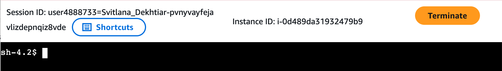
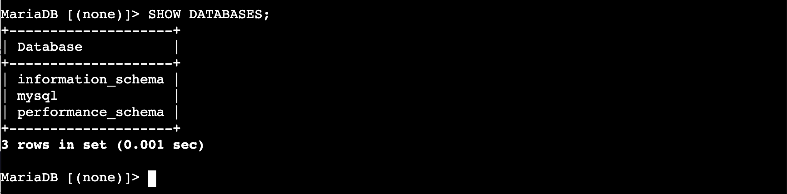
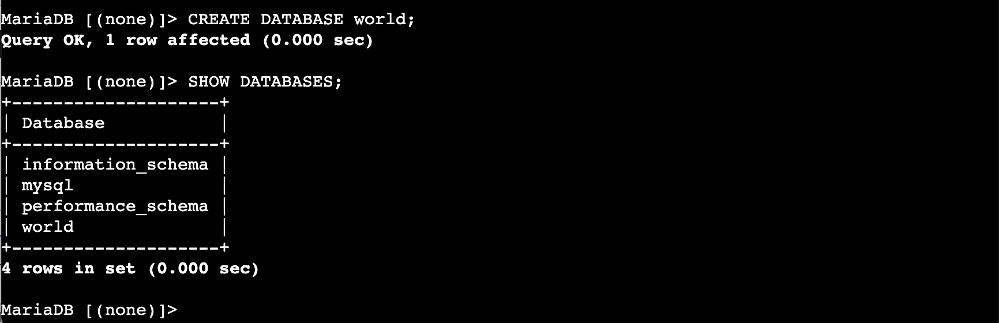
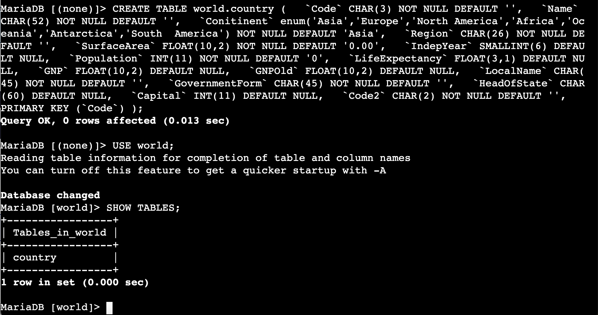
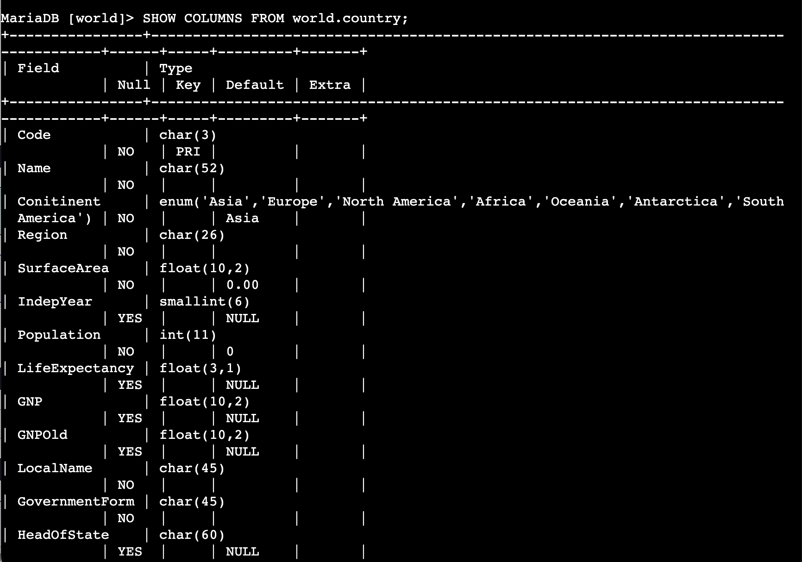
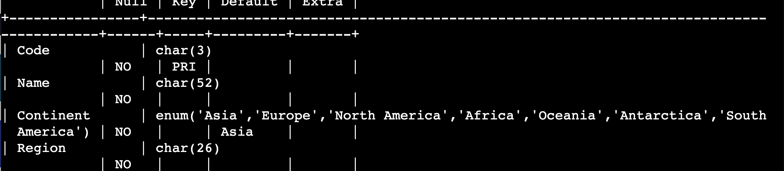
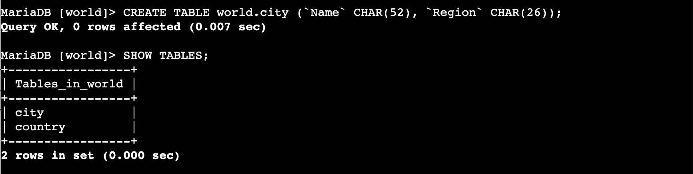
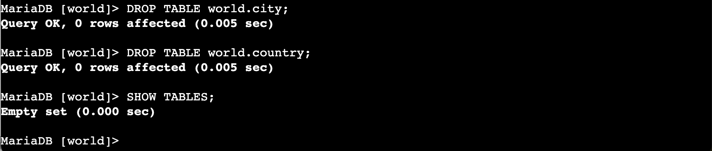
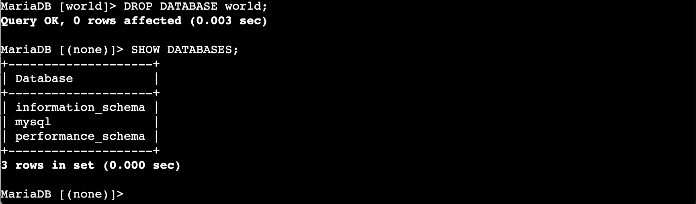

# Lab 268 — Database Table Operations

## About This Lab

This lab covers the fundamentals of relational database and table management using MariaDB on an Amazon EC2 instance. I connected to a pre-provisioned instance called Command Host through AWS Session Manager and used the MariaDB command-line client to run SQL statements directly against the database engine. The core operations were: creating and deleting databases, defining and deleting table schemas, and modifying a table structure after it had already been created using ALTER TABLE.

Relational databases sit behind most production applications. Understanding how to define and manage database structure at the SQL level matters whether you are deploying an application, troubleshooting a data layer, or provisioning a new environment from scratch. The ability to correct schema mistakes without dropping and recreating a table — which ALTER TABLE enables — is particularly relevant in environments where tables already contain data.

The lab also demonstrated AWS Systems Manager Session Manager as a way to access an EC2 instance without an open SSH port or a key pair. The connection goes through IAM rather than a network port, which is a cleaner security model for restricting and auditing terminal access to production instances.

AWS services used: Amazon EC2 (Command Host instance), AWS Systems Manager Session Manager.

---

## What I Did

The lab environment pre-provisioned an EC2 instance called Command Host running MariaDB 10.5.29 (a MySQL-compatible fork — identical SQL syntax, different prompt). I connected via Session Manager in the browser, elevated to root, and used the MariaDB client to work through creating a database and tables, spotting and fixing a typo in a column name, then tearing everything down in reverse order.

---

## Task 1: Connect to the Command Host

I navigated to EC2 > Instances, found the Command Host instance, and connected using the Session Manager tab. The terminal opened in the browser showing `sh-4.2$`. The Session Manager header confirmed the instance: `i-0d489da31932479b9`.



I elevated to root and navigated to the working directory:

```bash
sudo su
cd /home/ec2-user/
```

The prompt changed to `[root@ip-10-1-11-127 ec2-user]#`. Then I connected to MariaDB:

```bash
mysql -u root --password='re:St@rt!9'
```

The `MariaDB [(none)]>` prompt confirmed a successful connection. The `(none)` means no database is currently selected.

![MariaDB [(none)]> prompt after login, showing server version 10.5.29-MariaDB](screenshots/02_mysql_connected.png)

---

## Task 2: Create a Database and a Table

First I checked what databases already existed:

```sql
SHOW DATABASES;
```

The instance had three system databases: `information_schema`, `mysql`, and `performance_schema`. No `sys` database — that is specific to newer MySQL versions and is not present on this MariaDB installation.



I created the `world` database:

```sql
CREATE DATABASE world;
SHOW DATABASES;
```

MariaDB returned `Query OK, 1 row affected` — that `1 row` refers to the entry added to the internal system catalog, not a data row.



I created the `country` table with a full 15-column schema:

```sql
CREATE TABLE world.country (
  `Code` CHAR(3) NOT NULL DEFAULT '',
  `Name` CHAR(52) NOT NULL DEFAULT '',
  `Conitinent` enum('Asia','Europe','North America','Africa','Oceania','Antarctica','South America') NOT NULL DEFAULT 'Asia',
  `Region` CHAR(26) NOT NULL DEFAULT '',
  `SurfaceArea` FLOAT(10,2) NOT NULL DEFAULT '0.00',
  `IndepYear` SMALLINT(6) DEFAULT NULL,
  `Population` INT(11) NOT NULL DEFAULT '0',
  `LifeExpectancy` FLOAT(3,1) DEFAULT NULL,
  `GNP` FLOAT(10,2) DEFAULT NULL,
  `GNPOld` FLOAT(10,2) DEFAULT NULL,
  `LocalName` CHAR(45) NOT NULL DEFAULT '',
  `GovernmentForm` CHAR(45) NOT NULL DEFAULT '',
  `HeadOfState` CHAR(60) DEFAULT NULL,
  `Capital` INT(11) DEFAULT NULL,
  `Code2` CHAR(2) NOT NULL DEFAULT '',
  PRIMARY KEY (`Code`)
);
```

Then switched to the `world` database and verified the table:

```sql
USE world;
SHOW TABLES;
```

When I ran `USE world;`, MariaDB printed a message about reading table information for auto-completion. That is normal behaviour — it is not an error. The prompt changed to `MariaDB [world]>`.



I inspected the column definitions:

```sql
SHOW COLUMNS FROM world.country;
```

The third column was spelled `Conitinent` — the `i` and `n` are transposed. I fixed it:

```sql
ALTER TABLE world.country RENAME COLUMN Conitinent TO Continent;
```



```sql
SHOW COLUMNS FROM world.country;
```



---

## Challenge 1: Create the city Table

```sql
CREATE TABLE world.city (`Name` CHAR(52), `Region` CHAR(26));
SHOW TABLES;
```



---

## Task 3: Delete a Database and Tables

Dropped `city` first:

```sql
DROP TABLE world.city;
```

Then `country` (Challenge 2):

```sql
DROP TABLE world.country;
SHOW TABLES;
```

`SHOW TABLES` returned `Empty set` — both tables gone.



Then dropped the entire `world` database:

```sql
DROP DATABASE world;
SHOW DATABASES;
```

The prompt returned to `MariaDB [(none)]>` and SHOW DATABASES was back to the original 3 system databases.



---

## Challenges I Had

When I ran `USE world;` after creating the `country` table, MariaDB printed two lines before confirming the database change:

```
Reading table information for completion of table and column names
You can turn off this feature to get a quicker startup with -A
```

My first instinct was that something had gone wrong. It had not — MariaDB was loading table and column metadata to support tab-completion in the client. The database changed successfully straight after. The message suggests using the `-A` flag when connecting if you want to skip this, which is useful on databases with a large number of tables.

---

## What I Learned

When you use `ALTER TABLE ... RENAME COLUMN`, the database engine only modifies the column's metadata — it does not touch the data stored in the rows. The operation completed in milliseconds with `0 rows affected` and `0 warnings`. This matters in production because renaming a column on a large table does not require a full table scan or rebuild, unlike some other DDL changes such as changing a column's data type.

`DROP DATABASE` and `DROP TABLE` in MariaDB/MySQL are not transactional. Unlike `DELETE`, which can be rolled back if you are inside a transaction, DDL drop statements commit immediately and cannot be undone. This is why production databases use backups, point-in-time recovery, and restricted IAM/DB permissions to prevent accidental drops — the engine itself offers no safety net once the statement runs.

The `SHOW` commands (`SHOW DATABASES`, `SHOW TABLES`, `SHOW COLUMNS`) are MariaDB/MySQL-specific shortcuts. Underneath, they query the `INFORMATION_SCHEMA` system database. You can get the same results by querying `INFORMATION_SCHEMA.TABLES` and `INFORMATION_SCHEMA.COLUMNS` directly with SELECT statements — which is how you would do it if you needed to automate checks or write scripts that work across different SQL engines.

Session Manager removes the need to manage SSH keys or open port 22 on a security group. Access is still controlled, but through IAM instead of network rules. The EC2 instance needs an instance profile with `ssm:StartSession` permissions, and the connecting user needs the same IAM permission. If either is missing, the Session Manager tab in the console is greyed out. This is a meaningfully better security model than rotating key pairs and managing inbound rules manually.

The `enum()` column type in MariaDB hard-codes the list of allowed values directly in the schema. Any `INSERT` that provides a value outside that list is rejected by the engine at the point of write, before it reaches storage. That is useful for fields like continent names where you want data integrity without building a separate lookup table and a foreign key constraint.

---

## Resource Names Reference

| Resource | Value |
|---|---|
| EC2 instance | Command Host |
| Instance ID | i-0d489da31932479b9 |
| Connection method | AWS Systems Manager Session Manager |
| DB engine | MariaDB 10.5.29 |
| DB user | root |
| DB password | re:St@rt!9 |
| Database | world |
| Table 1 | world.country |
| Table 2 | world.city |
| Primary key (country) | Code |

---

## Commands Reference

See `commands.sh` for all SQL and bash commands used in this lab.
