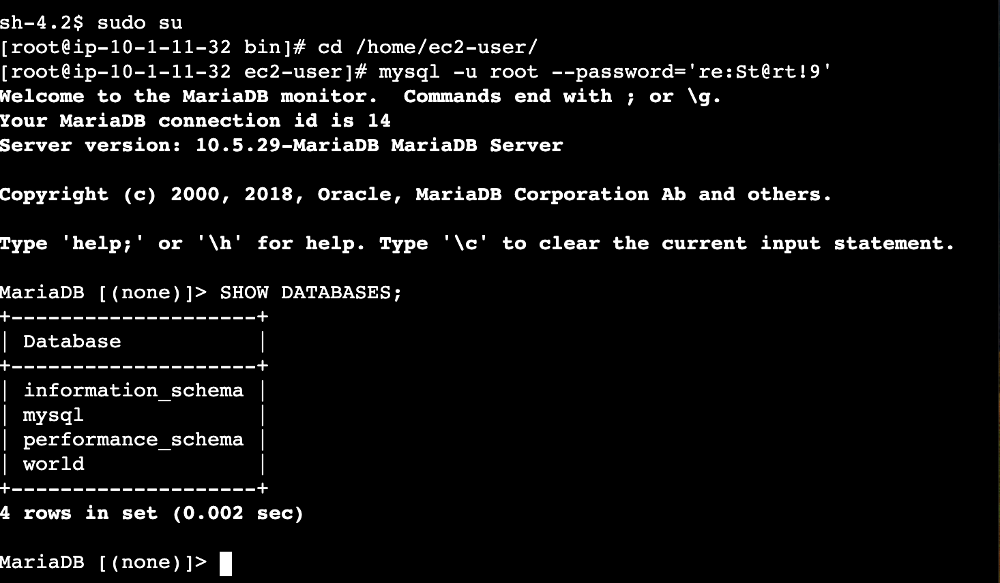
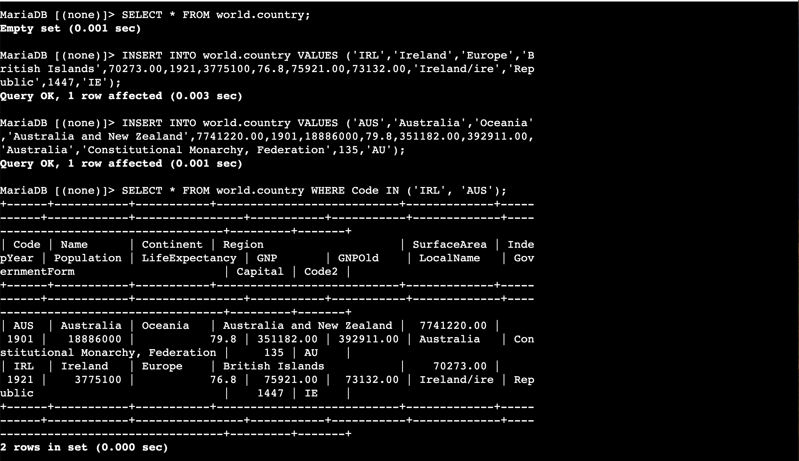
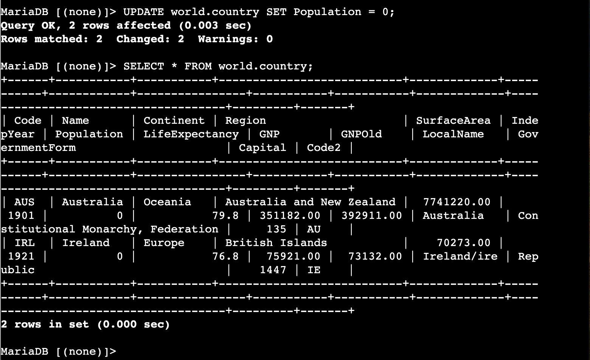
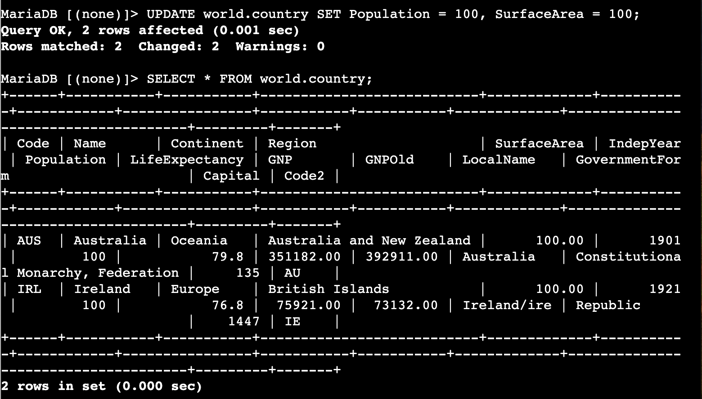
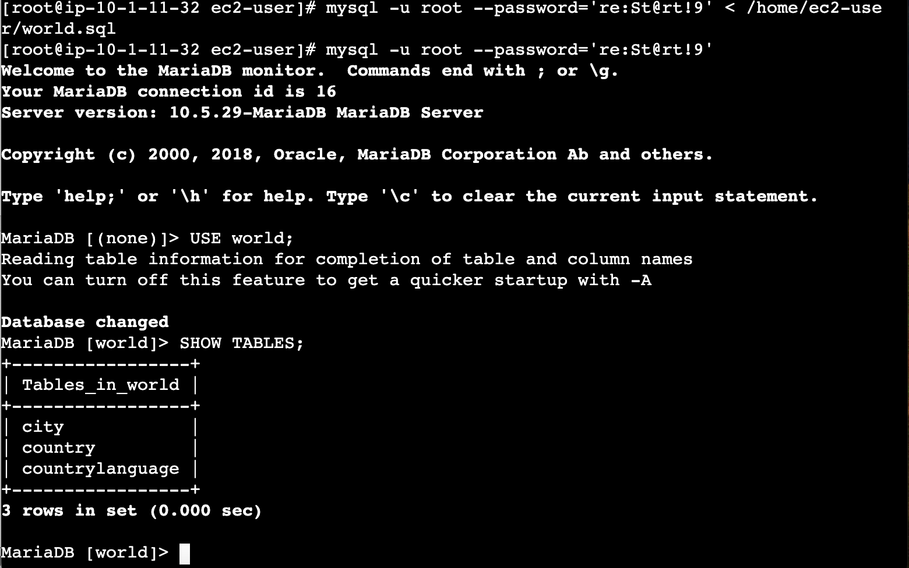
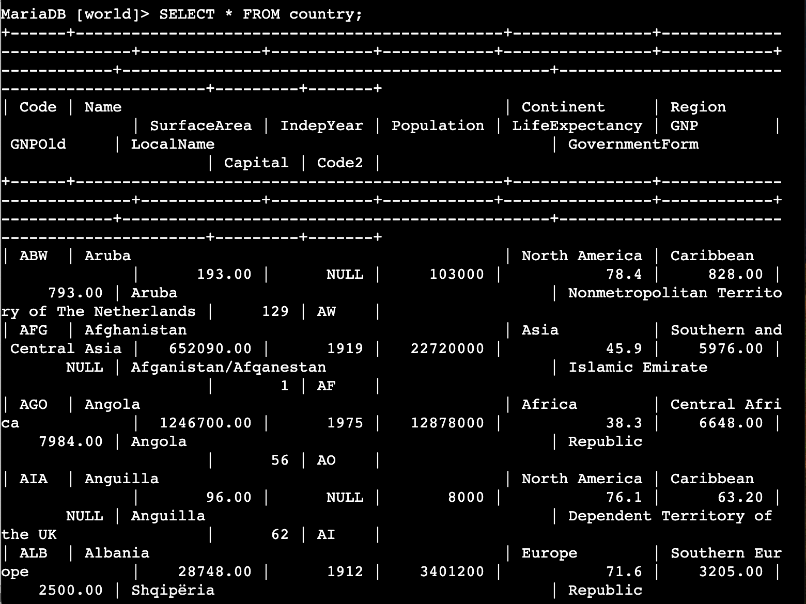
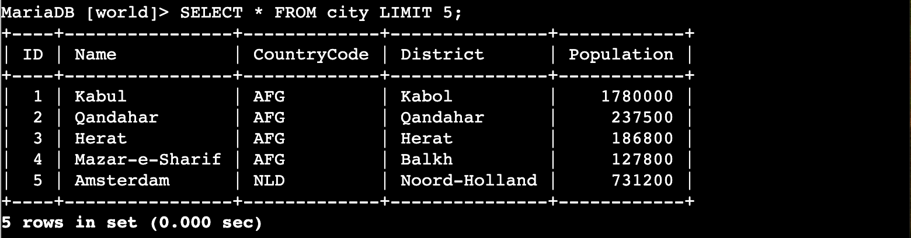
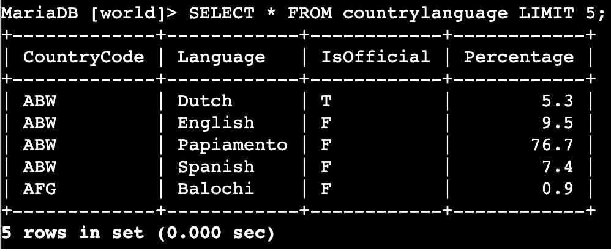

# LAB269 — Insert, Update, and Delete Data in a Database

## About This Lab

This lab covers the core data manipulation operations in SQL: INSERT, UPDATE, DELETE, and bulk import. These are the building blocks of working with any relational database — every application that stores user data, processes transactions, or logs events is doing some version of these operations constantly. Understanding how they work at the SQL level is essential before moving on to managed services like Amazon RDS, because the underlying mechanics are the same whether you are running MariaDB on an EC2 instance or on a fully managed database cluster.

The lab uses a MariaDB database called `world` that contains country, city, and language data. I connected to a pre-provisioned EC2 instance called the Command Host using AWS Session Manager, which means no SSH keys or security group changes were needed — Session Manager handles the secure shell session through the SSM agent. From there I used the MariaDB command-line client to run SQL statements directly against the database.

A key part of this lab is understanding the difference between statements that affect every row and statements that target specific rows. UPDATE and DELETE without a WHERE clause apply to the entire table — there is no confirmation prompt, no recycle bin, and no default undo. That is a real operational risk, and the lab builds that awareness through hands-on practice. The final task shows how a SQL backup file can restore data that has been deleted, which connects directly to real-world backup and restore procedures.

AWS services and tools used in this lab: Amazon EC2 (Command Host instance), AWS Systems Manager Session Manager, and MariaDB 10.5 running on the instance.

## What I Did

The lab environment had one EC2 instance already running when I started — the Command Host. I accessed it through Session Manager in the AWS console, which opened a browser-based terminal without needing an SSH key pair. MariaDB 10.5 was already installed and running on the instance. I worked through the lab by running SQL statements in the MariaDB shell and a couple of shell commands in the Linux terminal, then imported a full backup file at the end to restore the three-table world database.

---

## Task 1: Connect to a Database

I opened the EC2 console, selected the Command Host instance, and connected via Session Manager. In the terminal I switched to root and moved to the ec2-user home directory, then connected to MariaDB using the root credentials set at install time.

```bash
sudo su
cd /home/ec2-user/
mysql -u root --password='re:St@rt!9'
```

Once inside the MariaDB shell I ran `SHOW DATABASES;` to see what was available. The `world` database was already there alongside the three default system databases: `information_schema`, `mysql`, and `performance_schema`.

```sql
SHOW DATABASES;
```



---

## Task 2: Insert Data into a Table

I first confirmed the country table existed and checked its current state, then inserted two rows — one for Ireland and one for Australia. The VALUES list has to match the column order defined in the table schema exactly, so I ran the INSERT statements as-is from the lab.

```sql
SELECT * FROM world.country;

INSERT INTO world.country VALUES ('IRL','Ireland','Europe','British Islands',70273.00,1921,3775100,76.8,75921.00,73132.00,'Ireland/Éire','Republic',1447,'IE');

INSERT INTO world.country VALUES ('AUS','Australia','Oceania','Australia and New Zealand',7741220.00,1901,18886000,79.8,351182.00,392911.00,'Australia','Constitutional Monarchy, Federation',135,'AU');
```

I verified both rows were inserted with a SELECT filtered by the country codes:

```sql
SELECT * FROM world.country WHERE Code IN ('IRL', 'AUS');
```



---

## Task 3: Update Rows in a Table

I ran two UPDATE statements in sequence. Neither included a WHERE clause, so both affected every row in the table. The first set Population to 0, the second set both Population and SurfaceArea to 100.

```sql
UPDATE world.country SET Population = 0;
SELECT * FROM world.country;
```



```sql
UPDATE world.country SET Population = 100, SurfaceArea = 100;
SELECT * FROM world.country;
```



---

## Task 4: Delete Rows from a Table

Before deleting I disabled foreign key checks because the country table is referenced by the city and countrylanguage tables — without disabling the constraint MariaDB would reject the DELETE. Then I deleted all rows and confirmed the table was empty.

```sql
SET FOREIGN_KEY_CHECKS = 0;
DELETE FROM world.country;
SELECT * FROM world.country;
```


---

## Task 5: Import Data Using an SQL File

I quit the MariaDB shell and confirmed the backup file was present on disk, then piped it into the client using shell redirection. The file recreated all three tables (city, country, countrylanguage) and inserted the full dataset.

```bash
QUIT;
ls /home/ec2-user/world.sql
```


```bash
mysql -u root --password='re:St@rt!9' < /home/ec2-user/world.sql
```

No output from that command means it succeeded. I reconnected and verified:

```sql
mysql -u root --password='re:St@rt!9'
USE world;
SHOW TABLES;
```



```sql
SELECT * FROM country;
```



I also queried the other two tables that were created by the import to confirm all three were populated:

```sql
SELECT * FROM city LIMIT 5;
```



```sql
SELECT * FROM countrylanguage LIMIT 5;
```



---

## Challenges I Had

The INSERT statement for Ireland includes `'Ireland/Éire'` with an accented É character. The lab description uses that spelling, but when I ran the INSERT the terminal did not render the accent correctly — the stored value came back as `Ireland/ire` in subsequent SELECT queries, with the É dropped. This is a character encoding issue: the Session Manager terminal session was not configured with UTF-8 locale support, so the multi-byte character was stripped silently rather than causing an error. The data inserted and the query succeeded — the only visible effect was the missing character in the LocalName column. For a lab exercise this does not affect the outcome, but in a real schema where LocalName had a NOT NULL or CHECK constraint on format, the silent truncation would be a problem worth investigating through `SHOW VARIABLES LIKE 'character_set%';`.

The lab description also refers to the database engine as MySQL, but the instance is actually running MariaDB 10.5. The prompt shows `MariaDB [(none)]>` after connecting, not `mysql>`. All the SQL syntax used in this lab is compatible with both, so nothing broke, but it is worth knowing that AWS re/Start lab environments sometimes run MariaDB rather than MySQL Community Server.

---

## What I Learned

When you run UPDATE or DELETE without a WHERE clause, MariaDB applies the change to every row in the table with no confirmation step. There is no implicit transaction that you can roll back unless you have explicitly started one with BEGIN. This is why any real production workflow wraps destructive statements in a transaction and checks a COUNT(*) before committing.

Foreign key constraints exist to maintain referential integrity — if country is referenced by city and countrylanguage, MariaDB will block a DELETE on country rows that are still referenced elsewhere. Setting FOREIGN_KEY_CHECKS = 0 bypasses that check at the session level. It is useful in controlled situations like loading a backup in the correct order, but leaving it off in production would allow data to become inconsistent.

Importing a SQL file with `mysql ... < file.sql` is the standard way to restore from a logical backup. The redirect operator pipes the entire file as standard input to the client, which executes each statement in sequence. This is the same mechanism tools like `mysqldump` and `mariadb-dump` rely on for portable backups that can be restored on any compatible server version.

The MariaDB command-line client uses a separate syntax from the Linux shell — commands end with a semicolon, not a newline, and quoting rules differ. Understanding which environment you are in (shell prompt vs `MariaDB [(none)]>` prompt) matters when diagnosing errors, because the same string can be valid in one and a syntax error in the other.

When a SELECT query returns `Empty set`, that is a successful result — the query ran without error and correctly found no rows matching the condition. It is different from an error response, and distinguishing between the two is important when verifying that a DELETE or a filter condition worked as intended.

---

## Resource Names Reference

| Resource | Value |
|---|---|
| EC2 Instance | Command Host (ip-10-1-11-32) |
| Database Engine | MariaDB 10.5.29 |
| Database | world |
| Tables | country, city, countrylanguage |
| DB User | root |
| DB Password | re:St@rt!9 |
| SQL Backup File | /home/ec2-user/world.sql |
| Connection Method | AWS Session Manager |
| IRL Country Code | IRL |
| AUS Country Code | AUS |

---

## Commands Reference

See `commands.sh` for all commands used in this lab in a single reference file.
