# LAB270 – Selecting Data from a Database

## About This Lab

This lab is about writing SQL queries against a relational database using the MySQL command-line client on an AWS EC2 instance. The database, called `world`, contains three tables — `city`, `country`, and `countrylanguage` — populated with real geographic and demographic data from Statistics Finland. The task is to retrieve meaningful information from it using the `SELECT` statement and a set of standard SQL operators.

The skills this lab covers matter because almost every application that stores user data, transaction records, or configuration relies on a relational database somewhere in its stack. Being able to write precise queries — filtering rows, sorting results, counting records — is a foundational skill for cloud support roles, data analysis, and backend development. It is also the basis for understanding how AWS database services like RDS and Aurora work, because those services run the same engines (MySQL, MariaDB, PostgreSQL) and respond to the same SQL syntax.

The AWS services involved are EC2 (to host the Command Host instance running the MariaDB client) and Systems Manager Session Manager (to access the terminal without needing SSH or an open security group port). Session Manager is the more secure and auditable alternative to direct SSH access, and it is worth understanding how it works because it is commonly used in production environments where exposing port 22 is not acceptable.

By the end of the lab I had used `SELECT`, `COUNT()`, `WHERE`, `ORDER BY`, `AND`, `AS`, and the `>`, `<`, and `=` comparison operators to query the database and answer a specific analytical question about population and geography.

## What I Did

The lab environment provisioned an EC2 instance called the Command Host (instance ID: `i-09b877e1c871c9fed`) with MariaDB 10.5.29 already installed and the `world` database loaded. I accessed it through the AWS Management Console using Session Manager, which opened a browser-based terminal with no SSH key or open inbound port required. From there I switched to root, navigated to the working directory, and connected to the MariaDB server with the pre-configured password. All queries were run at the MariaDB prompt inside that terminal session.

---

## Task 1: Connect to the Command Host

I navigated to EC2 > Instances, selected the Command Host, and chose Connect. On the Connect page I selected the Session Manager tab and opened the terminal. The session header confirmed the instance ID `i-09b877e1c871c9fed`.

Once inside, I configured the environment and connected to the database:

```sql
sudo su
cd /home/ec2-user/
mysql -u root --password='re:St@rt!9'
```

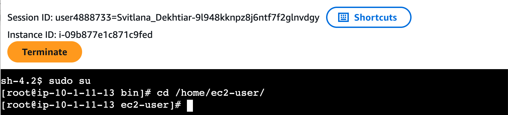

The MariaDB welcome banner appeared confirming server version 10.5.29, and the `MariaDB [(none)]>` prompt was ready for queries.

![MariaDB 10.5.29 connected — MariaDB [(none)]> prompt visible](screenshots/02_mysql_connected.png)

---

## Task 2: Query the world Database

### Verify the database exists

```sql
SHOW DATABASES;
```

Four databases were listed: `information_schema`, `mysql`, `performance_schema`, and `world`. The `world` database was confirmed present before continuing.

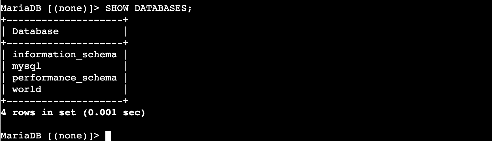

### View all rows in the country table

```sql
SELECT * FROM world.country;
```

This returned all 239 rows across every column. The terminal wrapped columns across multiple lines because the table is very wide — columns include Code, Name, Continent, Region, SurfaceArea, IndepYear, Population, LifeExpectancy, GNP, GNPOld, LocalName, GovernmentForm, Capital, and Code2.

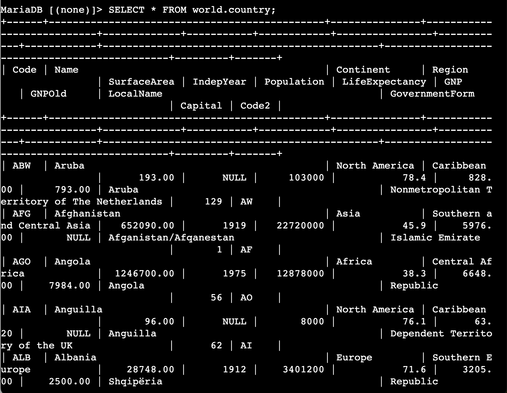

### Count the rows

```sql
SELECT COUNT(*) FROM world.country;
```

Returned `239`. Confirmed in 0.002 seconds.

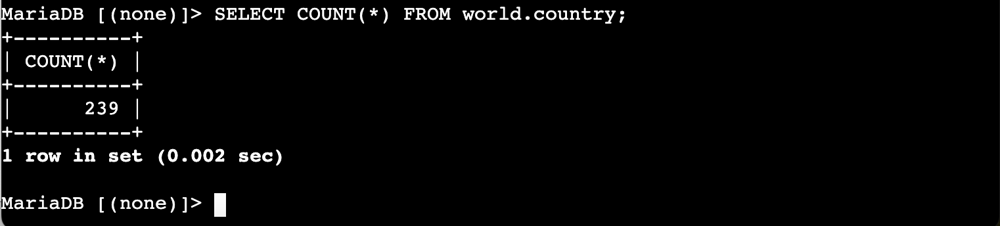

### Inspect the table schema

```sql
SHOW COLUMNS FROM world.country;
```

This listed all 15 column names and their data types — `Code` (char(3), primary key), `Name` (char(52)), `Continent` (enum), `Region` (char(26)), `SurfaceArea` (decimal(10,2)), `IndepYear` (smallint, nullable), `Population` (int(11)), and so on.

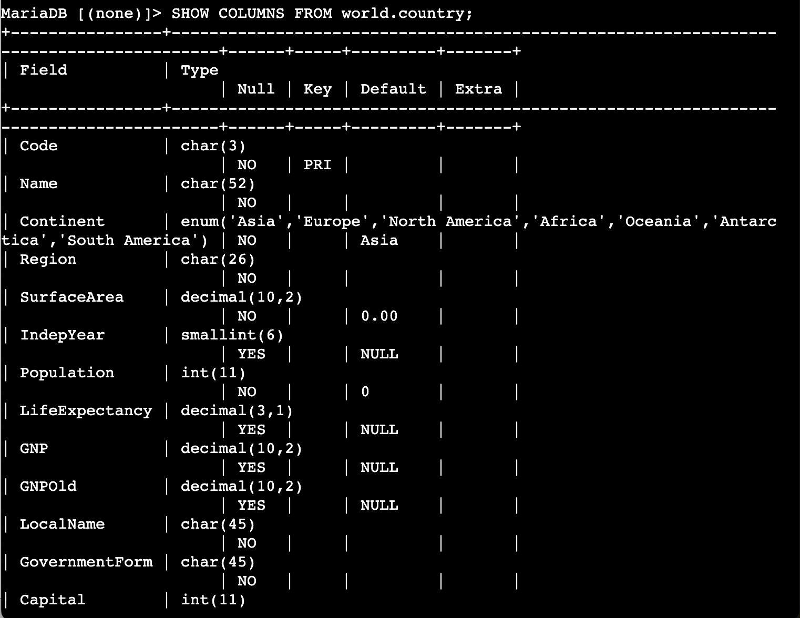

### Select specific columns

```sql
SELECT Name, Capital, Region, SurfaceArea, Population FROM world.country;
```

Selecting only the five columns I needed made the output much more readable. The `Capital` column stores a numeric ID rather than a name.

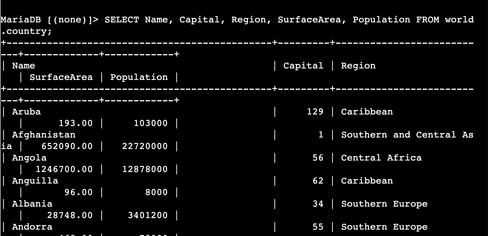

### Rename a column with AS

```sql
SELECT Name, Capital, Region, SurfaceArea AS "Surface Area", Population FROM world.country;
```

The `AS` keyword applies a display alias — `SurfaceArea` now shows as `Surface Area` in the column header. The table itself is unchanged.

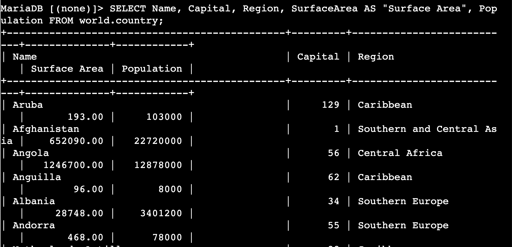

### Sort results with ORDER BY

```sql
SELECT Name, Capital, Region, SurfaceArea AS "Surface Area", Population FROM world.country ORDER BY Population;
```

The default sort is ascending. Territories with zero population appeared first — Antarctica, French Southern territories, Heard Island and McDonald Islands, Bouvet Island, and others.

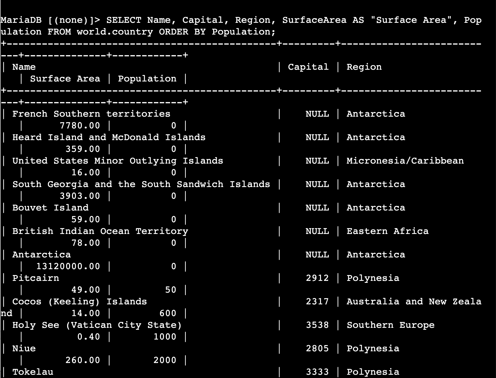

### Sort descending with DESC

```sql
SELECT Name, Capital, Region, SurfaceArea AS "Surface Area", Population FROM world.country ORDER BY Population DESC;
```

China (1,277,558,000) appeared first, followed by India (1,013,662,000), the United States (278,357,000), Indonesia, Brazil, and Pakistan.

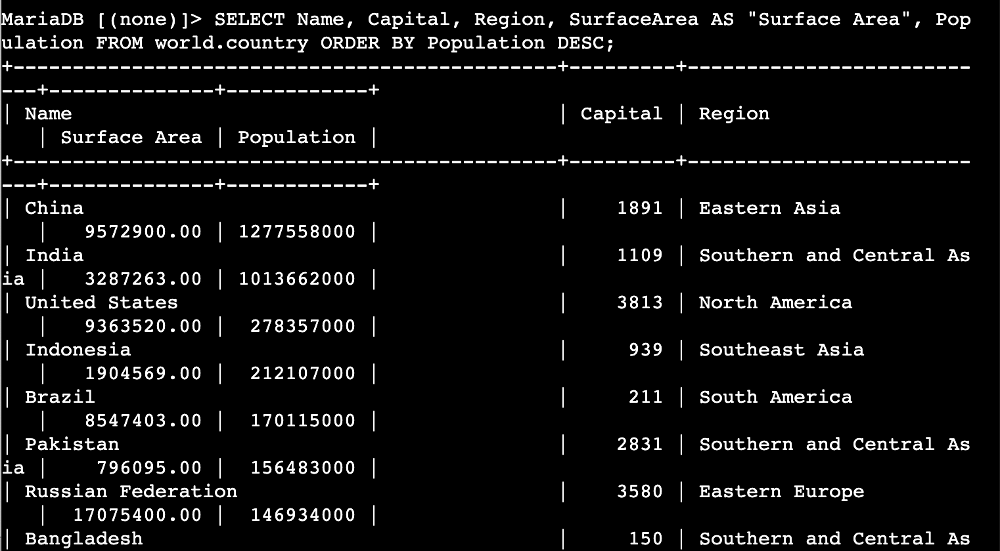

### Filter with WHERE and >

```sql
SELECT Name, Capital, Region, SurfaceArea AS "Surface Area", Population
FROM world.country
WHERE Population > 50000000
ORDER BY Population DESC;
```

I entered this across multiple lines. MariaDB displayed `->` for each continuation line, indicating it was waiting for the semicolon to know the statement was complete. This is normal behaviour, not an error. The result was approximately 25 countries above 50 million people.

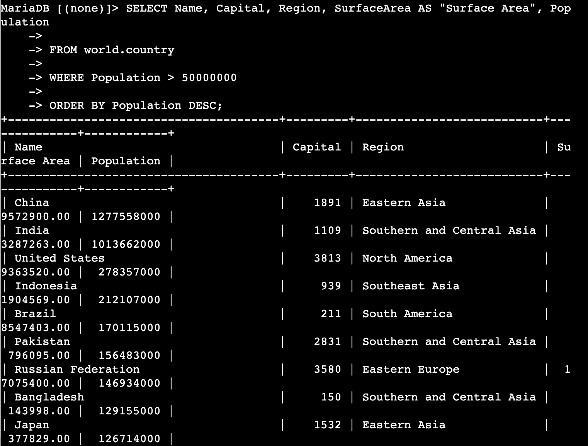

### Combine conditions with AND

```sql
SELECT Name, Capital, Region, SurfaceArea AS "Surface Area", Population
FROM world.country
WHERE Population > 50000000
AND Population < 100000000
ORDER BY Population DESC;
```

The `AND` operator required both conditions to hold. Result: Mexico (98.8M), Germany (82.1M), Vietnam (79.8M), Philippines (75.9M), Egypt (68.4M), Iran (67.7M), Turkey (66.5M), Ethiopia (62.5M), and a few others.

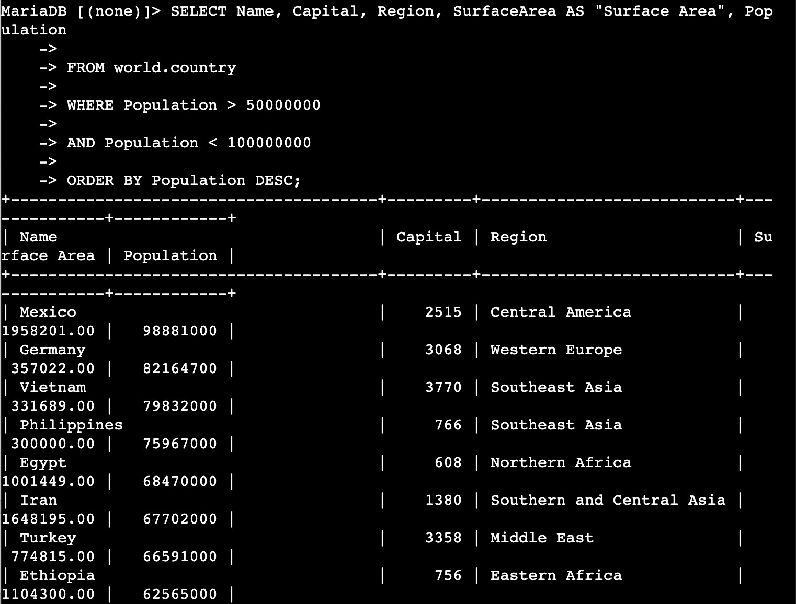

---

## Challenge

The question was: which country in Southern Europe has a population greater than 50,000,000?

```sql
SELECT Name, Capital, Region, SurfaceArea AS "Surface Area", Population
FROM world.country
WHERE Population > 50000000
AND Region = "Southern Europe";
```

The answer is Italy — population 57,680,000, capital ID 1464, surface area 301,316.00 km². One row returned in 0.000 seconds. Spain does not qualify in this dataset because its population at the time the data was recorded was below 50 million.

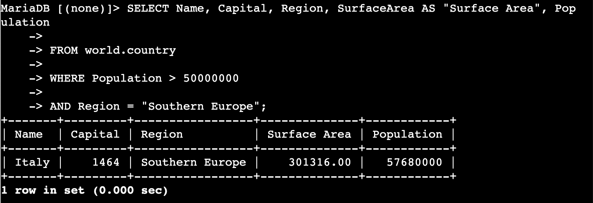

---

## Challenges I Had

When I first ran the `SELECT ... AS "Surface Area"` query after copying it from a formatted document, MySQL returned a syntax error on the quote character. The document had silently converted the straight double quotes (`"`) to curly typographic quotes (`"`). MariaDB does not recognise typographic quotes as string delimiters. I fixed it by retyping the quotes directly in the terminal instead of pasting from the document.

The `->` continuation prompt also tripped me up initially — when I pressed Enter partway through a multi-line query, I thought the terminal had frozen. It was actually waiting for the semicolon to know the statement was complete. Once I understood that `->` means the statement is not finished yet, multi-line queries became straightforward.

---

## What I Learned

**`SELECT *` is a debugging tool, not a production pattern.** Returning every column from a table when you only need three or four wastes bandwidth, makes results harder to read, and in an application context can expose sensitive columns. The `world.country` table has 15 columns — the terminal had to wrap them across multiple lines just to display one row. Using explicit column lists is the correct approach.

**`COUNT(*)` and `COUNT(column)` are not interchangeable.** `COUNT(*)` counts every row in the result set, including rows where some columns are `NULL`. `COUNT(column)` only counts rows where that column has a non-null value. In the `world.country` table, `IndepYear` is nullable — `COUNT(*)` returns 239 but `COUNT(IndepYear)` would return fewer, because some territories have no recorded independence year.

**`ORDER BY` sorts — it does not filter.** Changing the sort order does not change which rows are returned. Filtering happens in `WHERE`, which is evaluated before `ORDER BY`. The order of evaluation in a SQL query is: FROM → WHERE → SELECT → ORDER BY. Understanding this matters when debugging unexpected results.

**String comparisons in `WHERE` are case-sensitive for values.** Table and column names are case-insensitive in this MariaDB environment, but string literals inside quotes are not. `WHERE Region = "Southern Europe"` and `WHERE Region = "southern europe"` return different result sets. The exact casing of data values matters when writing `WHERE` clauses against text columns.

**Session Manager is a more secure alternative to SSH for EC2 access.** Traditional SSH requires an open inbound port 22 and a private key file. Session Manager works through the AWS Systems Manager service — the instance needs no inbound security group rules and access is controlled entirely through IAM policies. All session activity is also logged, which is important for security auditing in production environments.

---

## Resource Names Reference

| Resource | Name / Value | Notes |
|---|---|---|
| Database name | `world` | Pre-installed on Command Host |
| Database tables | `city`, `country`, `countrylanguage` | Three tables |
| DB user | `root` | Pre-configured |
| DB password | `re:St@rt!9` | Set during installation |
| EC2 instance label | Command Host | EC2 > Instances |
| Instance ID | `i-09b877e1c871c9fed` | Visible in Session Manager header |
| DB server version | MariaDB 10.5.29 | Shown on login banner |
| Connection method | Session Manager | No SSH key or open port required |
| Local repo path | `Desktop\AWS-reStart-Journey\Labs\Databases\lab-270-selecting-data-from-database` | |

---

## Commands Reference

All commands run during this lab are saved in [`commands.sh`](commands.sh).
