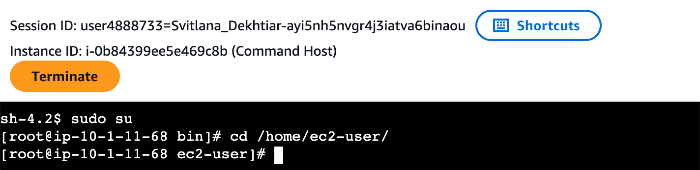
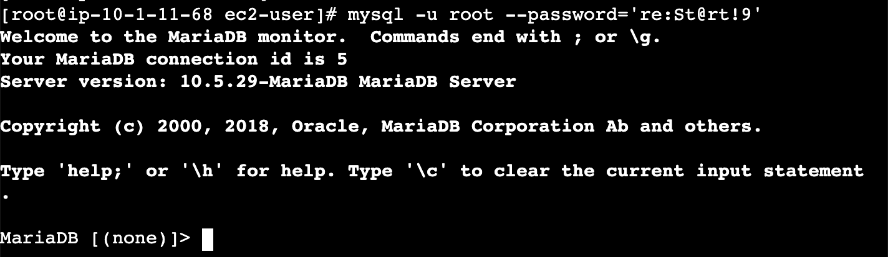
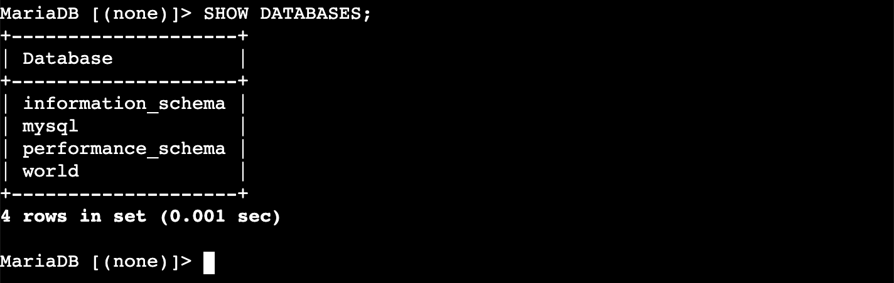
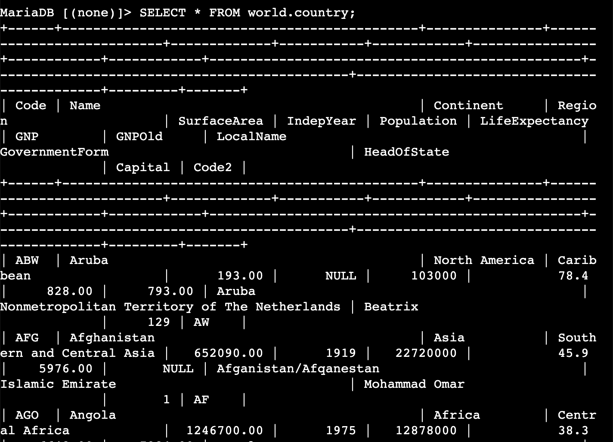
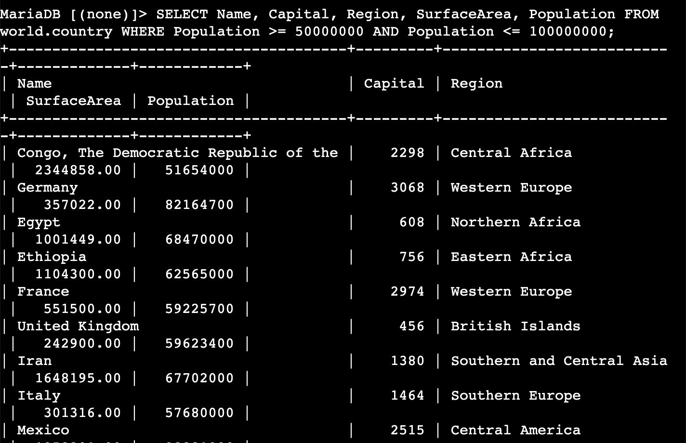
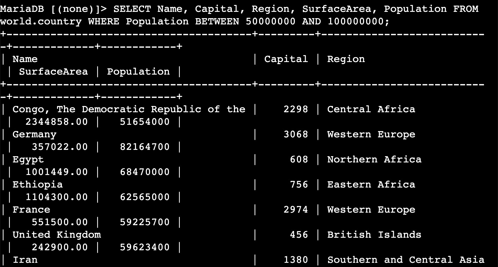
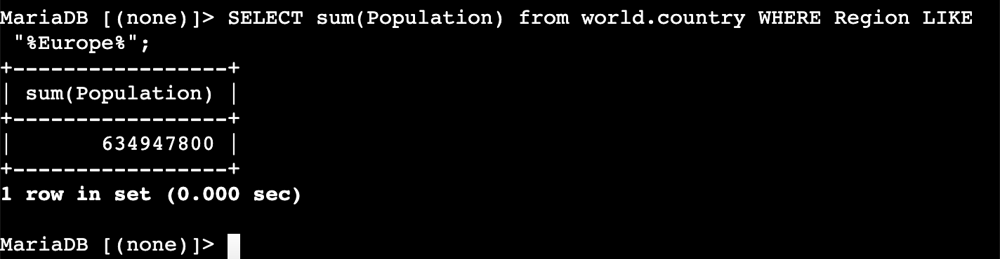
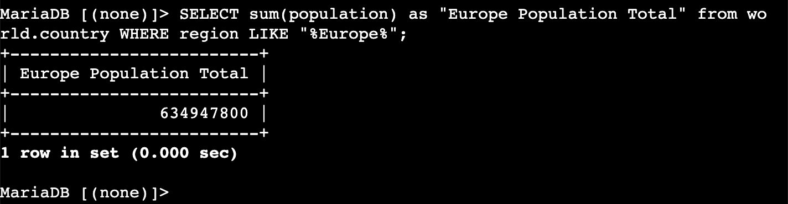
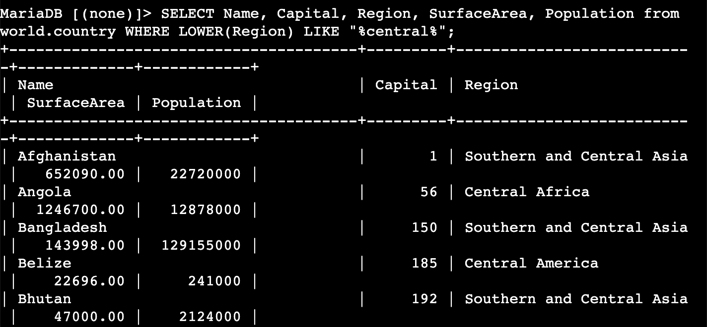
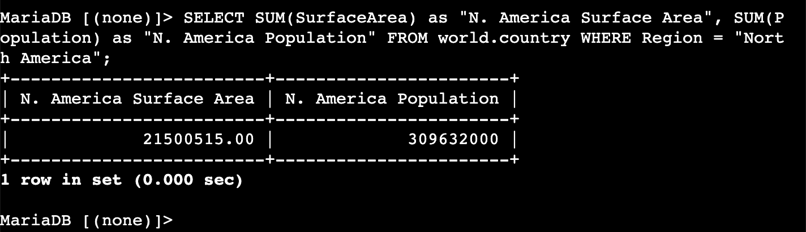

# Lab 271 — Performing a Conditional Search

## About This Lab

This lab covers querying a relational MySQL/MariaDB database using the `SELECT` statement and conditional operators. The skills practised here — filtering rows with `WHERE`, using range operators like `BETWEEN`, pattern matching with `LIKE`, aggregating data with `SUM`, and making output readable with column aliases — are everyday database operations in any cloud or backend role. Understanding how to write precise queries matters because cloud databases hold the business-critical data that applications and teams depend on, and pulling the wrong records has real consequences for performance and accuracy.

The AWS services involved are EC2 (the Command Host instance that hosts the database client) and AWS Systems Manager Session Manager (used to connect to the instance without SSH keys or open ports). Being able to connect to an instance securely via Session Manager and interact with a database through the command line demonstrates a practical grasp of how cloud infrastructure and database access fit together — this person can get into a cloud environment and work with data, not just read about it.

## What I Did

The lab environment came with an EC2 instance called Command Host (`i-0b84399ee5e469c8b`, hostname `ip-10-1-11-68`) already running, with MariaDB 10.5.29 installed and a database named `world` pre-loaded with three tables: `city`, `country`, and `countrylanguage`. I connected to the instance using AWS Session Manager through the browser — no SSH key or security group change required. From the terminal I switched to root, navigated to the ec2-user home directory, and opened the MySQL client. All queries in this lab targeted the `world.country` table.

## Task 1: Connect to the Command Host

I opened the EC2 console, selected the Command Host instance (`i-0b84399ee5e469c8b`), and connected via the Session Manager tab. Once the terminal was open I ran the following to prepare the environment and open the database client:

```bash
sudo su
cd /home/ec2-user/
```

```bash
mysql -u root --password='re:St@rt!9'
```

The client launched and showed the `MariaDB [(none)]>` prompt — server version 10.5.29-MariaDB, connection id 5.





## Task 2: Query the world Database

### Verify the database exists

```sql
SHOW DATABASES;
```

4 rows returned: `information_schema`, `mysql`, `performance_schema`, `world`.



### Review the full country table

```sql
SELECT * FROM world.country;
```

The country table has 15 columns so the output wraps across multiple lines in the terminal. The data starts with ABW (Aruba) and AFG (Afghanistan).



### Filter rows with WHERE and AND

```sql
SELECT Name, Capital, Region, SurfaceArea, Population
FROM world.country
WHERE Population >= 50000000 AND Population <= 100000000;
```

Returns countries with population between 50 million and 100 million. Results include Congo DRC (51,654,000), Germany (82,164,700), Egypt (68,470,000), Ethiopia (62,565,000), France (59,225,700), UK (59,623,400), Iran (67,702,000), Italy (57,680,000), Mexico, and others.



### Use BETWEEN for a range condition

```sql
SELECT Name, Capital, Region, SurfaceArea, Population
FROM world.country
WHERE Population BETWEEN 50000000 AND 100000000;
```

`BETWEEN` is inclusive of both boundary values and produces the same result as the `AND` query above.



### Aggregate with LIKE and SUM

```sql
SELECT sum(Population) from world.country WHERE Region LIKE "%Europe%";
```

The `%` wildcards on both sides of `Europe` match Eastern Europe, Western Europe, Southern Europe, Northern Europe, and British Islands. Total: **634,947,800**.



### Add a column alias with AS

```sql
SELECT sum(population) as "Europe Population Total" from world.country WHERE region LIKE "%Europe%";
```

The `AS` keyword renames the output column from `sum(population)` to `Europe Population Total`. Result is the same: **634,947,800**.



### Case-insensitive search with LOWER

```sql
SELECT Name, Capital, Region, SurfaceArea, Population
from world.country
WHERE LOWER(Region) LIKE "%central%";
```

`LOWER()` converts the stored value to lowercase before the comparison runs, catching Central Africa, Central America, and Southern and Central Asia. Results include Afghanistan, Angola, Bangladesh, Belize, Bhutan, and others.



## Challenge

Write a query that returns the total surface area and total population of North America.

```sql
SELECT SUM(SurfaceArea) as "N. America Surface Area", SUM(Population) as "N. America Population"
FROM world.country
WHERE Region = "North America";
```

Result: Surface Area **21,500,515.00**, Population **309,632,000**.

I used exact equality (`=`) rather than `LIKE` because `North America` is a precise value in the data with no spelling variations.



## Challenges I Had

No significant issues encountered during this lab.

## What I Learned

- When you use `BETWEEN` in a `WHERE` clause, both boundary values are included in the result — `BETWEEN 50000000 AND 100000000` returns rows where `Population` is exactly 50,000,000 or exactly 100,000,000 as well as everything in between. An off-by-one error in a compliance or financial query could include or exclude records that should not be there.

- When `LIKE` is combined with the `%` wildcard on both sides (`%Europe%`), the database cannot use an index on that column and must scan every row. On large tables this is expensive. In production, full-text indexes or dedicated search services replace `LIKE` for pattern matching at scale — but for small reference datasets like `world`, it is fine.

- When a `SELECT` clause contains only aggregate functions like `SUM`, the query returns exactly one row regardless of how many rows were evaluated. Adding `GROUP BY Region` would produce one row per region — a separate population total for each, rather than a single grand total.

- The `AS` keyword creates a column alias that exists only in the output — it cannot be referenced in the `WHERE` clause of the same query. To filter on an aggregated value you must use `HAVING` instead of `WHERE`.

- Session Manager removes the need to manage SSH keys, open inbound ports on security groups, or assign a public IP to an instance. Access is controlled entirely through IAM permissions on the instance profile. This means the attack surface is smaller — no port 22 exposed to the internet — which is why it is the preferred connection method in hardened AWS environments.

## Resource Names Reference

| Resource / Field | Value |
|---|---|
| EC2 Instance Name | Command Host |
| Instance ID | i-0b84399ee5e469c8b |
| Instance Hostname | ip-10-1-11-68 |
| Server Version | 10.5.29-MariaDB MariaDB Server |
| Database Name | world |
| DB Tables | city, country, countrylanguage |
| DB Username | root |
| DB Password | re:St@rt!9 |
| Connection Method | Session Manager (no SSH key required) |
| Europe Population Total | 634,947,800 |
| N. America Surface Area | 21,500,515.00 |
| N. America Population | 309,632,000 |
| Local Repo Path | Desktop\AWS-reStart-Journey\Labs\Databases\lab-271-conditional-search |
| Screenshots Folder | Desktop\AWS-reStart-Journey\Labs\Databases\lab-271-conditional-search\screenshots\ |

## Commands Reference

All commands run during this lab are saved in [commands.sh](commands.sh).
