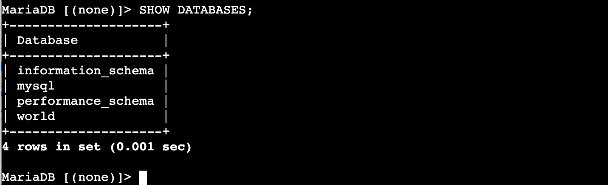
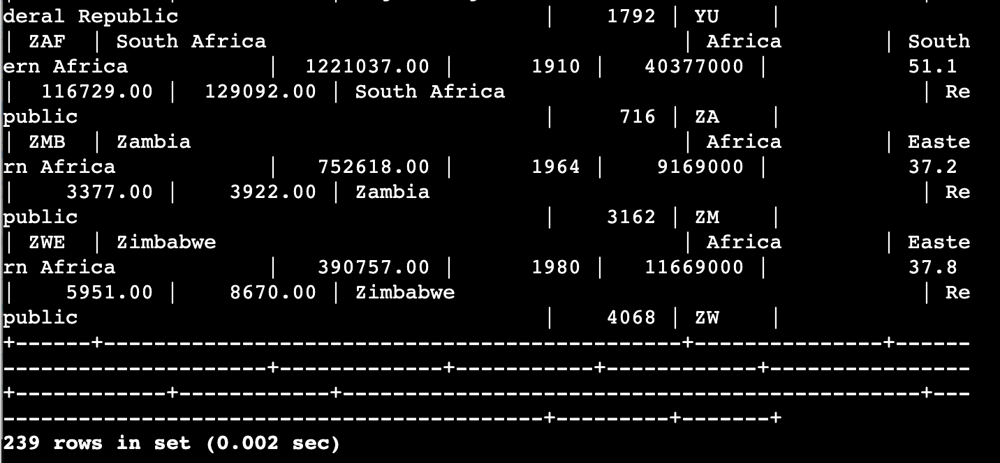
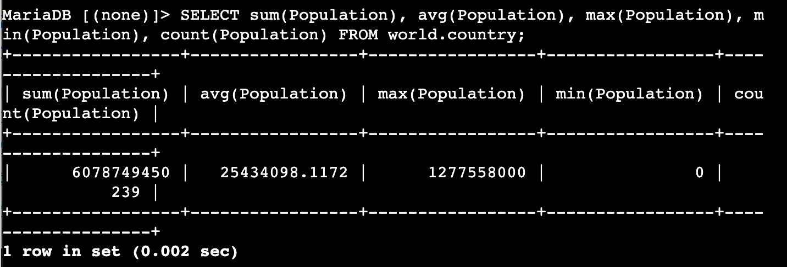
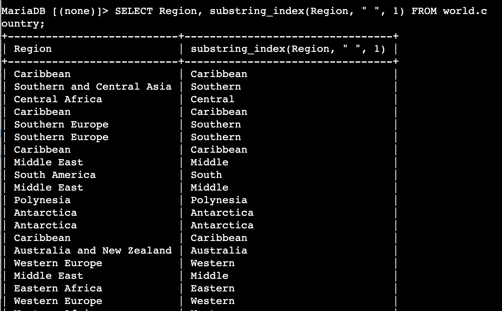
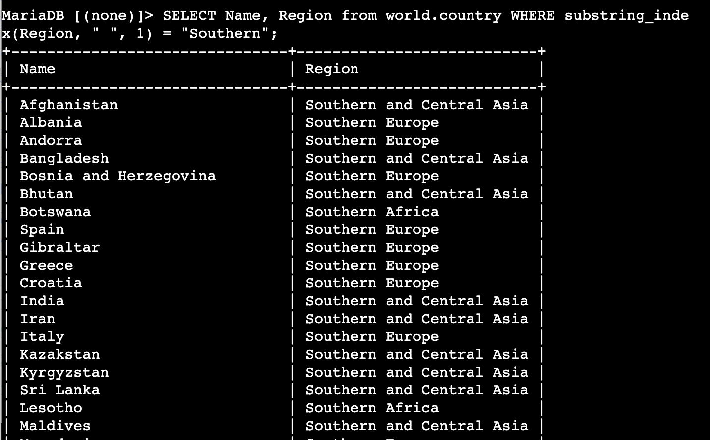
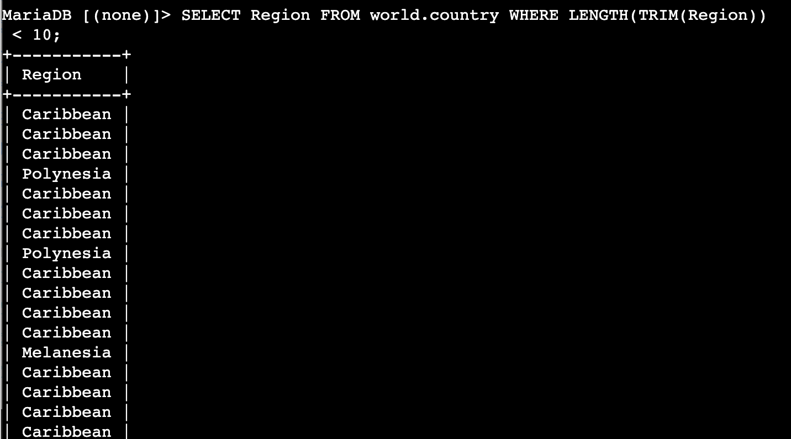
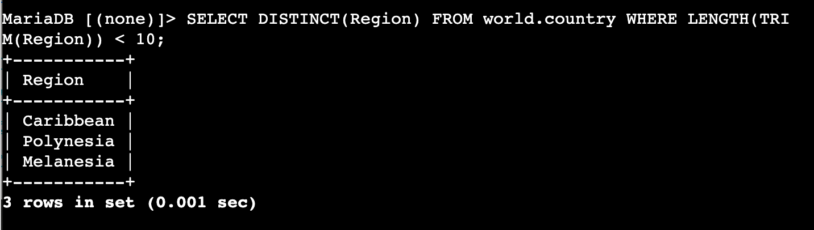
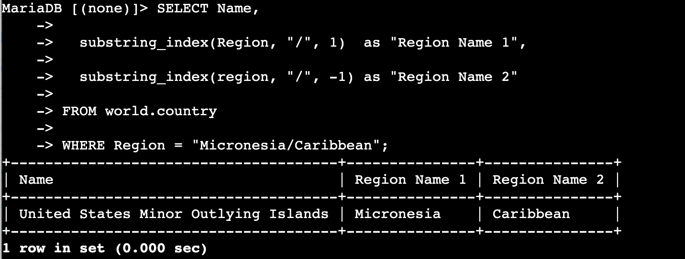

# Lab 272 — Working with Functions

## About This Lab

This lab covers the use of built-in SQL functions within `SELECT` statements and `WHERE` clauses against a pre-existing relational database called **world**, which contains three tables: `city`, `country`, and `countrylanguage`. The skills demonstrated here — aggregating data, manipulating strings, and deduplicating results — are core to any data-facing role in cloud engineering, database administration, or backend development.

The lab uses **Amazon EC2** (specifically a Command Host instance accessed via **AWS Systems Manager Session Manager**) and a locally installed **MariaDB** database server. There is no RDS instance in this lab — the database runs directly on the EC2 instance. The ability to connect to a database server on a remote EC2 instance, run analytical queries, and interpret structured output is a practical skill relevant to cloud operations work and is exactly what an engineer does when diagnosing production data issues or validating application behaviour.

## What I Did

The lab environment pre-provisioned an EC2 instance (Command Host) with MariaDB already installed and the `world` database already loaded. I connected to the instance using Session Manager — no SSH keys required — then used the MariaDB CLI to run a series of queries demonstrating aggregate and string functions. The lab is structured as a single task with multiple queries, progressing from simple aggregation through string manipulation and deduplication, finishing with an open-ended challenge query.

---

## Task 1: Connect to the Command Host

I navigated to EC2 in the AWS Management Console, selected the Command Host instance, and opened a Session Manager terminal. I then elevated to root and changed to the ec2-user home directory before connecting to the database.

```bash
sudo su
cd /home/ec2-user/
```

```bash
mysql -u root --password='re:St@rt!9'
```

---

## Task 2: Query the world Database

### Confirm the database exists

```sql
SHOW DATABASES;
```

Four databases are present: `information_schema`, `mysql`, `performance_schema`, and `world`. The result confirmed the lab environment was correctly provisioned.



### View the country table

```sql
SELECT * FROM world.country;
```

This returns all 239 rows and shows the full column structure — including `Name`, `Region`, `Population`, and more — before applying any functions.



### Aggregate functions: SUM, AVG, MAX, MIN, COUNT

```sql
SELECT sum(Population), avg(Population), max(Population), min(Population), count(Population)
FROM world.country;
```

This produces a single summary row across all 239 countries:

| Function | Result |
|----------|--------|
| SUM      | 6,078,749,450 |
| AVG      | 25,434,098.1172 |
| MAX      | 1,277,558,000 |
| MIN      | 0 |
| COUNT    | 239 |

`MIN()` returns 0 because some territories are listed without a population figure. `COUNT()` confirms all 239 rows contain a non-NULL value in the Population column.



### SUBSTRING_INDEX — split a string

```sql
SELECT Region, substring_index(Region, " ", 1) FROM world.country;
```

`SUBSTRING_INDEX(string, delimiter, count)` returns the portion of the string before the nth occurrence of the delimiter. Passing `1` returns everything before the first space — the first word of each region name. The output shows 239 rows with the original region alongside its extracted first word.



### SUBSTRING_INDEX in a WHERE clause

```sql
SELECT Name, Region
FROM world.country
WHERE substring_index(Region, " ", 1) = "Southern";
```

Functions can be used inside `WHERE` conditions, not just `SELECT` lists. This filters to countries whose region begins with "Southern" — returning results from Southern Europe, Southern Africa, and Southern and Central Asia.



### LENGTH and TRIM — filter by string length

```sql
SELECT Region FROM world.country WHERE LENGTH(TRIM(Region)) < 10;
```

`TRIM()` strips leading and trailing whitespace before `LENGTH()` counts characters. Without `TRIM()`, regions with padding would return incorrect counts. This query returns many duplicate rows because multiple countries share each region name.



### DISTINCT — remove duplicates

```sql
SELECT DISTINCT(Region) FROM world.country WHERE LENGTH(TRIM(Region)) < 10;
```

Adding `DISTINCT()` collapses repeated values to one row each. From the many duplicate rows in the previous query, exactly three unique regions qualify: Caribbean, Polynesia, and Melanesia.



### Challenge: split Micronesia/Caribbean into two columns

```sql
SELECT Name,
  substring_index(Region, "/", 1)  as "Region Name 1",
  substring_index(region, "/", -1) as "Region Name 2"
FROM world.country
WHERE Region = "Micronesia/Caribbean";
```

Using `-1` as the third argument returns everything after the last occurrence of the delimiter — isolating the second half of the string. Only one country has `Micronesia/Caribbean` as its region: United States Minor Outlying Islands.



---

## Challenges I Had

No significant issues encountered during this lab.

---

## What I Learned

- When you pass a negative count to `SUBSTRING_INDEX`, it measures from the right of the string rather than the left — so `SUBSTRING_INDEX(col, "/", -1)` returns everything after the last `/`. This means the same function can extract both halves of a delimited string without needing separate calls, which matters when normalising inconsistently formatted data in a production database.

- `COUNT()` counts non-NULL values in the specified column, not total rows. If a column contains NULLs, `COUNT(column)` and `COUNT(*)` return different numbers — `COUNT(*)` includes NULLs, `COUNT(column)` does not. The `min(Population)` returning 0 rather than NULL here is a data quality issue: territories without population data were stored as 0 instead of NULL, which means `COUNT()` still includes them.

- `TRIM()` only removes spaces by default, and only from the start and end of a string — it does not remove internal spaces. Combining it with `LENGTH()` gives a reliable character count for filtering purposes, but it is not a substitute for `REPLACE()` when internal whitespace needs cleaning.

- Aggregate functions like `SUM()`, `AVG()`, `MAX()`, and `MIN()` collapse all matching rows into a single result row. Without `GROUP BY`, they operate across the entire table. Adding `GROUP BY Region` to the aggregate query would produce one result row per region — a pattern used constantly in production reporting and cost analysis.

- Session Manager removes the need for SSH keys and open inbound ports to connect to EC2 instances. Access is controlled through IAM roles attached to the instance, which is more secure and easier to audit than managing key pairs. In a real environment this also means access can be revoked instantly by modifying the IAM role rather than rotating or revoking SSH keys.

---

## Resource Names Reference

| Resource / Setting   | Value                                              |
|----------------------|----------------------------------------------------|
| Database name        | world                                              |
| Tables used          | world.country                                      |
| DB user              | root                                               |
| DB password          | re:St@rt!9                                         |
| Total country rows   | 239                                                |
| Local repo path      | ~\Desktop\AWS-reStart-Journey\Labs\Databases\lab-272-working-with-functions |
| Screenshots folder   | ~\Desktop\AWS-reStart-Journey\Labs\Databases\lab-272-working-with-functions\screenshots\ |

---

## Commands Reference

All commands run during this lab are saved in [commands.sh](commands.sh).
