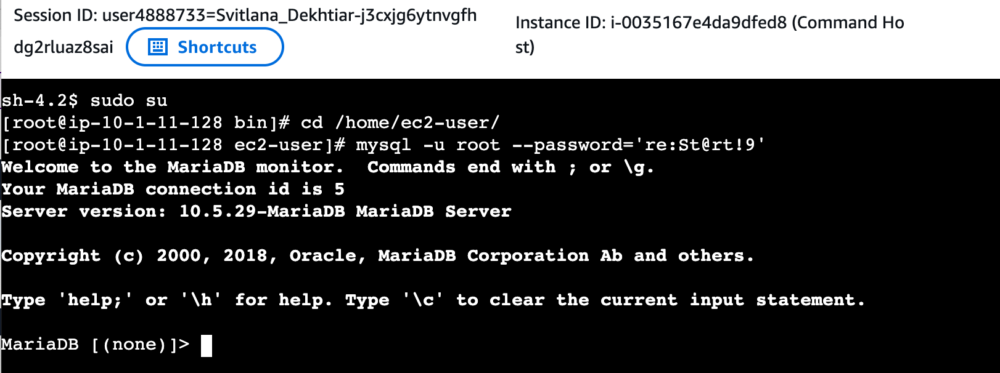
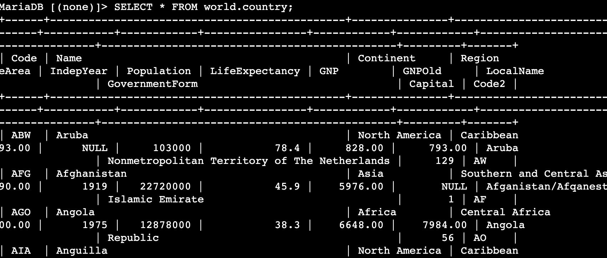
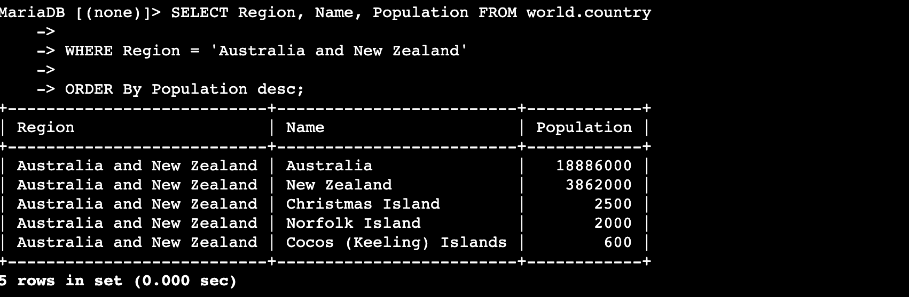
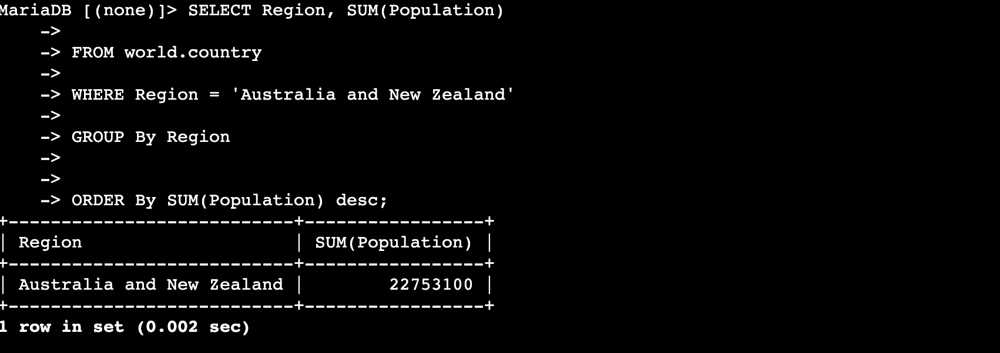
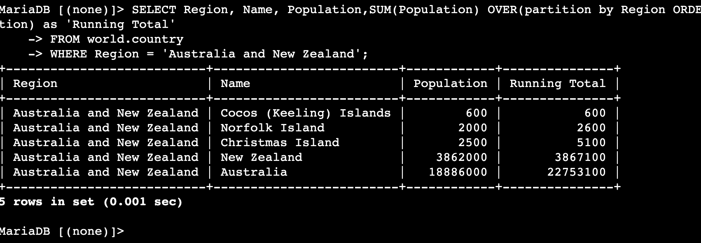
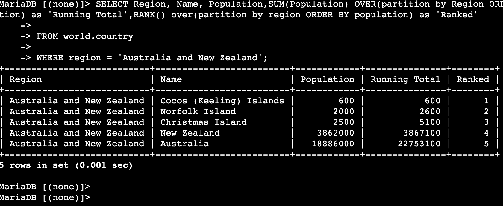
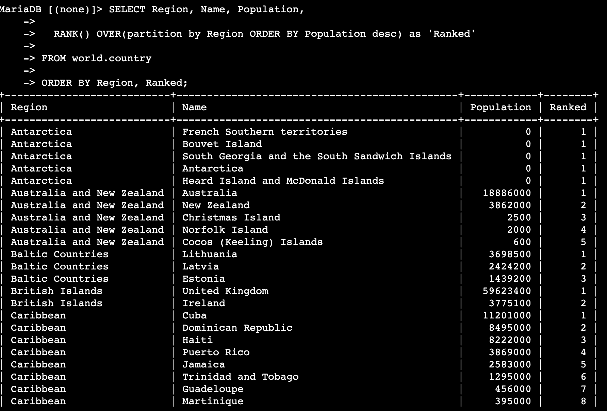

# Lab 273 — Organizing Data

## About This Lab

This lab covers two of the most important data organisation techniques in relational databases: the `GROUP BY` clause and SQL window functions using the `OVER` clause. These are skills that come up constantly in cloud data engineering, analytics, and backend roles — any job where you need to summarise, rank, or compute running totals across grouped records.

The lab uses a MariaDB instance running on an Amazon EC2 instance, accessed through AWS Systems Manager Session Manager — no SSH keys or open ports required. The database is named `world` and contains three tables: `city`, `country`, and `countrylanguage`. All queries in this lab target the `country` table. Services involved include EC2 for the compute instance hosting MariaDB, and Systems Manager for browser-based terminal access.

To a recruiter: this lab demonstrates the ability to write progressively complex SQL — from basic filtering to windowed aggregation with ranking — against a real relational database running on cloud infrastructure.

## What I Did

The lab environment came pre-built with a Command Host EC2 instance (`i-0035167e4da9dfed8`) running MariaDB 10.5.29. I connected to it using Session Manager (connection ID 5), switched to root, and connected to the MariaDB monitor. I then ran a sequence of queries against `world.country` (239 rows), starting with simple `WHERE` and `ORDER BY` clauses, then aggregating with `GROUP BY` and `SUM()`, and finally applying window functions using `OVER()` with both `SUM()` and `RANK()`. The lab ended with a challenge query ranking all 239 countries across every region by population.

## Task 1: Connect to the Command Host

I opened the EC2 console, selected the Command Host instance (`i-0035167e4da9dfed8`), and connected via the Session Manager tab. Once the browser terminal opened I ran:

```bash
sudo su
cd /home/ec2-user/
mysql -u root --password='re:St@rt!9'
```

The MariaDB monitor confirmed server version 10.5.29-MariaDB and connection ID 5.



## Task 2: Query the world Database

### Show Databases

```sql
SHOW DATABASES;
```


### Review the country Table

```sql
SELECT * FROM world.country;
```

This returned all 239 rows. The table has 15+ columns; the ones used throughout this lab are `Name`, `Region`, and `Population`.



### Filter and Order by Region

```sql
SELECT Region, Name, Population FROM world.country
WHERE Region = 'Australia and New Zealand'
ORDER By Population desc;
```

Returns 5 rows, from Australia (18,886,000) down to Cocos (Keeling) Islands (600).



### GROUP BY with SUM()

```sql
SELECT Region, SUM(Population)
FROM world.country
WHERE Region = 'Australia and New Zealand'
GROUP By Region
ORDER By SUM(Population) desc;
```

`GROUP BY` collapses all 5 rows into a single result row. `SUM(Population)` totals them to **22,753,100**.



### Window Function — Running Total with OVER()

```sql
SELECT Region, Name, Population,
  SUM(Population) OVER(partition by Region ORDER BY Population) as 'Running Total'
FROM world.country
WHERE Region = 'Australia and New Zealand';
```

The key difference between `GROUP BY` and `OVER()`: `GROUP BY` collapses rows; `OVER()` keeps every row and computes the aggregate across a sliding window. `PARTITION BY Region` resets the running total for each region. The final running total (22,753,100) matches the `GROUP BY` result — same data, different presentation.



### RANK() with OVER()

```sql
SELECT Region, Name, Population,
  SUM(Population) OVER(partition by Region ORDER BY Population) as 'Running Total',
  RANK() over(partition by region ORDER BY population) as 'Ranked'
FROM world.country
WHERE region = 'Australia and New Zealand';
```

`RANK()` assigns a position number to each row within a partition. Cocos (Keeling) Islands ranks 1 (smallest population), Australia ranks 5 (largest). Both the running total and rank appear as added columns alongside the original row data.



### Challenge: Rank All Countries by Population Within Each Region

```sql
SELECT Region, Name, Population,
  RANK() OVER(partition by Region ORDER BY Population desc) as 'Ranked'
FROM world.country
ORDER BY Region, Ranked;
```

Changing to `ORDER BY Population desc` inside `OVER()` flips the ranking so rank 1 goes to the most populous country in each region. All 5 Antarctica territories have Population 0 and therefore all tie at Ranked 1 — a real-world example of how `RANK()` handles ties.



## Challenges I Had

No significant issues encountered during this lab.

## What I Learned

- **`GROUP BY` collapses rows; `OVER()` preserves them.** When you use `GROUP BY` with `SUM()`, the result set contains one row per group. When you use `SUM() OVER(PARTITION BY ...)`, every original row is retained and the aggregate appears as an additional column. Choosing between them depends on whether you need individual rows or summaries.

- **Window functions evaluate after `WHERE` but before the final `ORDER BY`.** The `OVER()` clause operates on the filtered result set. In this lab, filtering to the Australia and New Zealand region first meant the running total peaked at 22,753,100 — the same value returned by `GROUP BY` on the same filtered data.

- **`PARTITION BY` inside `OVER()` is the window equivalent of `GROUP BY`.** It divides the result set into independent groups for the window function to operate within. Without it, the window function treats the entire result set as one partition and the running total accumulates across all 239 countries.

- **`RANK()` handles ties by skipping ranks.** All five Antarctica territories have a population of 0, so all five receive Ranked 1 and rank 2 is skipped entirely. This is different from `DENSE_RANK()`, which would not skip, and `ROW_NUMBER()`, which would assign unique sequential numbers regardless of ties.

- **Session Manager provides terminal access without exposing SSH ports.** All terminal access used AWS Systems Manager Session Manager through the browser — no key pairs, no inbound rules on port 22. The instance ID `i-0035167e4da9dfed8` was visible in the Session Manager header, making it easy to confirm which instance I was connected to.

## Resource Names Reference

| Resource / Setting    | Value |
|-----------------------|-------|
| Database Engine       | MariaDB 10.5.29-MariaDB |
| EC2 Instance          | Command Host (i-0035167e4da9dfed8) |
| Connection ID         | 5 |
| Database Name         | world |
| Tables                | city, country, countrylanguage |
| DB User               | root |
| DB Password           | re:St@rt!9 |
| Connection Method     | AWS Systems Manager — Session Manager |
| Region Total (ANZ)    | 22,753,100 |
| Country Rows          | 239 |
| Local Repo Root       | [USER WILL PROVIDE] |
| Screenshots Folder    | [USER WILL PROVIDE]/screenshots/ |
| GitHub Repo           | https://github.com/svitlana-dekhtiar/aws-restart-journey |

## Commands Reference

All commands run during this lab are saved in [commands.sh](commands.sh).
