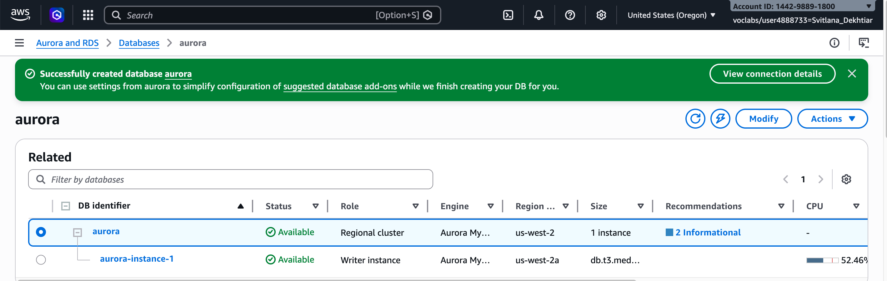
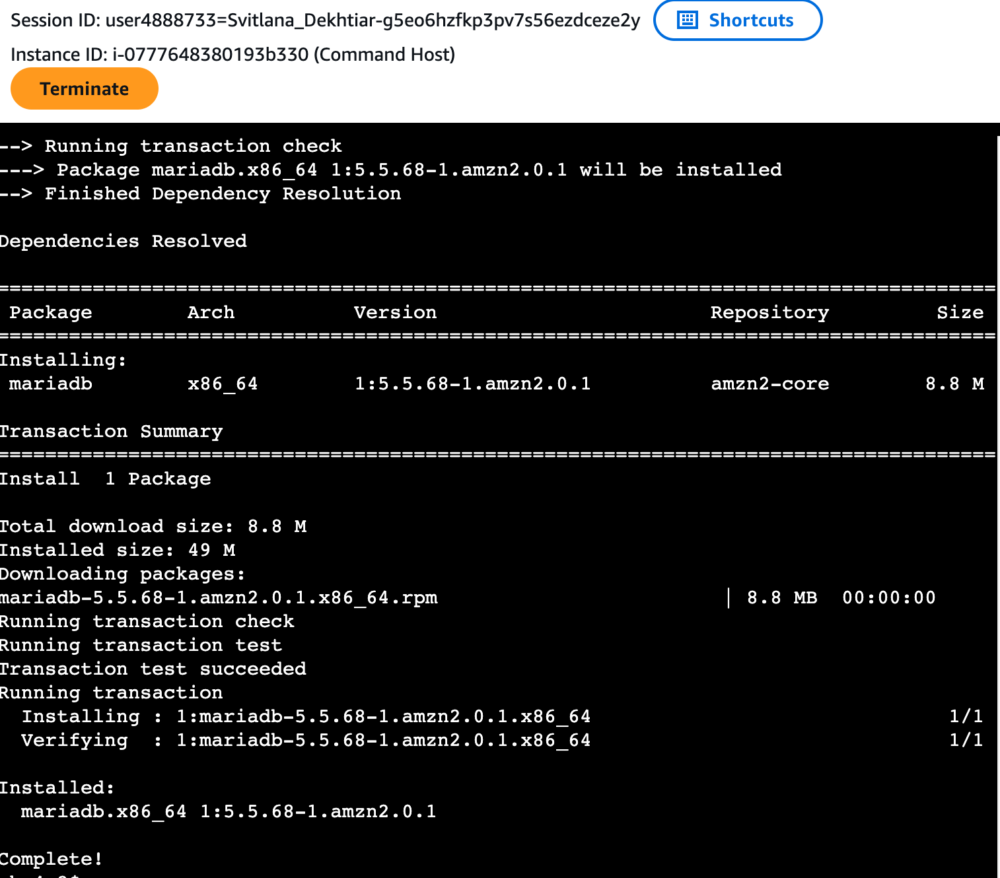
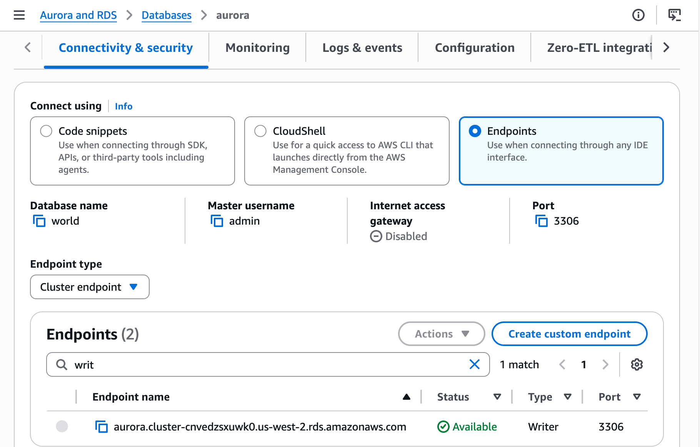
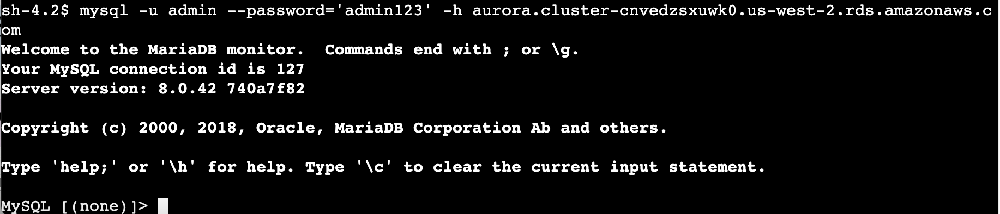
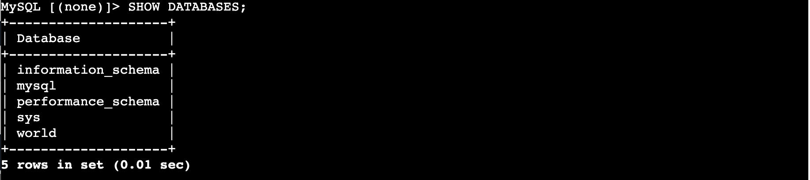
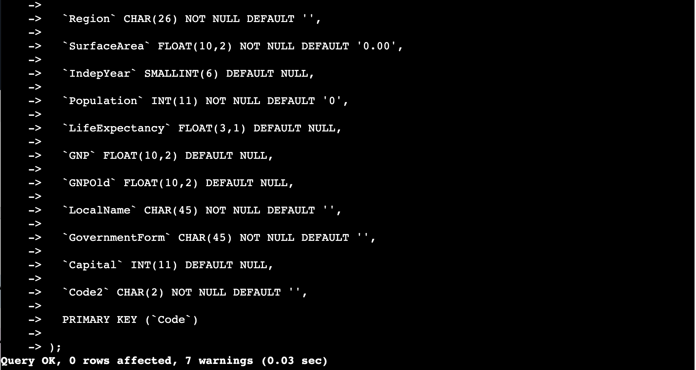
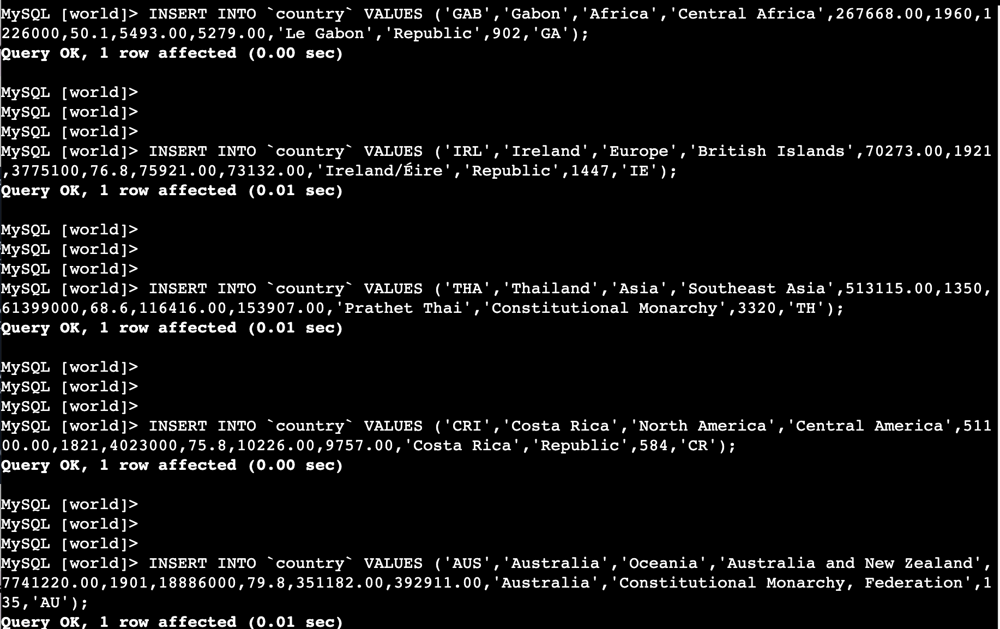
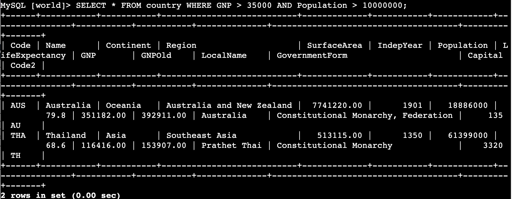

# Lab 274 — Introduction to Amazon Aurora

## About This Lab

Amazon Aurora is AWS's fully managed, MySQL-compatible relational database engine. Unlike self-managed MySQL running on EC2, Aurora is provisioned and operated through Amazon RDS — AWS handles patching, backups, replication, and failover automatically. This lab introduces the core workflow for spinning up an Aurora cluster, connecting to it from a compute instance inside the same VPC, and running SQL statements against it.

The services involved are Amazon RDS (which manages the Aurora cluster), Amazon EC2 (the Command Host used as a jump host to reach the private database endpoint), and AWS Systems Manager Session Manager (which provides browser-based terminal access to EC2 without requiring SSH keys or open inbound ports). Together, these three services represent a pattern used extensively in production cloud environments: private database endpoints accessible only from within the VPC, with compute acting as the access layer.

For a recruiter, this lab demonstrates the ability to provision managed cloud databases, configure network security (VPC, subnet groups, security groups), and connect to and query a relational database running in a private network — all foundational cloud infrastructure skills.

## What I Did

The lab provided a pre-built VPC (LabVPC) with a DB subnet group and a security group (DBSecurityGroup) already configured. I provisioned an Aurora MySQL 8.0 cluster inside that VPC, connected to a pre-built EC2 instance called Command Host (i-0777648380193b330) via Session Manager, installed the MariaDB client on that instance, retrieved the Aurora writer endpoint from the RDS console, connected to the database, created a table, inserted five records, and ran a filtered query.

## Task 1: Create an Aurora Instance

I navigated to the RDS console and created a new Aurora (MySQL Compatible) cluster using Standard create. The key configuration choices were: Dev/Test template, `db.t3.medium` burstable instance class, no Aurora Replica (single-AZ for the lab), placement inside LabVPC with the existing `dbsubnetgroup`, no public access, and `DBSecurityGroup` as the only security group. I also set the initial database name to `world` under Additional configuration, and disabled encryption and enhanced monitoring to keep the lab environment simple.

The cluster identifier was `aurora`, master username `admin`, and password `admin123`. After submitting, the instance took a few minutes to reach Available status.

```
DB cluster identifier: aurora
Engine: Aurora (MySQL Compatible) — version 8.0
Instance class: db.t3.medium
Initial database: world
```



## Task 2: Connect to an Amazon EC2 Linux Instance

I navigated to EC2 → Instances, selected the Command Host instance, and connected using the Session Manager tab. This opened a browser-based terminal without requiring any SSH key configuration or inbound port rules.


## Task 3: Configure the Amazon EC2 Linux Instance to Connect to Aurora

First, I installed the MariaDB client using the yum package manager:

```bash
sudo yum install mariadb -y
```



Next, I returned to the RDS console, opened the `aurora` cluster, and copied the Writer endpoint from the Connectivity & security tab.



With the endpoint in hand, I connected from the Command Host terminal:

```bash
mysql -u admin --password='admin123' -h aurora.cluster-cnvedsxuwk0.us-west-2.rds.amazonaws.com
```

The connection banner confirmed the server version:

```
Welcome to the MariaDB monitor.  Commands end with ; or \g.
Your MySQL connection id is 127
Server version: 8.0.42 740a7f82

MySQL [(none)]>
```

Although the MariaDB client binary was used to connect, the server itself is Aurora MySQL 8.0.42.



## Task 4: Create a Table and Insert and Query Records

I first confirmed the available databases:

```sql
SHOW DATABASES;
```

```
+--------------------+
| Database           |
+--------------------+
| information_schema |
| mysql              |
| performance_schema |
| sys                |
| world              |
+--------------------+
5 rows in set (0.01 sec)
```



I switched to the `world` database:

```sql
USE world;
```

Then created the `country` table:

```sql
CREATE TABLE `country` (
  `Code` CHAR(3) NOT NULL DEFAULT '',
  `Name` CHAR(52) NOT NULL DEFAULT '',
  `Continent` enum('Asia','Europe','North America','Africa','Oceania','Antarctica','South America') NOT NULL DEFAULT 'Asia',
  `Region` CHAR(26) NOT NULL DEFAULT '',
  `SurfaceArea` FLOAT(10,2) NOT NULL DEFAULT '0.00',
  `IndepYear` SMALLINT(6) DEFAULT NULL,
  `Population` INT(11) NOT NULL DEFAULT '0',
  `LifeExpectancy` FLOAT(3,1) DEFAULT NULL,
  `GNP` FLOAT(10,2) DEFAULT NULL,
  `GNPOld` FLOAT(10,2) DEFAULT NULL,
  `LocalName` CHAR(45) NOT NULL DEFAULT '',
  `GovernmentForm` CHAR(45) NOT NULL DEFAULT '',
  `Capital` INT(11) DEFAULT NULL,
  `Code2` CHAR(2) NOT NULL DEFAULT '',
  PRIMARY KEY (`Code`)
);
```



I inserted five country records — Gabon, Ireland, Thailand, Costa Rica, and Australia:

```sql
INSERT INTO `country` VALUES ('GAB','Gabon','Africa','Central Africa',267668.00,1960,1226000,50.1,5493.00,5279.00,'Le Gabon','Republic',902,'GA');
INSERT INTO `country` VALUES ('IRL','Ireland','Europe','British Islands',70273.00,1921,3775100,76.8,75921.00,73132.00,'Ireland/Éire','Republic',1447,'IE');
INSERT INTO `country` VALUES ('THA','Thailand','Asia','Southeast Asia',513115.00,1350,61399000,68.6,116416.00,153907.00,'Prathet Thai','Constitutional Monarchy',3320,'TH');
INSERT INTO `country` VALUES ('CRI','Costa Rica','North America','Central America',51100.00,1821,4023000,75.8,10226.00,9757.00,'Costa Rica','Republic',584,'CR');
INSERT INTO `country` VALUES ('AUS','Australia','Oceania','Australia and New Zealand',7741220.00,1901,18886000,79.8,351182.00,392911.00,'Australia','Constitutional Monarchy, Federation',135,'AU');
```



Finally, I ran a filtered query to find countries with GNP over 35,000 and population over 10,000,000:

```sql
SELECT * FROM country WHERE GNP > 35000 AND Population > 10000000;
```

```
+------+-----------+-----------+---------------------------+-------------+-----------+------------+----------------+-----------+-----------+--------------+-------------------------------------+---------+-------+
| Code | Name      | Continent | Region                    | SurfaceArea | IndepYear | Population | LifeExpectancy | GNP       | GNPOld    | LocalName    | GovernmentForm                      | Capital | Code2 |
+------+-----------+-----------+---------------------------+-------------+-----------+------------+----------------+-----------+-----------+--------------+-------------------------------------+---------+-------+
| AUS  | Australia | Oceania   | Australia and New Zealand | 7741220.00  |      1901 |   18886000 |           79.8 | 351182.00 | 392911.00 | Australia    | Constitutional Monarchy, Federation |     135 | AU    |
| THA  | Thailand  | Asia      | Southeast Asia            |  513115.00  |      1350 |   61399000 |           68.6 | 116416.00 | 153907.00 | Prathet Thai | Constitutional Monarchy             |    3320 | TH    |
+------+-----------+-----------+---------------------------+-------------+-----------+------------+----------------+-----------+-----------+--------------+-------------------------------------+---------+-------+
2 rows in set (0.00 sec)
```

Australia and Thailand met both conditions. Ireland's population is under 10 million; Gabon and Costa Rica have GNP values well below the threshold.



## Challenges I Had

No significant issues encountered during this lab.

## What I Learned

- **Aurora is MySQL-compatible but not the same as MySQL on EC2.** Because Aurora is managed by RDS, I don't interact with the underlying OS or handle binary installation. The database endpoint is DNS-based, and AWS handles failover, backups, and patching behind that endpoint. The trade-off is less control — you can't install arbitrary MySQL plugins — but the operational overhead drops significantly.

- **The writer endpoint routes to the primary instance regardless of failover.** Aurora's cluster endpoint (writer) is a DNS record that always resolves to the current primary. If the primary fails, Aurora promotes a replica and updates that DNS record — so applications reconnect without changing their connection string. This is meaningfully different from a self-managed MySQL setup where failover requires manual intervention or external tooling.

- **A DB subnet group restricts which subnets Aurora can place instances in.** Rather than choosing a single subnet, you define a group of subnets across multiple AZs. Aurora uses this to decide where to place the primary and, if configured, read replicas. Using private subnets (no direct internet route) and setting Public access to No means the only way to reach the database is from inside the VPC — a standard security posture for production databases.

- **Session Manager removes the need for a bastion host or open SSH ports.** Traditionally, accessing a private EC2 instance required either a VPN or a publicly reachable jump server. Session Manager routes the terminal session through the AWS Systems Manager API, so the EC2 instance only needs outbound HTTPS — no inbound ports needed at all. This is both more secure and easier to audit.

- **The MariaDB client connects to Aurora MySQL.** The client binary installed via `yum install mariadb` is branded as MariaDB, but it speaks the MySQL wire protocol and connects cleanly to Aurora MySQL 8.0. The server version (`8.0.28`) is visible in the connection banner. This is a common source of confusion — the client and server can be from different distributions as long as the protocol version is compatible.

## Resource Names Reference

| Resource | Value |
|---|---|
| DB Cluster Identifier | aurora |
| Master Username | admin |
| Master Password | admin123 |
| Initial Database | world |
| Instance Class | db.t3.medium |
| Engine | Aurora MySQL 8.0.42 (740a7f82) |
| Region | us-west-2 |
| Availability Zone | us-west-2a |
| Aurora Writer Endpoint | aurora.cluster-cnvedsxuwk0.us-west-2.rds.amazonaws.com |
| Port | 3306 |
| VPC | LabVPC |
| Subnet Group | dbsubnetgroup |
| Security Group | DBSecurityGroup |
| Internet Gateway | Disabled (no public access) |
| EC2 Instance | Command Host (i-0777648380193b330) |
| Connection Method | Session Manager (no SSH) |
| MySQL Connection ID | 127 |
| Table Created | country |
| Records Inserted | 5 (GAB, IRL, THA, CRI, AUS) |
| Query Result Count | 2 rows (AUS, THA) |
| Local Lab Folder | ~/Desktop/AWS-reStart-Journey/Labs/Databases/lab-274-intro-to-aurora |
| Screenshots Folder | ~/Desktop/AWS-reStart-Journey/Labs/Databases/lab-274-intro-to-aurora/screenshots/ |

## Commands Reference

All commands run during this lab are saved in [commands.sh](commands.sh).
