# Lab 275: Introduction to Amazon DynamoDB

## About This Lab

Amazon DynamoDB is a fully managed NoSQL database service that delivers consistent, single-digit millisecond performance at any scale. Unlike relational databases, DynamoDB does not require a predefined schema — each item in a table can have its own set of attributes beyond the required keys. This makes it well-suited for applications where data shapes vary or where throughput and availability requirements are strict.

This lab covers the core DynamoDB workflow: creating a table with a partition key and sort key, inserting items with different attribute sets, modifying existing data, querying by primary key, scanning with filters, and deleting the table. These are the fundamental operations any cloud practitioner needs to understand when working with NoSQL data on AWS. For a recruiter, this lab demonstrates that I can work directly with a managed AWS database service through the console — creating, querying, and destroying resources cleanly without leaving orphaned infrastructure.

Services used: Amazon DynamoDB, AWS Management Console.

## What I Did

The lab environment was pre-configured with an active AWS account in the US East (Oregon) region. There was no EC2 or SSH involved — all work was done through the DynamoDB section of the AWS Management Console. I created a Music table in on-demand capacity mode, populated it with three items representing different artists and songs, corrected a data entry error, ran both a query and a scan to retrieve specific records, and then deleted the table at the end.

## Task 1: Create a new table

I navigated to DynamoDB in the AWS Management Console and created a table named **Music**. I set **Artist** as the partition key (String) and **Song** as the sort key (String), leaving the default settings for indexes. The table was created in on-demand capacity mode and moved to Active status within about a minute.

The combination of Artist + Song forms a composite primary key. Two items can share the same Artist as long as their Song values differ, which is exactly what the Music use case requires.

```
Table name:    Music
Partition key: Artist (String)
Sort key:      Song (String)
Capacity mode: On-demand
Region:        United States (Oregon)
```

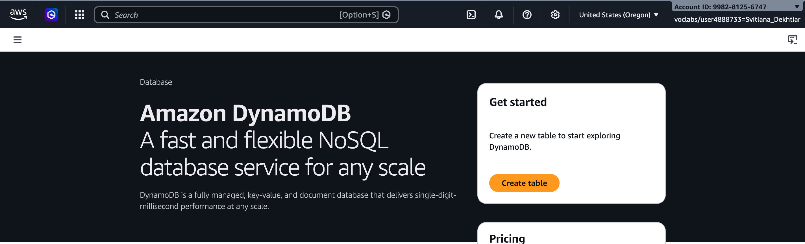

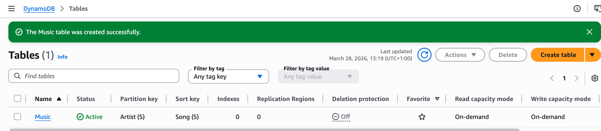

## Task 2: Add data

I added three items to the Music table. Each item required Artist and Song, but I also added different extra attributes to demonstrate DynamoDB's schema flexibility — each item has a different attribute set.

**Item 1 — Pink Floyd: Money**

```
Artist: Pink Floyd
Song:   Money
Album:  The Dark Side of the Moon
Year:   1973
```

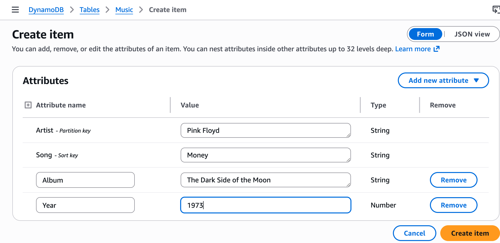

**Item 2 — John Lennon: Imagine**

```
Artist: John Lennon
Song:   Imagine
Album:  Imagine
Year:   1971
Genre:  Soft rock
```

This item includes a `Genre` attribute that the Pink Floyd item does not have. DynamoDB stored it without any schema changes.

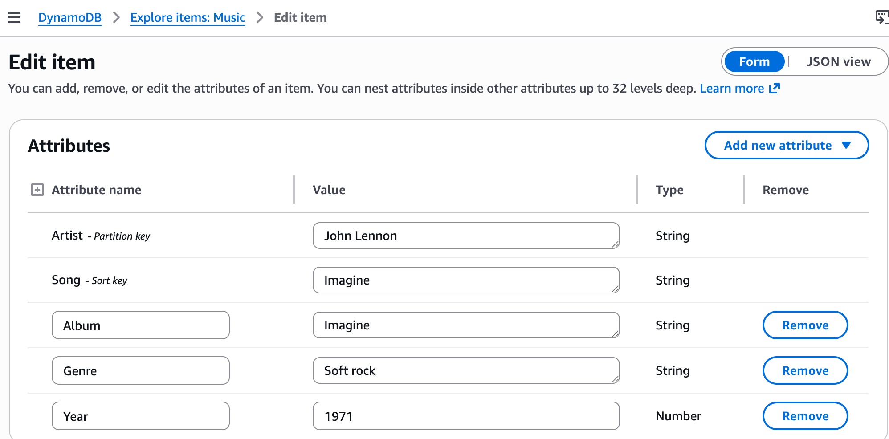

**Item 3 — Psy: Gangnam Style**

```
Artist:        Psy
Song:          Gangnam Style
Album:         Psy 6 (Six Rules), Part 1
Year:          2011
LengthSeconds: 219
```

This item includes `LengthSeconds`, which appears on no other item. Year was entered as 2011 intentionally — it gets corrected in Task 3.

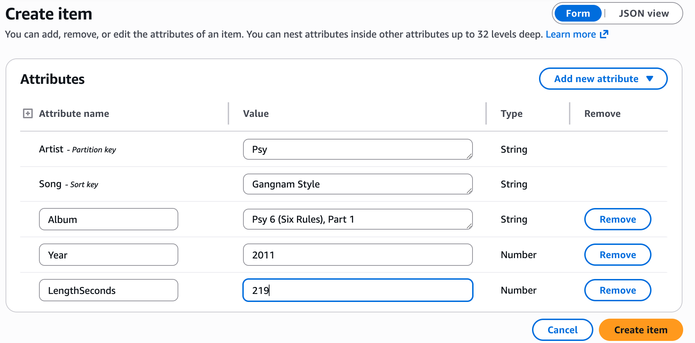

After adding all three items:

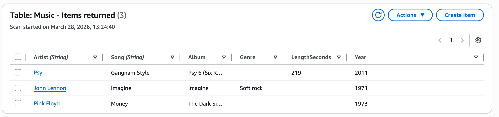

## Task 3: Modify an existing item

The Psy item had Year set to 2011, which was incorrect — Gangnam Style was released in 2012. I opened the item via Explore Items, changed the Year value from 2011 to 2012, and chose Save and close.

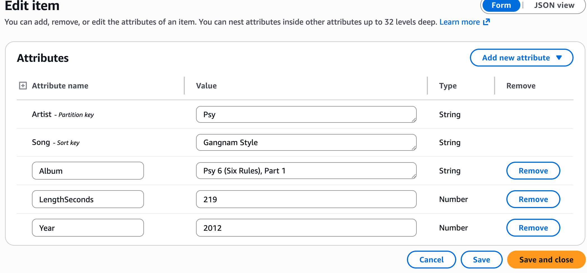

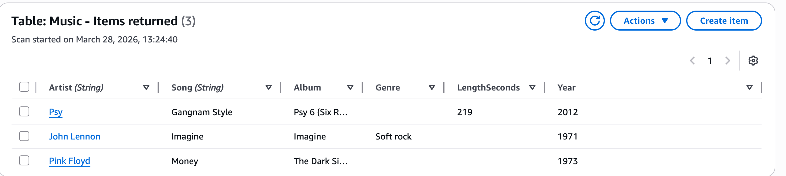

## Task 4: Query the table

DynamoDB supports two retrieval methods: **Query** and **Scan**.

A **Query** uses the partition key (and optionally the sort key) to retrieve items directly via the table's index. It only reads items that match — no wasted reads.

A **Scan** reads every item in the table first, then applies filters. It works for any attribute but consumes full read capacity regardless of how many items match.

**Query — Psy / Gangnam Style**

I queried using Artist = Psy and Song = Gangnam Style:

```
Items returned: 1
Items scanned:  1
Efficiency:     100%
RCUs consumed:  0.5
```

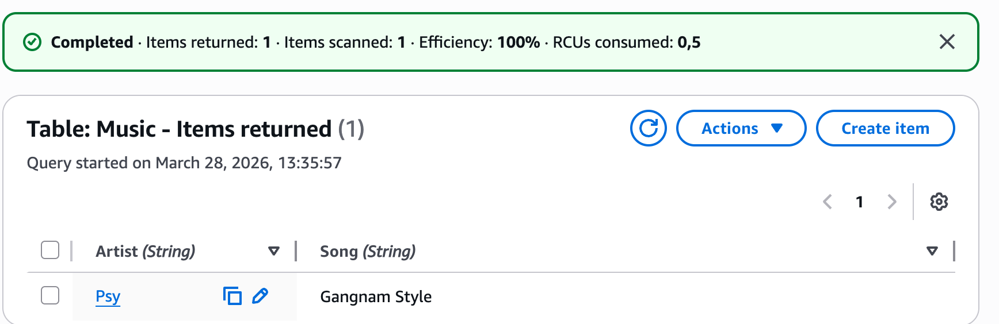

**Scan — Year = 1971**

I configured a scan with Attribute name: Year, Type: Number, Condition: Equal to, Value: 1971:

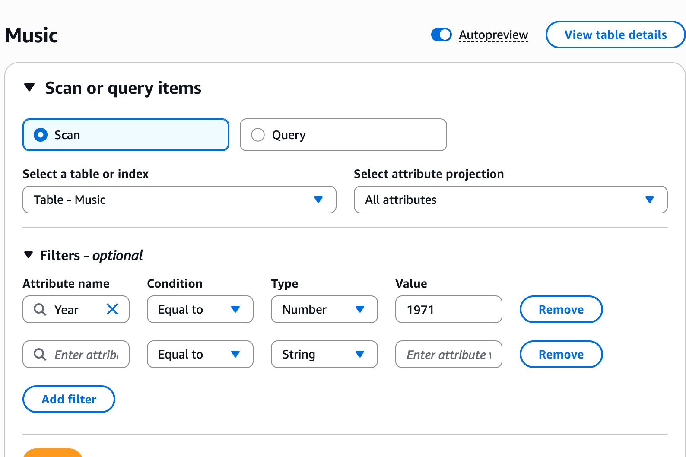

```
Items returned: 1
Items scanned:  3
Efficiency:     33.33%
RCUs consumed:  2
```

One item returned: John Lennon / Imagine / 1971.


The efficiency difference is concrete here: the query used 0.5 RCUs and touched exactly 1 item; the scan used 2 RCUs and touched all 3 items before filtering down to 1.

## Task 5: Delete the table

I deleted the Music table from Actions > Delete table. The confirmation dialog required typing `confirm` before the action could proceed. After deletion, the Tables list showed 0 tables.

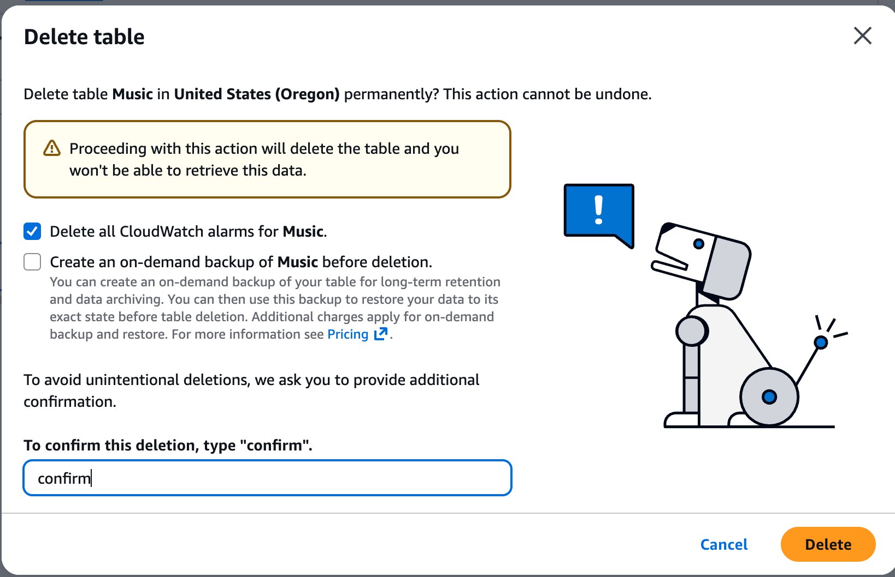

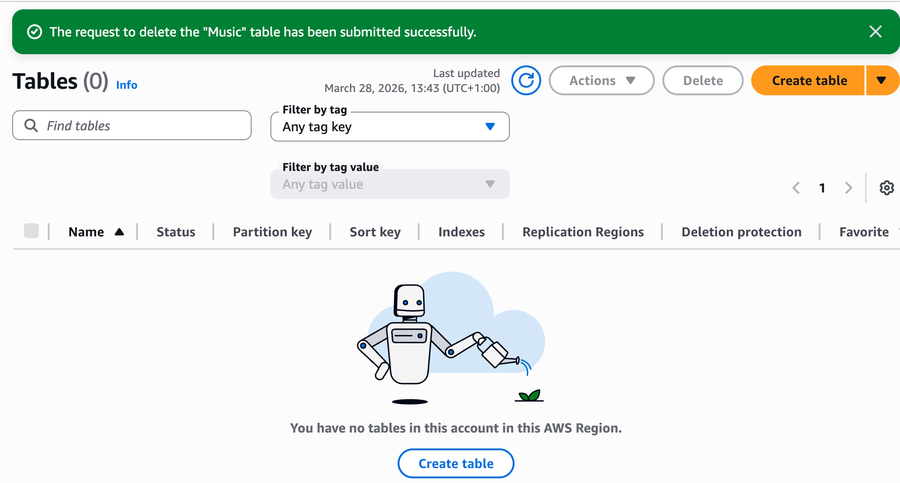

## Challenges I Had

The lab guide instructed me to type `delete` in the deletion confirmation dialog, but the actual DynamoDB console prompt asks for `confirm`. This is a discrepancy between the lab instructions and the current AWS console UI. I typed `confirm` as the console required and the deletion proceeded without issues.

## What I Learned

- DynamoDB uses a partition key to distribute data across physical partitions. When you also define a sort key, the two together form a composite primary key — this means a table can hold multiple items with the same artist as long as each has a different song title. The partition key alone is not required to be unique; only the combination must be.

- Unlike relational databases, DynamoDB does not enforce a schema beyond the required key attributes. Each item can carry a completely different set of attributes. I added Genre to one item and LengthSeconds to another without any ALTER TABLE equivalent — DynamoDB handled it at the item level.

- The efficiency difference between Query and Scan is measurable, not theoretical. In this lab the query consumed 0.5 RCUs and read 1 item; the scan consumed 2 RCUs and read 3 items to return 1. In a production table with millions of items, a full-table scan consuming proportional read capacity regardless of result size becomes a significant cost and performance concern.

- DynamoDB is a fully managed service: there is no server to provision, no storage volume to attach, and no OS to maintain. Creating a table, inserting items, querying, and deleting all happened through a console interface with no infrastructure setup. The on-demand capacity mode meant I did not need to estimate read/write throughput upfront.

- Cloud lab guides can lag behind the actual AWS console UI. The deletion confirmation word changed from `delete` to `confirm` at some point after this lab was written. Recognising the discrepancy, reading the actual console prompt, and adapting is a normal part of working with cloud services — documentation is always slightly behind the product.

## Resource Names Reference

| Resource / Parameter | Value |
|---|---|
| DynamoDB Table Name | Music |
| Partition Key | Artist (String) |
| Sort Key | Song (String) |
| Capacity Mode | On-demand |
| AWS Region | United States (Oregon) |
| Delete confirmation word | confirm |
| Local repo root | Desktop/AWS-reStart-Journey/Labs/Databases/lab-275-introduction-to-dynamodb |
| Screenshots folder | Desktop/AWS-reStart-Journey/Labs/Databases/lab-275-introduction-to-dynamodb/screenshots/ |
| GitHub repo | https://github.com/svitlana-dekhtiar/aws-restart-journey |

## Commands Reference

All commands run during this lab are saved in [commands.sh](commands.sh).
