# Lab 262: Internet Protocols — Static and Dynamic Addresses

## About This Lab

This lab focuses on one of the most common networking issues in AWS: understanding why EC2 instance public IP addresses change on every stop/start cycle, and how to fix it. The core AWS service is EC2, and the key concept is Elastic IP (EIP) addresses — static public IPv4 addresses that you allocate to your account and associate with instances.

In a real cloud role, this knowledge matters immediately. Any production workload that exposes an IP address to external systems — DNS records, firewall allowlists, third-party integrations — breaks if the IP changes unexpectedly. Knowing when to use a dynamic IP versus an EIP, and how to configure the latter, is a practical skill any cloud support or infrastructure engineer needs on day one.

## What I Did

I worked as a cloud support engineer troubleshooting a simulated customer ticket. The customer's EC2 instance was losing its public IP every time it was stopped and restarted, breaking connected resources. I replicated the issue by launching an EC2 instance (`i-0f05fe2f53bee1abb`, named `test instance`) in the pre-built VPC `vpc-0c2c76f4572ccc85e` (Lab VPC), subnet `subnet-0227522f1f0e55dd5` (Public Subnet 1) with auto-assigned public IP enabled. I observed the dynamic behaviour firsthand, then resolved it by allocating an Elastic IP (`50.112.147.142`) and associating it with the instance.

## Task 1: Investigate the Customer's Environment

### Launching the test instance

I launched an EC2 instance with the following configuration:

- AMI: Amazon Linux 2 (HVM)
- Instance type: t3.micro
- Network: vpc-0c2c76f4572ccc85e (Lab VPC)
- Subnet: subnet-0227522f1f0e55dd5 (Public Subnet 1)
- Auto-assign Public IP: Enabled
- Security group: Linux Instance SG
- Key pair: vockey | RSA
- Name: test instance

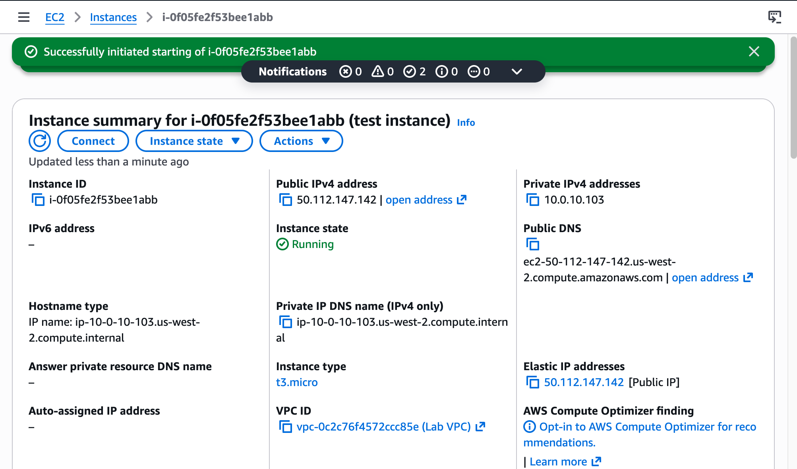

### Observing dynamic IP behaviour

Once the instance was running, I noted the Public IPv4 address (`44.249.61.24`) and Private IPv4 address (`10.0.10.103`) in the instance summary.

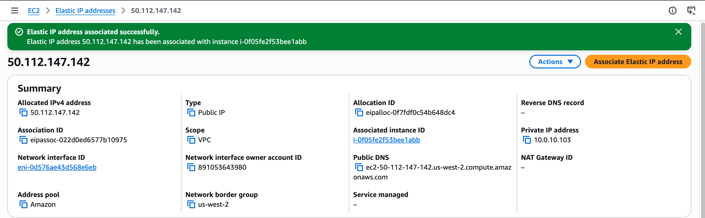

I then stopped the instance. The new AWS console still displayed the previous public IP in the summary field rather than clearing it — this is a UI display lag. The IP is genuinely released at the network level.

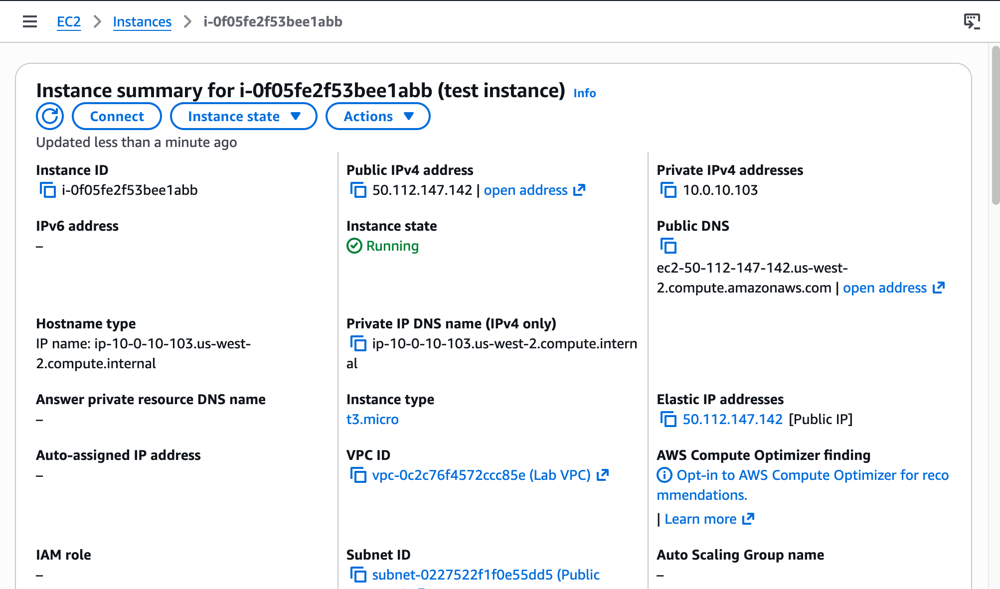

After restarting, the public IP had changed to `44.255.198.4` — a new address assigned from the AWS pool. The private IP `10.0.10.103` was unchanged throughout.

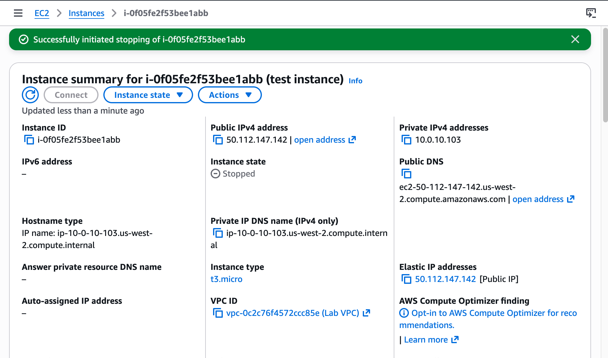

This confirmed the root cause: auto-assigned public IPs are dynamic. AWS releases them on stop and assigns a new one on start.

### Allocating an Elastic IP

I navigated to EC2 → Network & Security → Elastic IPs and clicked **Allocate Elastic IP address** with default settings. The allocated EIP was `50.112.147.142` (Allocation ID: `eipalloc-0f7fdf0c54b648dc4`).

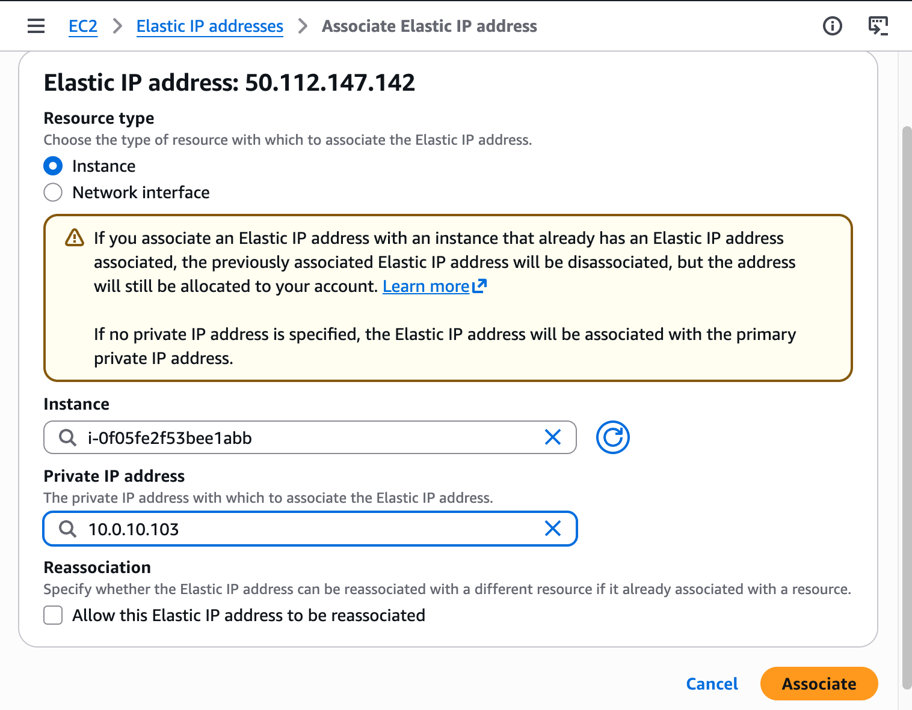

### Associating the EIP to the instance

I selected the EIP, then chose Actions → Associate Elastic IP address. I set the instance to `i-0f05fe2f53bee1abb` and the private IP to `10.0.10.103`, then clicked Associate.

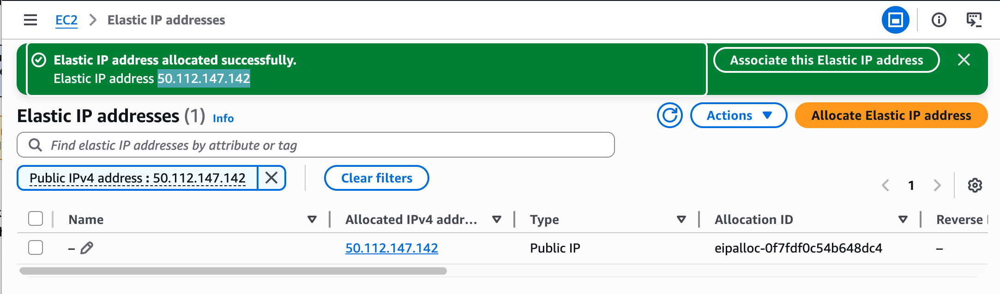

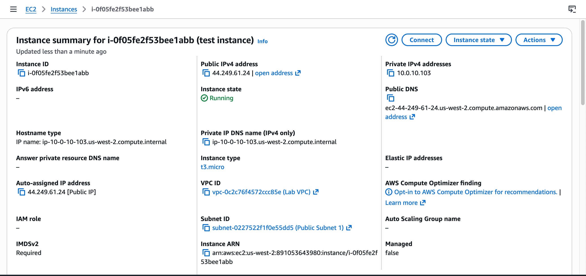

### Verifying static IP behaviour

Back in the Instances view, the instance summary now showed `50.112.147.142` in both the **Public IPv4 address** and **Elastic IP addresses** fields.

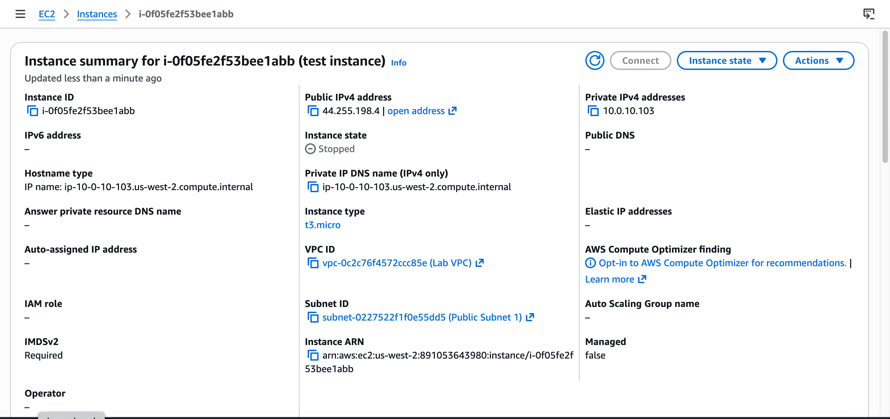

I stopped the instance. The EIP `50.112.147.142` remained visible in the **Elastic IP addresses** field — unlike a dynamic IP, it is not released on stop.

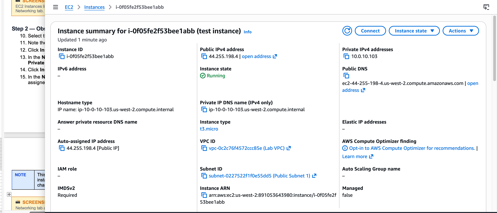

After restarting, the public IP was still `50.112.147.142` — identical to before. The EIP is persistent. The customer's issue is resolved.

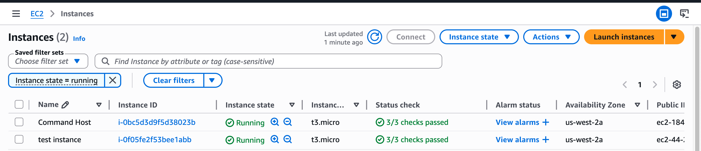

## Task 2: Send the Response to the Customer

Based on my investigation, I prepared the following response to Bob's ticket:

---

Hi Bob,

I've investigated the issue with your Public Instance and identified the root cause.

Your instance is configured with an auto-assigned public IP address. This type of IP is dynamic — AWS releases it back to the shared pool whenever the instance is stopped, and assigns a new one when it starts again. That is why the address changes every time.

The fix is to allocate an Elastic IP (EIP) and associate it with your instance. An EIP is a static public IPv4 address tied to your AWS account — it persists through stop/start cycles and will never change unless you explicitly release it.

I have applied this fix to the test environment. The EIP `50.112.147.142` is now associated with the instance and verified to remain unchanged through a full stop/start cycle.

Note: AWS charges for EIPs that are allocated but not associated with a running instance. Keep it associated whenever the instance is running to avoid unnecessary charges.

Let me know if you have any questions.

---

## Challenges I Had

**Console showing public IP on a stopped instance — then not.**

When I stopped `test instance` and checked the instance summary without refreshing, the console still displayed the previous public IP (`44.255.198.4`) in the Public IPv4 address field. This contradicted what the lab instructions described — that the field would clear when the instance stops.

To verify whether this was a UI issue or real AWS behaviour, I launched a second instance (`test instance 2`, `i-0ccaf9080af137484`) with identical settings. I stopped it, then closed the browser entirely and reopened it. This time, the console correctly showed the Public IPv4 address field as empty (`—`) while the instance was in the Stopped state.

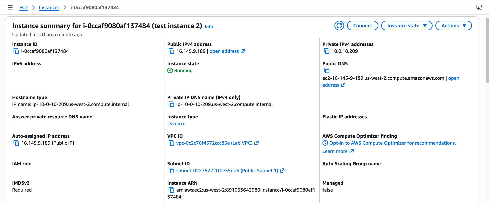

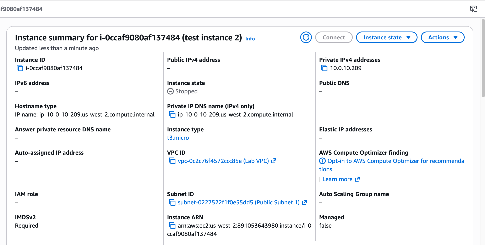

After restarting, a completely new IP was assigned (`44.249.30.34`), which confirmed the dynamic behaviour described in the lab.

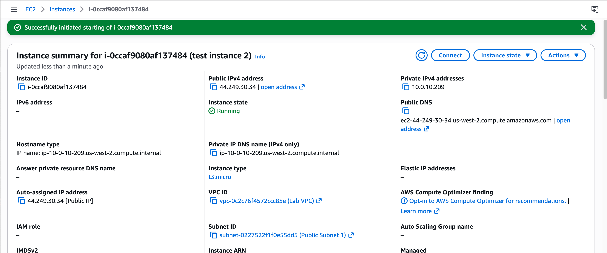

**Root cause:** The first observation was a browser cache issue — the AWS console was displaying a stale value from the previous page load. When the browser session was fresh, the console correctly showed the IP as released. This confirms that the lab instructions are accurate: the public IP is genuinely released when the instance stops. The discrepancy on the first instance was purely a display artefact.

## What I Learned

- When an EC2 instance is launched with Auto-assign Public IP enabled, AWS assigns a public IP from its pool — but that IP belongs to AWS, not to the instance. The moment the instance stops, AWS reclaims it and may assign it to something else entirely. This is expected behaviour by design for ephemeral workloads.

- An Elastic IP is a static public IPv4 address that you explicitly allocate to your AWS account. It stays allocated until you release it, regardless of what happens to the instance. Once associated, it survives stop/start cycles, meaning DNS records, firewall rules, and API allowlists that reference that IP continue to work.

- The private IP of an EC2 instance is always static within its VPC subnet for the lifetime of the instance. Only the public IP is affected by stop/start cycles.

- There is a cost implication to EIPs: AWS charges for allocated EIPs that are not currently associated with a running instance. A running instance with an associated EIP incurs no EIP charge — only idle or unassociated EIPs do. This matters when deciding whether to allocate one.

- The correct fix for this type of customer ticket is always to allocate an EIP and associate it, not to leave the instance permanently running. Leaving it running to preserve the IP is expensive and fragile; an EIP is the purpose-built solution.

## Resource Names Reference

| Resource | Value |
|----------|-------|
| VPC | vpc-0c2c76f4572ccc85e (Lab VPC) |
| Public Subnet | subnet-0227522f1f0e55dd5 (Public Subnet 1) |
| Security Group | Linux Instance SG |
| Key Pair | vockey \| RSA |
| Test Instance Name | test instance |
| Test Instance ID | i-0f05fe2f53bee1abb |
| Private IPv4 | 10.0.10.103 (static — never changed) |
| Dynamic Public IPv4 (1st run) | 44.249.61.24 |
| Dynamic Public IPv4 (2nd run) | 44.255.198.4 |
| Elastic IP (EIP) | 50.112.147.142 |
| EIP Allocation ID | eipalloc-0f7fdf0c54b648dc4 |
| EIP Association ID | eipassoc-022d0ed6577b10975 |
| Network Interface | eni-0d576ae43d568e6eb |
| Region | us-west-2 (United States — Oregon) |
| Local Repo | ~/Desktop/AWS-reStart-Journey/Labs/Networking/lab-262-static-dynamic-addresses |
| Screenshots Folder | ~/Desktop/AWS-reStart-Journey/Labs/Networking/lab-262-static-dynamic-addresses/screenshots/ |

## Commands Reference

All commands run during this lab are saved in [commands.sh](commands.sh).
