# Lab 263 — Create Subnets and Allocate IP Addresses in an Amazon VPC

## About This Lab

This lab covers the fundamentals of Amazon VPC design: selecting the right CIDR block based on IP address requirements, creating a VPC with a public subnet, and understanding why private IP address ranges are used for cloud networking. The core AWS service is Amazon VPC, with supporting concepts from RFC 1918 (private address space) and CIDR notation.

For a recruiter, this demonstrates that I can translate plain-language networking requirements into correct AWS infrastructure decisions — specifically, how to size a VPC and subnet rather than accepting defaults.

## What I Did

I worked in the AWS Management Console in the `us-west-2` region. The scenario presented a customer who needed a VPC with approximately 15,000 private IP addresses in a `192.x.x.x` range and a public subnet with at least 50 usable IPs. I calculated the correct CIDR blocks, built the VPC using the "VPC and more" wizard, and verified the resulting architecture including the Internet Gateway attachment and route table. The VPC (`vpc-08cec88201afa16c0`) was created with CIDR `192.168.0.0/18` and a single public subnet (`subnet-07275adf2ccbaa201`) with CIDR `192.168.1.0/26`.

## Task 1: Investigate the Customer's Needs

The key decision was choosing the right CIDR blocks. `192.168.0.0/18` is within the RFC 1918 private address space and provides 16,384 IPs — the smallest standard block that exceeds 15,000. For the public subnet, `/26` gives 64 total addresses (59 usable after AWS reserves 5), which satisfies the ≥50 requirement.

I opened the VPC dashboard and clicked **Create VPC**, selecting **VPC and more**. The wizard was configured across several sections:

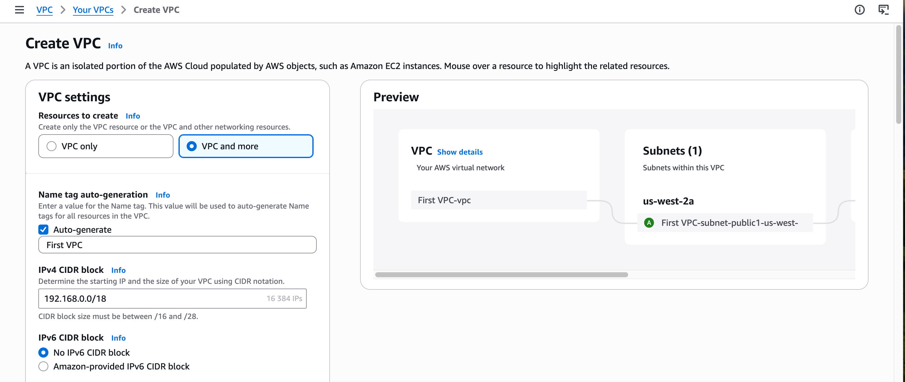

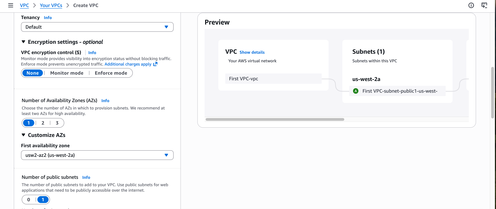

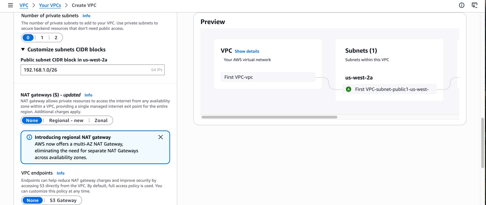

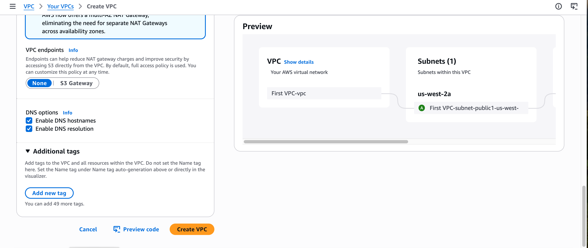

After clicking **Create VPC**, the console showed the workflow completion page with all resources created successfully.

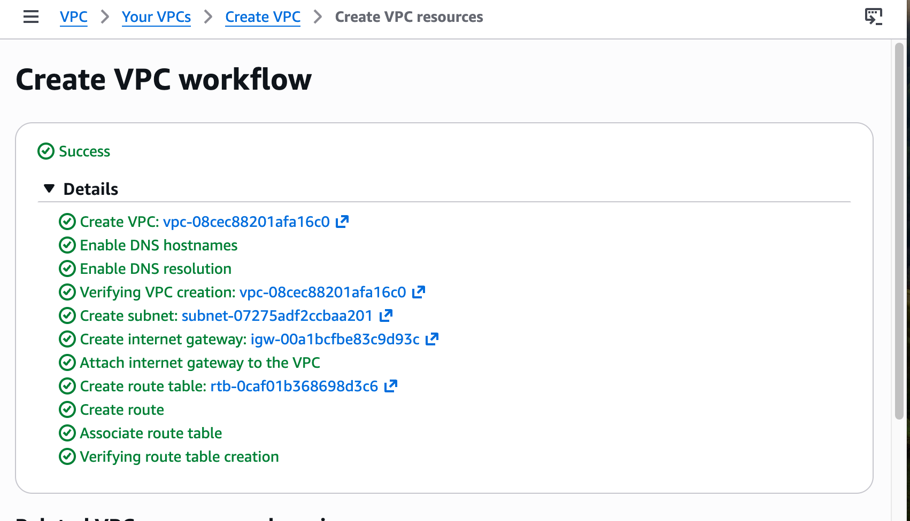

I confirmed the VPC appeared in the **Your VPCs** list with status Available.

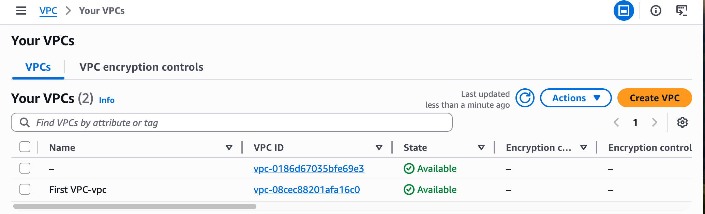

I opened the VPC detail page to verify the CIDR and DNS settings.

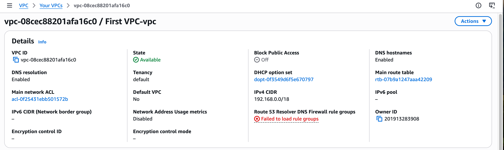

I verified the Internet Gateway was created and attached to the VPC.

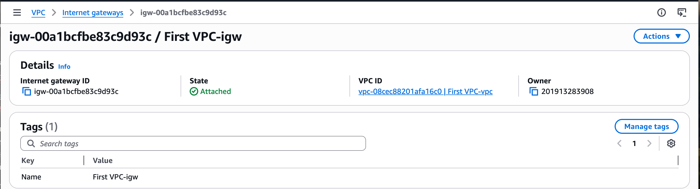

I confirmed the public subnet details: CIDR `192.168.1.0/26`, 59 available IPs, associated with the correct VPC and route table.

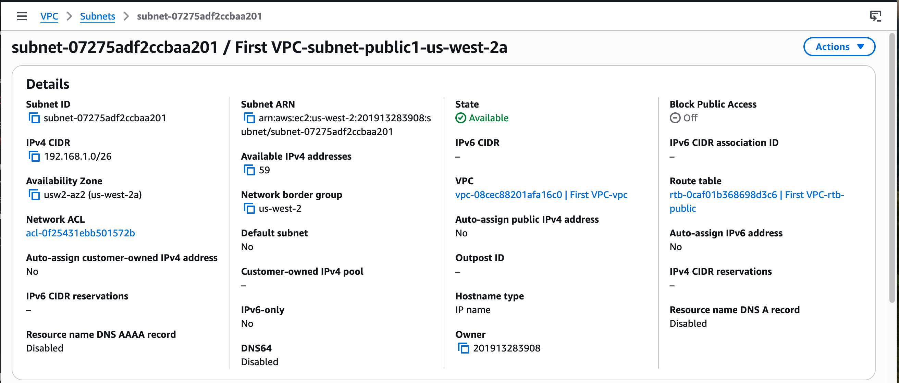

I checked the subnet's route table to confirm internet routing was configured correctly: the `0.0.0.0/0` route points to `igw-00a1bcfbe83c9d93c`, which makes the subnet publicly routable.

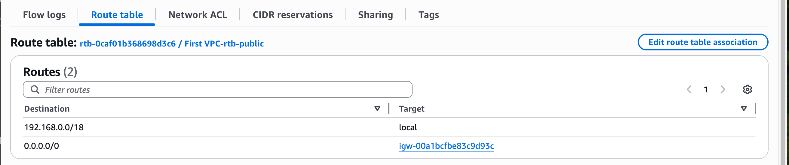

## Task 2: Review the Architecture

I reviewed the completed architecture using the **Resource map** tab on the VPC detail page. It shows the VPC, public subnet in `us-west-2a`, two route tables (one public, one main), and the Internet Gateway — confirming the full architecture matches the customer's requirements.

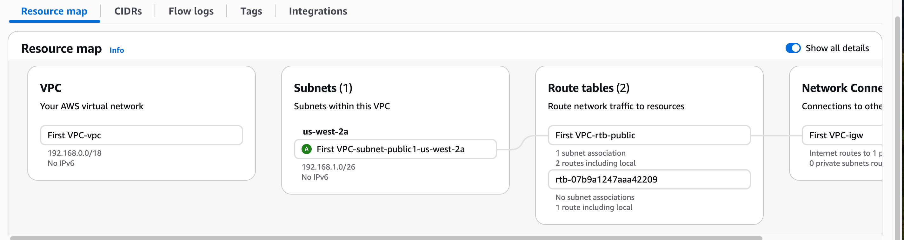

The CIDR decisions hold up: `192.168.0.0/18` satisfies the 15,000 IP requirement and is RFC 1918 compliant. `192.168.1.0/26` provides 59 usable IPs, meeting the ≥50 threshold. The route table entry `0.0.0.0/0 → igw-00a1bcfbe83c9d93c` is what makes the subnet publicly routable — not just the CIDR assignment.

## Challenges I Had

The lab instructions describe an older VPC Wizard with a **"VPC with a Single Public Subnet"** option that no longer exists in the AWS Console. The current interface uses a unified **"VPC and more"** flow. To replicate the intended architecture, I set AZs to 1, public subnets to 1, and private subnets to 0. The result matched the lab requirements exactly.

During an earlier attempt I accidentally selected **"VPC only"** instead of **"VPC and more"**. This created a VPC with no subnet, no Internet Gateway, and DNS hostnames disabled — none of which are visible until after creation. The fix was to delete that VPC and recreate it with the correct option.

The VPC detail page showed a **"Failed to load rule groups"** error under Route 53 Resolver DNS Firewall. This is a permission restriction in the lab environment and has no effect on VPC functionality.

## What I Learned

- **When sizing a VPC CIDR block**, choose the smallest block that covers the required IP count plus AWS's per-subnet reservation of 5 addresses — over-allocating wastes address space that could be used for future subnets within the same VPC.
- **When a customer specifies a "192.x.x.x" range**, the correct RFC 1918 block is within `192.168.0.0/16` — not all `192.x.x.x` addresses are private, and using a public range inside a VPC causes routing conflicts.
- **When selecting a CIDR for ~15,000 IPs**, `/18` (16,384) is the correct choice — `/19` (8,192) falls short and `/17` (32,768) wastes more space than necessary.
- **When AWS reserves 5 IPs per subnet** (network address, VPC router, DNS, future use, broadcast), a `/26` gives 59 usable addresses, not 64 — this matters when verifying a subnet meets a minimum IP requirement.
- **When a subnet's route table has a `0.0.0.0/0` entry pointing to an Internet Gateway**, traffic from that subnet can reach the internet — this route entry is what defines a subnet as "public", not the CIDR or the IGW attachment alone.

## Resource Names Reference

| Resource | Value |
|---|---|
| VPC Name | First VPC-vpc |
| VPC ID | vpc-08cec88201afa16c0 |
| VPC IPv4 CIDR Block | 192.168.0.0/18 |
| Subnet Name | First VPC-subnet-public1-us-west-2a |
| Subnet ID | subnet-07275adf2ccbaa201 |
| Public Subnet CIDR | 192.168.1.0/26 |
| Available IPs in Subnet | 59 |
| Availability Zone | us-west-2a |
| Internet Gateway ID | igw-00a1bcfbe83c9d93c |
| Public Route Table ID | rtb-0caf01b368698d3c6 |
| Main Route Table ID | rtb-07b9a1247aaa42209 |
| Region | us-west-2 |
| Local Repo Root | ~/Desktop/AWS-reStart-Journey/Labs/Networking/lab-263-create-subnets-vpc |
| Screenshots Folder | ~/Desktop/AWS-reStart-Journey/Labs/Networking/lab-263-create-subnets-vpc/screenshots/ |
| GitHub Repo | https://github.com/svitlana-dekhtiar/aws-restart-journey |

## Commands Reference

All commands run during this lab are saved in `commands.sh`.
