# Lab 264 — Creating Networking Resources in an Amazon Virtual Private Cloud (VPC)

## About This Lab

This lab covers building a fully functional VPC from scratch inside AWS — without any pre-configured resources. The scenario is a customer who cannot ping the internet from their EC2 instance. The task is to diagnose what is missing and construct the correct networking stack: VPC, subnet, route table, internet gateway, network ACL, and security group. Every component must be correctly configured and associated before the EC2 instance can reach the internet.

The lab reinforces how the individual pieces of an AWS VPC relate to each other in a layered architecture. It demonstrates how traffic flows from an EC2 instance, through the security group, through the NACL, to the route table, and out via the internet gateway. Understanding this flow is directly applicable to designing and debugging production networking configurations on AWS.

## What I Did

I worked in the AWS Management Console building all networking resources in order from VPC down to EC2. I created VPC `vpc-078a40425be9f13b8` with CIDR `192.168.0.0/18`, subnet `subnet-076649e214715c61a` with CIDR `192.168.1.0/26` in `us-west-2d`, route table `rtb-0a688eb6fee7cad7f` with a `0.0.0.0/0` route targeting IGW `igw-0bab926c4179d2f78`, NACL `acl-0902701903fca16b1` with rule 100 allowing all inbound and outbound traffic, and security group `sg-0ad911c78dda3ac6c` with SSH, HTTP, and HTTPS inbound rules. I launched EC2 instance `i-073b6f31fe15592b2` into the public subnet, connected via SSH to `44.249.193.243`, and confirmed internet connectivity with `ping google.com`.

## Task 1: Investigate the customer's needs

**Creating the VPC**

Created `Test VPC` (`vpc-078a40425be9f13b8`) with CIDR `192.168.0.0/18` using the VPC only option.

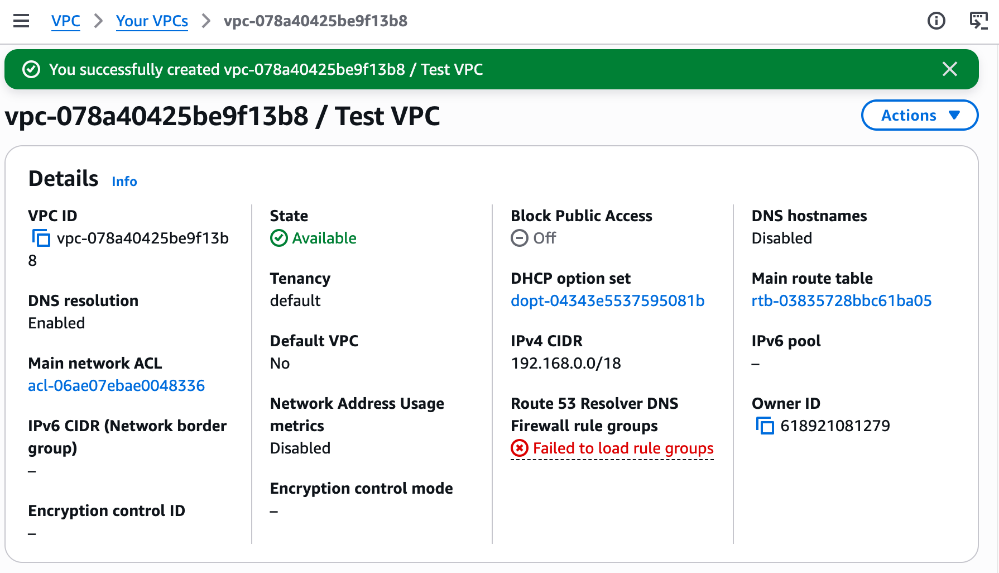

**Creating Subnets**

Created `Public Subnet` (`subnet-076649e214715c61a`) with CIDR `192.168.1.0/26` in availability zone `us-west-2d`.

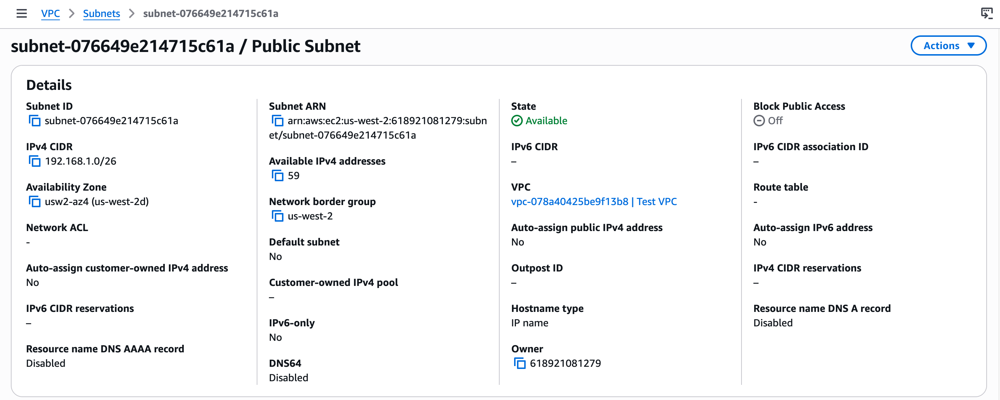

**Create Route Table**

Created `Public Route Table` (`rtb-0a688eb6fee7cad7f`) attached to `Test VPC`. At this point it only has the local route for `192.168.0.0/18`.

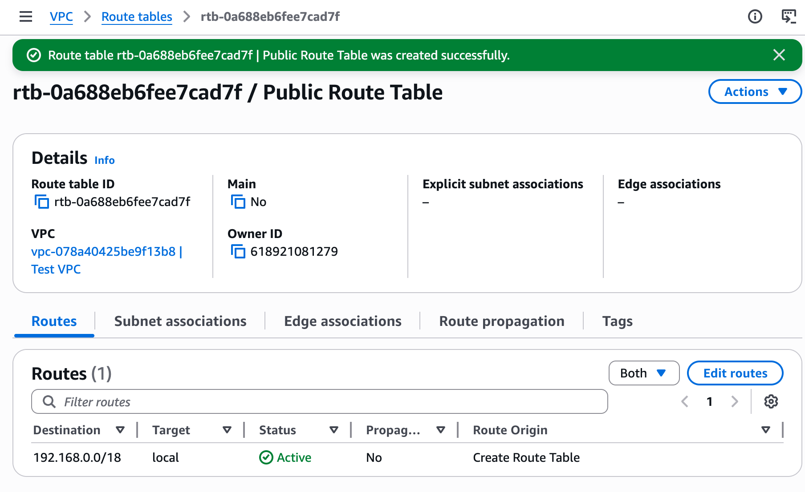

**Create Internet Gateway and Attach**

Created `TEST VPC IGW` (`igw-0bab926c4179d2f78`) and attached it to `vpc-078a40425be9f13b8`.

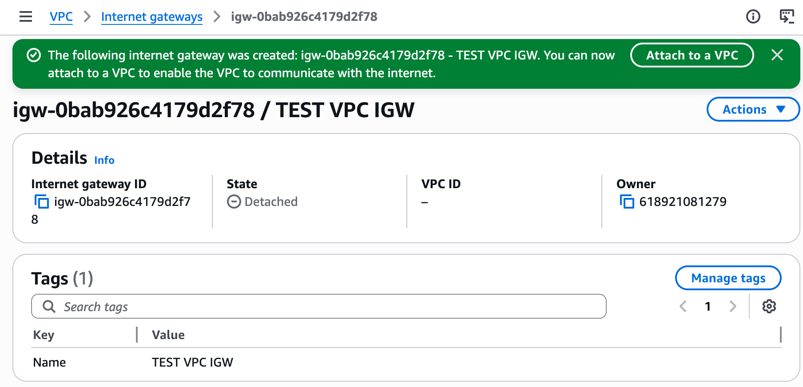

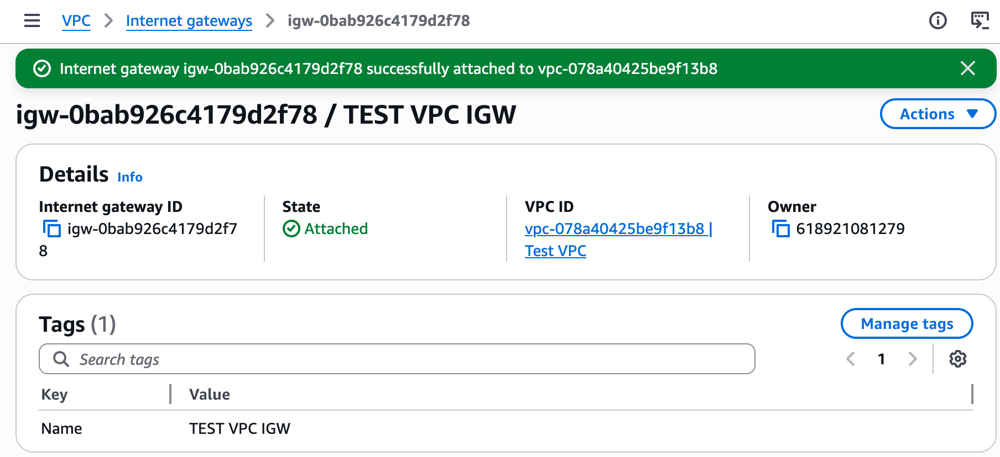

**Add Route and Associate Subnet**

Added route `0.0.0.0/0 → igw-0bab926c4179d2f78` to `rtb-0a688eb6fee7cad7f`. Associated `subnet-076649e214715c61a` as an explicit subnet association.


**Creating a Network ACL**

Created `Public Subnet NACL` (`acl-0902701903fca16b1`) with inbound rule 100 and outbound rule 100, both allowing all traffic. Associated it with `Public Subnet`.

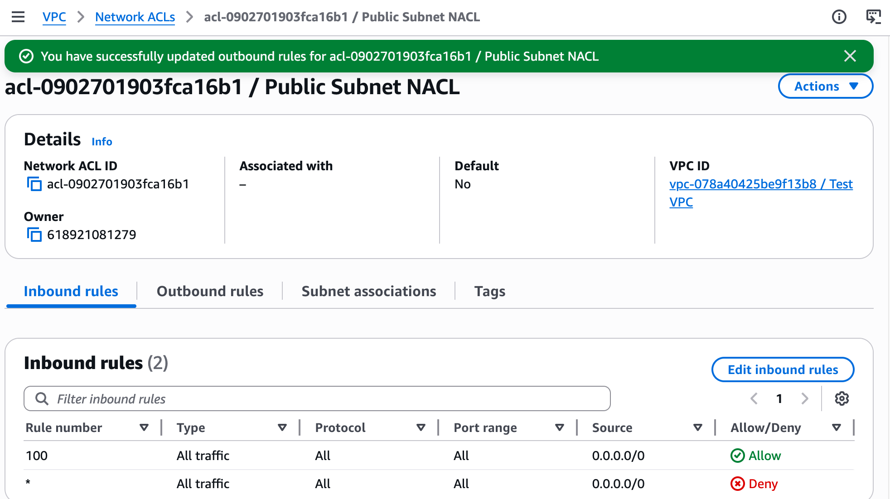

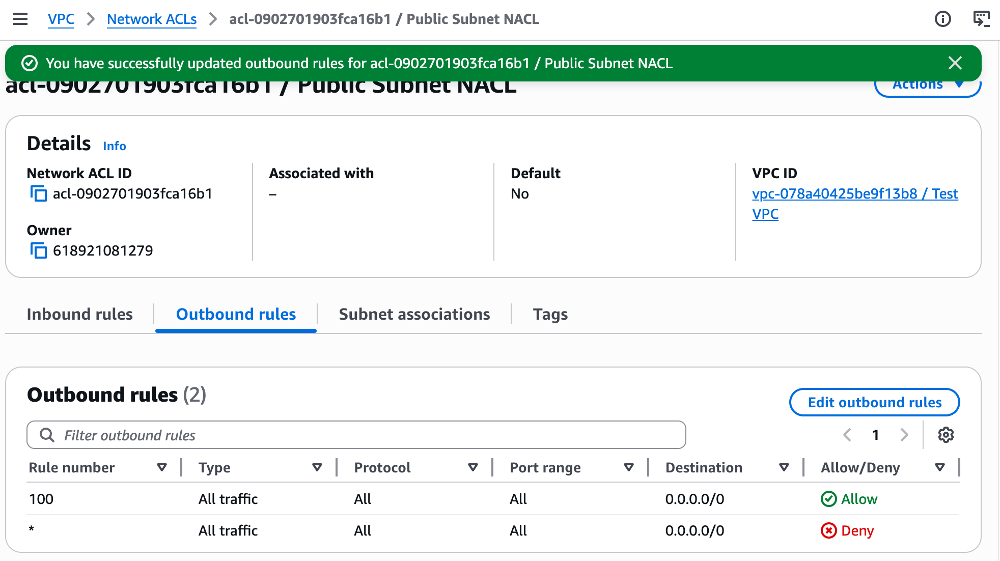

**Creating a Security Group**

Created `public security group` (`sg-0ad911c78dda3ac6c`) attached to `vpc-078a40425be9f13b8`. Inbound: SSH (22), HTTP (80), HTTPS (443) from `0.0.0.0/0`. Outbound: all traffic.

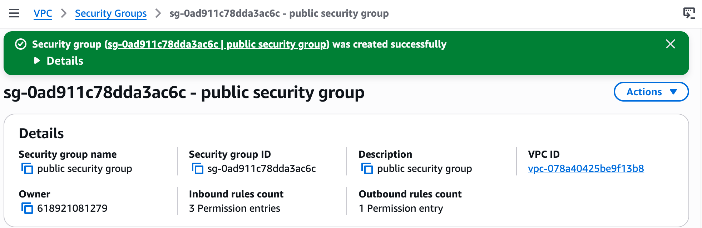

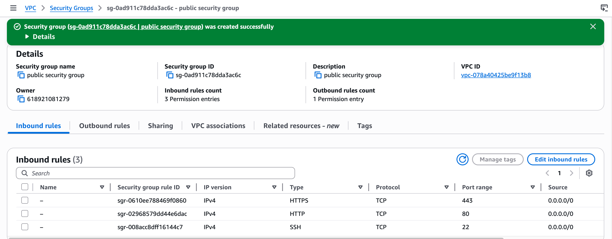

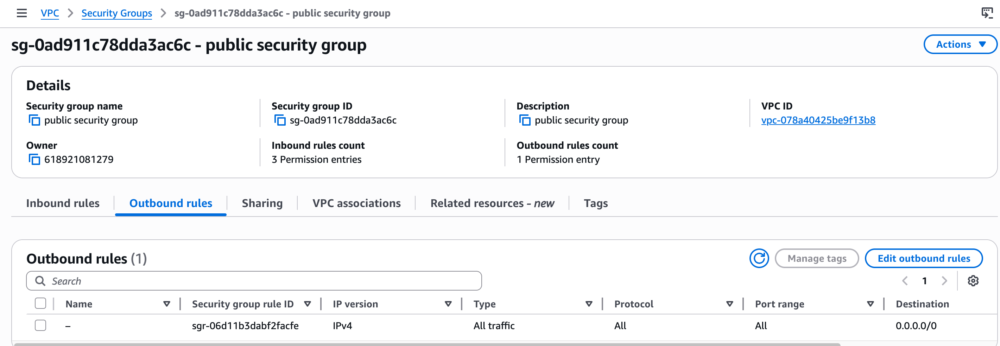

## Task 2: Launch EC2 Instance and SSH into Instance

Launched EC2 instance `i-073b6f31fe15592b2` using Amazon Linux 2023 AMI, `t3.micro`, in `subnet-076649e214715c61a` with Auto-assign public IP enabled and `sg-0ad911c78dda3ac6c` selected. Public IP assigned: `44.249.193.243`.

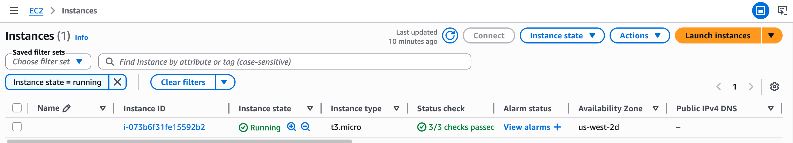

Connected via SSH from macOS:

```bash
chmod 400 labsuser.pem
ssh -i labsuser.pem ec2-user@44.249.193.243
```

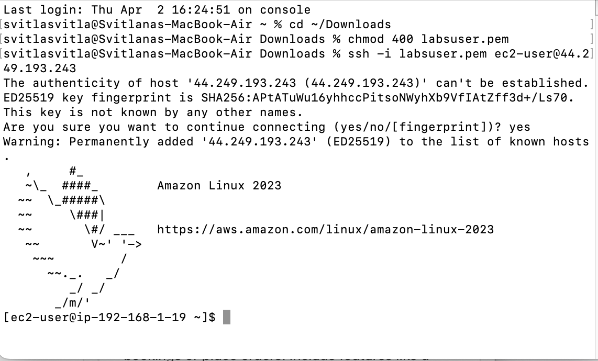

## Task 3: Use ping to test internet connectivity

```bash
ping google.com
```

17 packets transmitted, 17 received, 0% packet loss. RTT avg 6.2 ms. The VPC has full internet connectivity through the internet gateway.

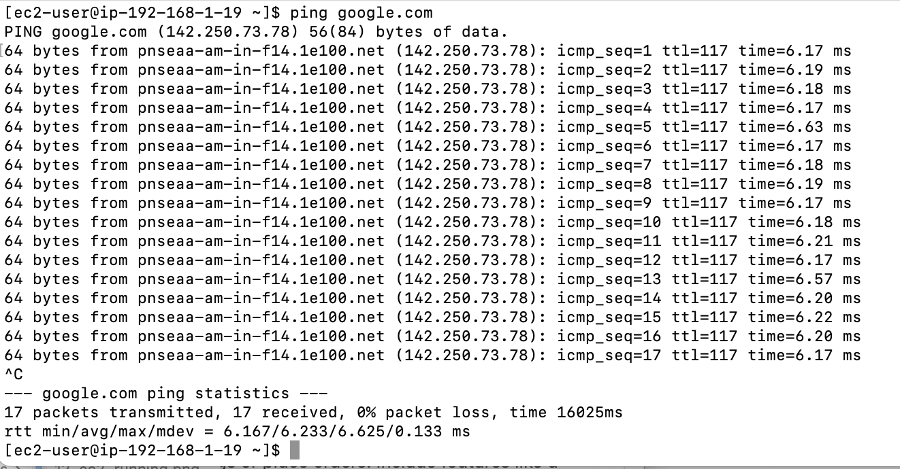

## Challenges I Had

No significant issues encountered.

## What I Learned

- **When an IGW is missing from the route table, the VPC cannot reach the internet** — even if the IGW exists and is attached. The route `0.0.0.0/0 → igw-xxxxx` must be explicitly added to the route table that is associated with the public subnet.
- **When a NACL is created manually, it starts with a DENY ALL rule** — unlike the default NACL which allows all traffic. Explicit allow rules must be added, and the NACL must be associated with the subnet; without the association it has no effect.
- **When a security group allows no inbound traffic, SSH connections time out silently** — security groups block all inbound by default, so every required port must be explicitly opened.
- **When the route table is not associated with a subnet, the subnet falls back to the main route table** — which only has the local route. This breaks internet access without producing a clear error message.
- **When building a VPC, working top-down through the left navigation pane reduces errors** — VPC, subnet, route table, IGW, NACL, security group in that order ensures each resource exists before it is referenced, and the naming convention (Public Route Table, Public Subnet, Public Subnet NACL) makes associations unambiguous as the network grows.

## Resource Names Reference

| Resource | Value |
|---|---|
| VPC Name | Test VPC |
| VPC ID | vpc-078a40425be9f13b8 |
| VPC CIDR | 192.168.0.0/18 |
| Subnet Name | Public Subnet |
| Subnet ID | subnet-076649e214715c61a |
| Subnet CIDR | 192.168.1.0/26 |
| Subnet AZ | us-west-2d |
| Route Table | Public Route Table |
| Route Table ID | rtb-0a688eb6fee7cad7f |
| Internet Gateway | TEST VPC IGW |
| IGW ID | igw-0bab926c4179d2f78 |
| NACL Name | Public Subnet NACL |
| NACL ID | acl-0902701903fca16b1 |
| Security Group | public security group |
| SG ID | sg-0ad911c78dda3ac6c |
| EC2 Instance ID | i-073b6f31fe15592b2 |
| EC2 Public IP | 44.249.193.243 |
| EC2 AMI | Amazon Linux 2023 AMI |
| EC2 Type | t3.micro |
| Key Pair | vockey |
| Region | us-west-2 |
| Local Repo Root | ~/Desktop/AWS-reStart-Journey/Labs/Networking/lab-264-creating-networking-resources-vpc |
| Screenshots Folder | ~/Desktop/AWS-reStart-Journey/Labs/Networking/lab-264-creating-networking-resources-vpc/screenshots/ |
| GitHub Repo | https://github.com/svitlana-dekhtiar/aws-restart-journey |

## Commands Reference

All commands run during this lab are saved in `commands.sh`.
