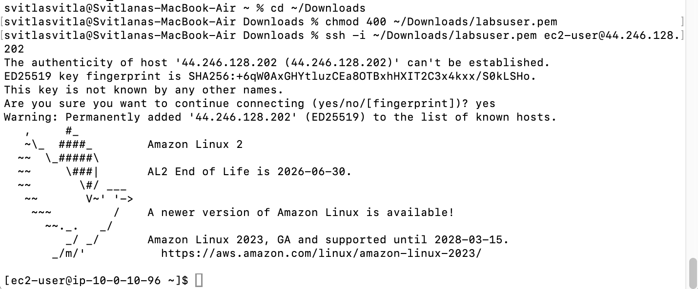
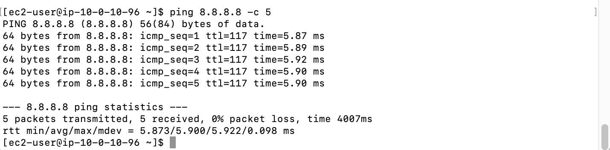
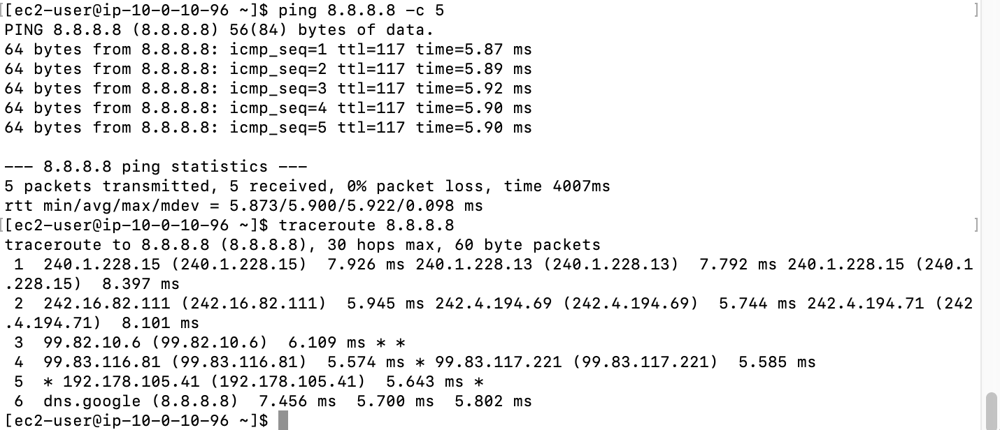
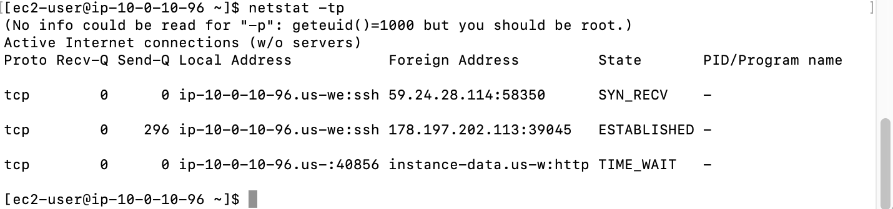
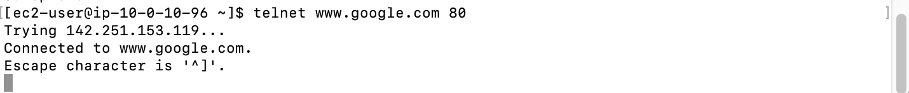
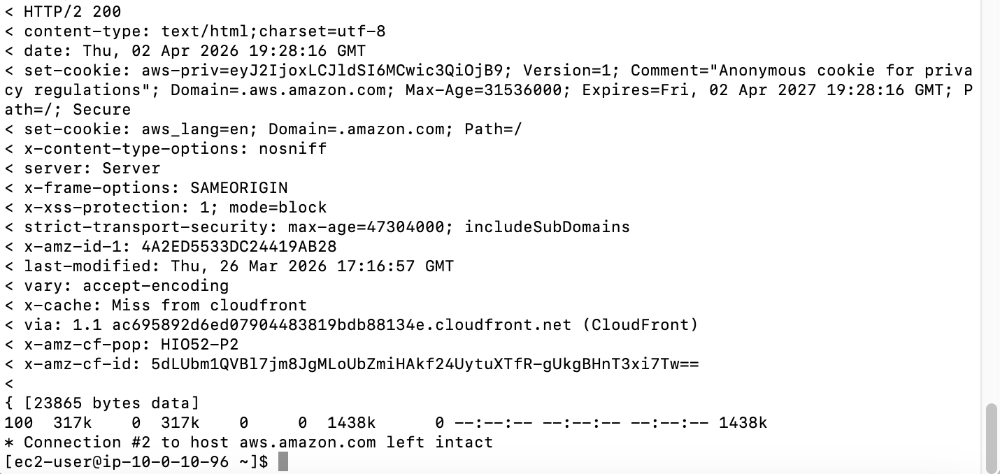

# Lab 265 — Internet Protocol Troubleshooting Commands

## About This Lab

This lab covers the most common network troubleshooting commands used in day-to-day cloud operations and customer support scenarios. Working through the OSI model from layer 3 to layer 7, I practised `ping`, `traceroute`, `netstat`, `telnet`, and `curl` — each paired with a realistic customer scenario that explains when and why you would reach for that tool. The lab runs on an Amazon Linux 2 EC2 instance accessed via SSH.

For a cloud support or networking role, the ability to quickly isolate whether a problem sits at the network layer, the transport layer, or the application layer is a core skill. This lab reinforces that mental model with hands-on execution rather than theory.

## What I Did

I connected to an Amazon Linux 2 EC2 instance (`ip-10-0-10-96`, public IP `44.246.128.202`) using SSH with a downloaded PEM key. From there I ran five troubleshooting commands across three OSI layers, observed their output, and matched each tool to the type of connectivity problem it is designed to diagnose.

## Task 1: Use SSH to Connect to an Amazon Linux EC2 instance

Set key permissions and opened an SSH session to the lab instance.

```bash
chmod 400 ~/Downloads/labsuser.pem
ssh -i ~/Downloads/labsuser.pem ec2-user@44.246.128.202
```



## Task 2: Practice Troubleshooting Commands

### Layer 3 (Network): ping

Used `ping` to send 5 ICMP echo requests to Google's public DNS server `8.8.8.8`. All 5 packets were received with 0% loss and a round-trip time of approximately 5.9 ms, confirming that the EC2 instance's security group allows outbound ICMP and basic IP routing is functional.

```bash
ping 8.8.8.8 -c 5
```



### Layer 3 (Network): traceroute

Used `traceroute` to map the path from the EC2 instance to `8.8.8.8`. The route resolved in 6 hops, reaching `dns.google` at ~7.5 ms. Hop 3 showed partial asterisks (`* *`) — normal behaviour for routers configured to filter traceroute probes rather than a true failure.

```bash
traceroute 8.8.8.8
```



### Layer 4 (Transport): netstat

Used `netstat -tp` to list established TCP connections on the instance. The output showed the active SSH session from `178.197.202.113:39045` and a `TIME_WAIT` connection to the instance metadata service.

```bash
netstat -tp
```



### Layer 4 (Transport): telnet

Installed `telnet` and connected to `www.google.com` on port 80. The connection resolved to `142.251.153.119` and succeeded immediately — confirming no security group or NACL rule is blocking outbound TCP on port 80.

```bash
sudo yum install telnet -y
telnet www.google.com 80
```



### Layer 7 (Application): curl

Used `curl -vLo /dev/null https://aws.com` to make a full HTTPS request. The response returned `HTTP/2 200` from `aws.amazon.com` via CloudFront (`x-amz-cf-pop: HIO52-P2`), confirming application-layer connectivity end-to-end.

```bash
curl -vLo /dev/null https://aws.com
```



## Challenges I Had

Running `netstat -tp` as `ec2-user` (without `sudo`) produced the warning: `No info could be read for "-p": geteuid()=1000 but you should be root.` The connection table itself was still displayed correctly, but the `PID/Program name` column showed dashes instead of process names. The fix is to run `sudo netstat -tp` to see which process owns each connection.

## What I Learned

- **When to use `ping` vs `traceroute`**: `ping` confirms basic reachability to a target in a single round-trip; `traceroute` shows every hop along the path. When a customer reports latency but not total failure, `traceroute` pinpoints which segment of the route is slow — this matters because the fix for a congested ISP hop is different from the fix for an AWS routing or security group issue.
- **Interpreting `***` in traceroute**: Three asterisks at a hop do not always mean failure — many routers deprioritise or drop traceroute probes to avoid CPU load. A real failure is identified when the hosts on either side of a failing hop are also unreachable, not when a single intermediate router filters probes.
- **Layer 4 ambiguity — refused vs timed out**: `telnet` to a port returns one of two failure modes. "Connection refused" means the host is reachable but nothing is listening or a firewall is actively rejecting. "Connection timed out" means the packet never arrives — typically a missing route or a silent drop. This distinction saves significant debugging time before escalating.
- **`netstat` permissions matter**: Running `netstat -tp` without root privileges hides process ownership (`-p` flag requires `sudo`). In a security context, knowing which process owns an unexpected open port is the whole point — always run `sudo netstat -tp` during incident investigation.
- **`curl -v` for application-layer debugging**: HTTP errors (4xx, 5xx) only surface at layer 7. `curl -v` exposes the full TLS handshake, redirect chain, response headers, and status code — making it the right first tool when `ping` and `telnet` both succeed but the application is still unreachable.

## Resource Names Reference

| Resource / Setting   | Value |
|----------------------|-------|
| EC2 instance         | Amazon Linux 2 (lab-provided) |
| Public IP            | 44.246.128.202 |
| Instance hostname    | ip-10-0-10-96 |
| Key file             | labsuser.pem |
| Key location         | ~/Downloads/labsuser.pem |
| Region               | us-east-1 |
| Local repo root      | ~/Desktop/AWS-reStart-Journey/Labs/Networking/lab-265-ip-troubleshooting |
| Screenshots folder   | ~/Desktop/AWS-reStart-Journey/Labs/Networking/lab-265-ip-troubleshooting/screenshots |
| GitHub repo          | https://github.com/svitlana-dekhtiar/aws-restart-journey |

## Commands Reference

All commands run during this lab are saved in `commands.sh`.
