# Lab 266 — Troubleshooting a Network Issue

## About This Lab

This lab is a cloud support scenario: a customer reports that an Apache HTTP server installed on an EC2 instance cannot be reached via a browser or ping. The task is to diagnose the networking issue by inspecting VPC components — subnets, route tables, internet gateway, and security groups — then fix what is blocking traffic. AWS VPC, EC2, and Security Groups are the primary services involved. For a recruiter, this lab demonstrates the ability to read infrastructure state methodically and isolate a root cause rather than guess.

The lab reinforces a core operational skill: distinguishing between routing problems and access control problems. A correctly configured route table and IGW does not guarantee that traffic reaches an application — security group rules are evaluated independently and operate at the instance level.

## What I Did

I connected to an Amazon Linux 2 EC2 instance (private IP `10.0.10.67`) via SSH using a PEM key downloaded from the Vocareum credentials panel. The public IP was `44.255.199.108`. The instance was running inside `vpc-0f65dbf6f3032d666` (Lab VPC), which replicated the customer's environment. I started the Apache HTTP server, confirmed the connection failure in a browser, then worked through each VPC component in the AWS Console to locate the misconfiguration.

## Task 1: Use SSH to Connect to an Amazon Linux EC2 Instance

Downloaded `labsuser.pem` from the Vocareum **Details** panel and noted the public IP. Set key permissions and connected:

```bash
cd ~/Downloads
chmod 400 labsuser.pem
ssh -i labsuser.pem ec2-user@44.255.199.108
```

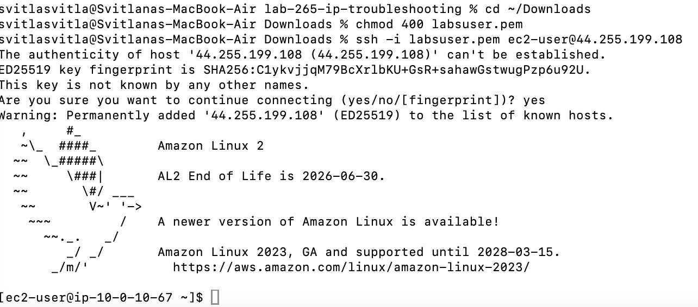

## Task 2: Install httpd

Checked the status of the httpd service — it was inactive. Started it and confirmed it became active:

```bash
sudo systemctl status httpd.service
sudo systemctl start httpd.service
sudo systemctl status httpd.service
```

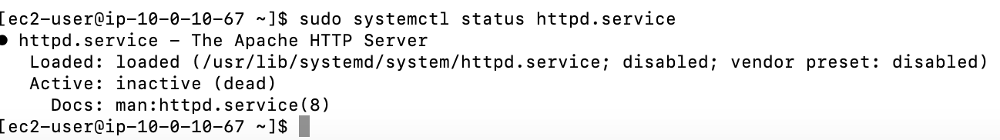

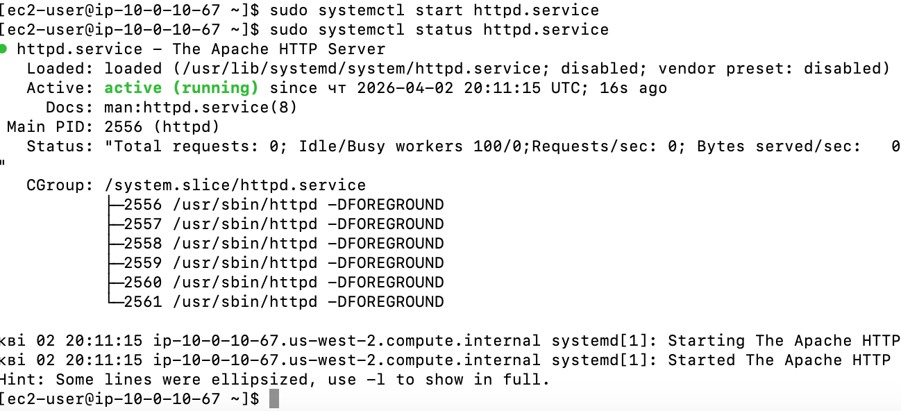

Attempted to load the Apache test page in a browser using `http://44.255.199.108` — the page returned `ERR_CONNECTION_TIMED_OUT`, confirming the customer's reported issue.

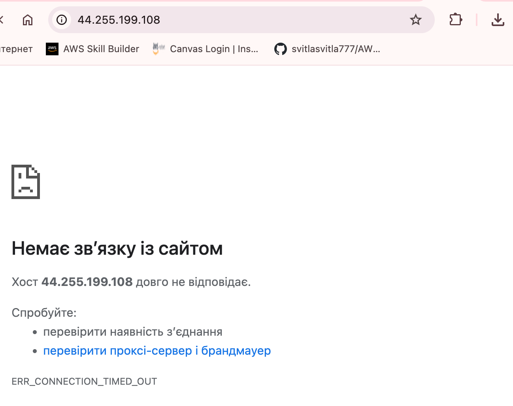

## Task 3: Investigate the Customer's VPC Configuration

Navigated to **VPC** in the AWS Console and inspected each component systematically.

**VPC** — confirmed `vpc-0f65dbf6f3032d666` (Lab VPC) was in Available state with CIDR `10.0.0.0/16`.

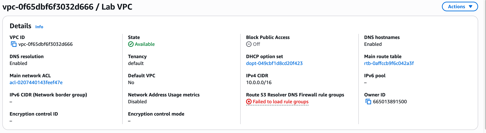

**Resource map** — reviewed the full topology: Lab VPC → Public Subnet 1 → Public Route Table → `igw-00c6a8b0e8c379dfa`.


**Subnet** — confirmed `subnet-0d976ded0592600c5` (Public Subnet 1, `10.0.10.0/24`, us-west-2a) was correctly associated to the Public Route Table.

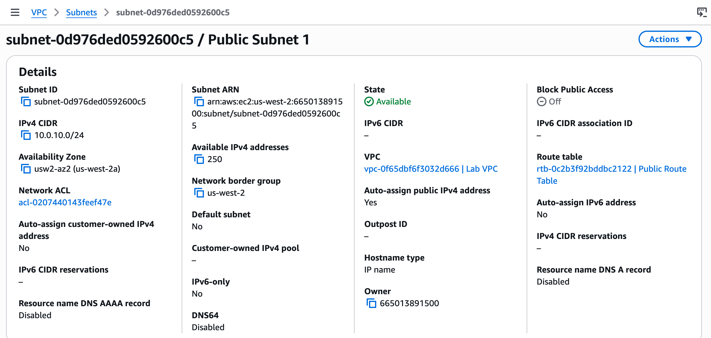

**Route Table** — confirmed `rtb-0c2b3f92bddbc2122` (Public Route Table) had a `0.0.0.0/0` route pointing to `igw-00c6a8b0e8c379dfa`. Routing was correct.

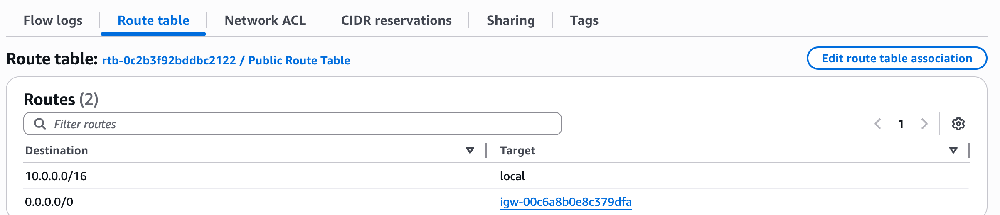

**Internet Gateway** — confirmed `igw-00c6a8b0e8c379dfa` was in state `Attached` to the Lab VPC. IGW was functional.

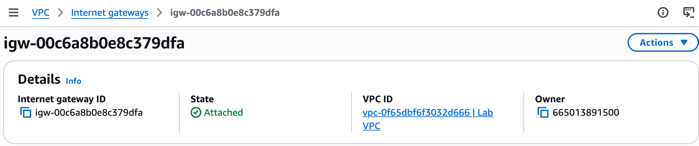

**Security Group** — opened `sg-0d09265853b002a60`. The details panel showed only 1 inbound permission entry. This was suspicious — Apache requires port 80.

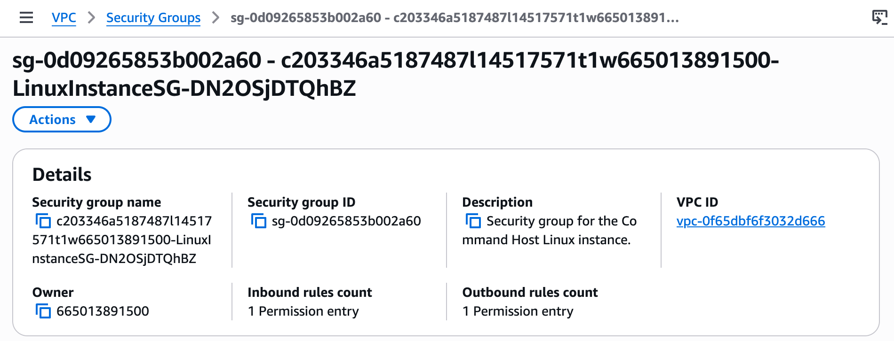

**Inbound rules** — the single rule was SSH on port 22. There was no HTTP rule on port 80. This was the root cause.

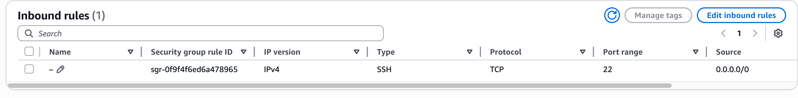

Clicked **Edit inbound rules** → **Add rule**: Type `HTTP`, Protocol `TCP`, Port range `80`, Source `0.0.0.0/0`. Saved the rule.

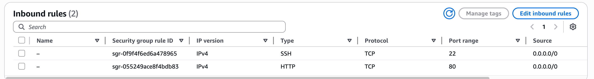

Reloaded `http://44.255.199.108` — the Apache test page loaded successfully.

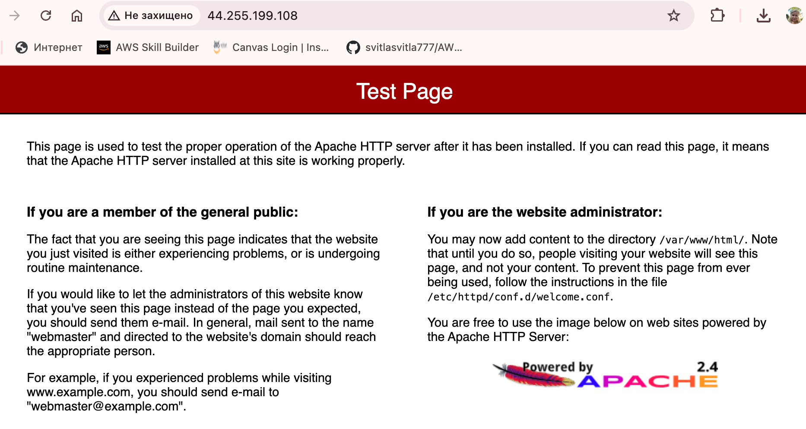

## Challenges I Had

No significant issues encountered. The lab was straightforward once I confirmed that the route table had a valid `0.0.0.0/0` entry and the IGW was attached — that narrowed the fault immediately to the security group inbound rules.

## What I Learned

- **When an EC2 instance is reachable from inside the VPC but not from the internet, check security group inbound rules before anything else** — routing problems and access control problems have different symptoms, and a working route table does not mean traffic can reach the application.
- **Security groups are stateful** — allowing inbound traffic on port 80 automatically permits the return traffic without a separate outbound rule. This is different from network ACLs, which require explicit rules in both directions.
- **The VPC resource map is a fast way to verify topology** — one view shows whether the subnet is associated to the right route table and whether the IGW is connected, saving time compared to checking each component individually.
- **A service can be `active (running)` at the OS level and still be completely unreachable** — httpd was healthy on the instance, but the security group blocked all HTTP traffic at the VPC boundary. The application layer and the network access control layer are independent.
- **Security group inbound rules are the most common misconfiguration for web servers on EC2** — port 22 (SSH) is frequently pre-configured in lab environments, but port 80 for HTTP must be explicitly added when running a web server.

## Resource Names Reference

| Resource | Value |
|---|---|
| EC2 Public IP | 44.255.199.108 |
| EC2 Private IP | 10.0.10.67 (ip-10-0-10-67) |
| PEM Key | labsuser.pem |
| Key Location | ~/Downloads/labsuser.pem |
| VPC ID | vpc-0f65dbf6f3032d666 (Lab VPC) |
| VPC CIDR | 10.0.0.0/16 |
| Subnet | subnet-0d976ded0592600c5 (Public Subnet 1, 10.0.10.0/24, us-west-2a) |
| Route Table | rtb-0c2b3f92bddbc2122 (Public Route Table) |
| Internet Gateway | igw-00c6a8b0e8c379dfa |
| Security Group | sg-0d09265853b002a60 |
| Region | us-west-2 |
| Local Repo | ~/Desktop/AWS-reStart-Journey/Labs/Networking/lab-266-troubleshooting-network |
| Screenshots | ~/Desktop/AWS-reStart-Journey/Labs/Networking/lab-266-troubleshooting-network/screenshots/ |
| GitHub Repo | https://github.com/svitlana-dekhtiar/aws-restart-journey |

## Commands Reference

All commands run during this lab are saved in `commands.sh`.
