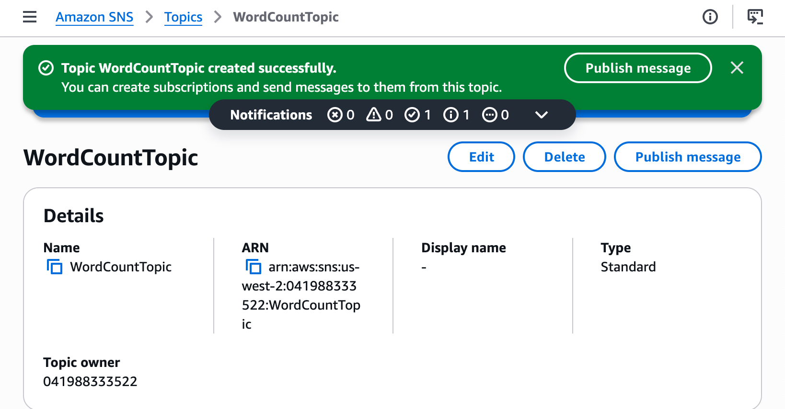
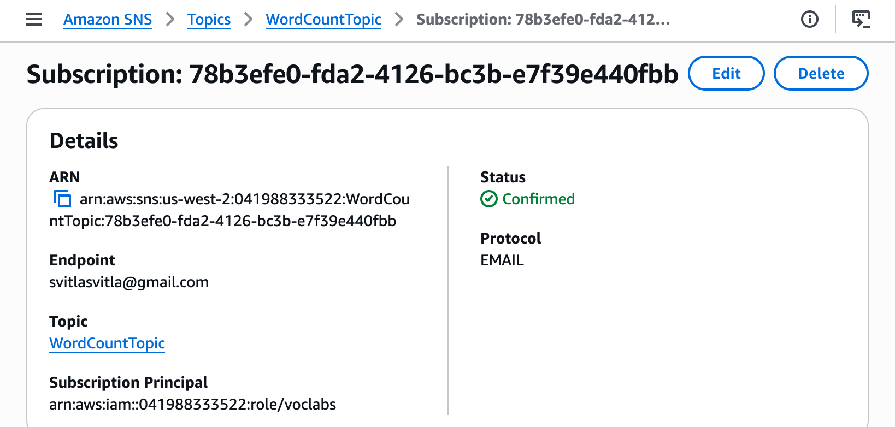
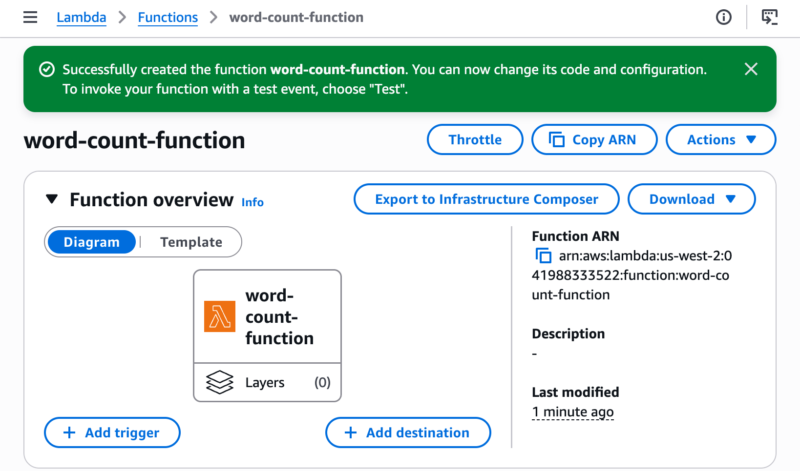
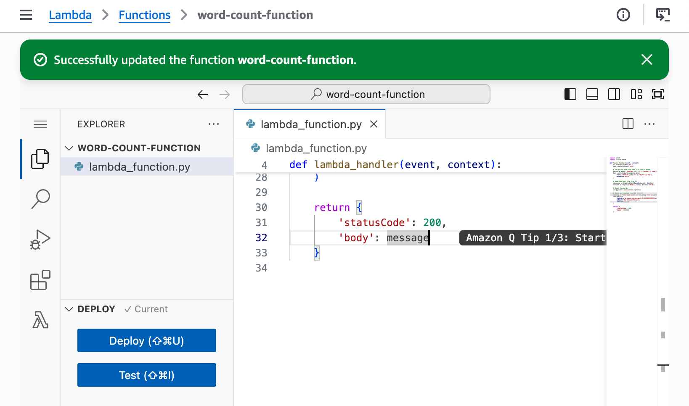
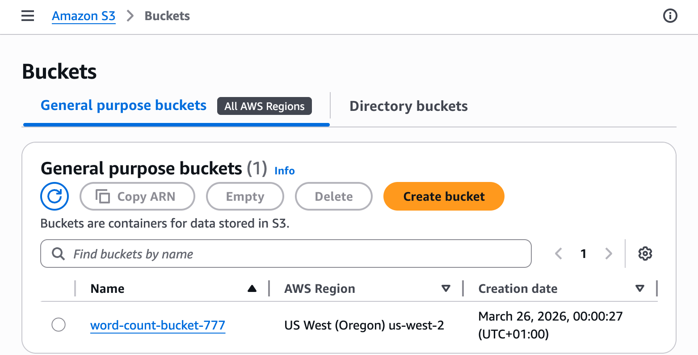
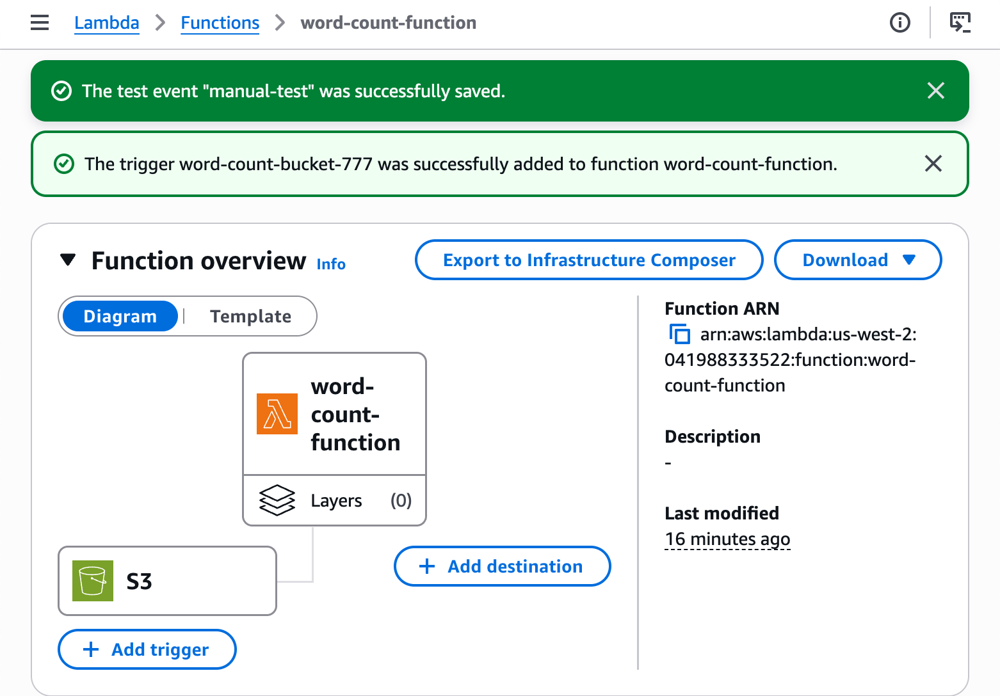
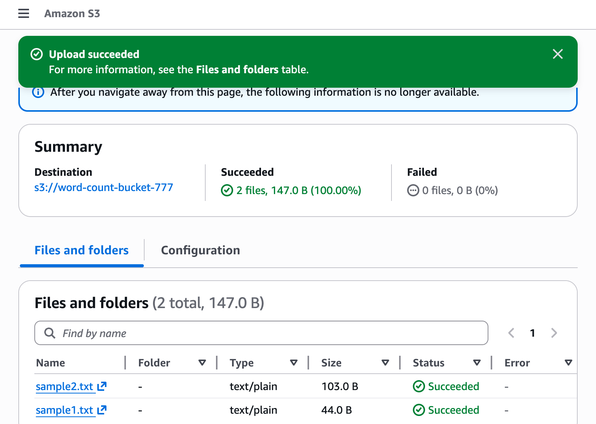
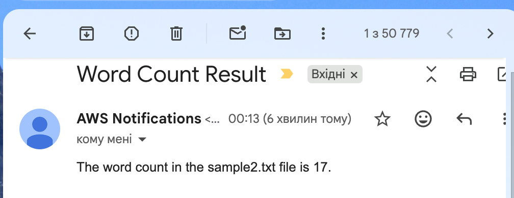

# AWS Lambda Challenge Lab — Word Count Function

## About This Lab

This lab is about building a serverless pipeline on AWS. The core task is writing a Lambda function in Python that automatically counts the words in a text file whenever that file gets uploaded to an S3 bucket. The result gets sent to me by email through SNS. There are no servers to provision, no background processes to keep running — the function simply wakes up when an event arrives, does its work, and shuts down.

The three AWS services involved are AWS Lambda, Amazon S3, and Amazon SNS. Lambda is AWS's serverless compute service — you give it code, tell it what should trigger it, and it runs. S3 (Simple Storage Service) is object storage; the bucket here acts as the drop zone for text files. SNS (Simple Notification Service) handles the messaging — once the word count is calculated, Lambda publishes the result to an SNS topic, which forwards it to a subscribed email address.

The skills this lab covers are directly relevant to real cloud work. Serverless architectures are used heavily in production because they scale automatically and cost nothing when idle. Event-driven triggers — S3 notifying Lambda when a file lands — are the backbone of data processing pipelines everywhere, from image resizing to log analysis to ETL workflows. Knowing how to wire these services together, and how to give a Lambda function the right IAM permissions to touch them, is a practical and in-demand cloud skill.

The lab also required configuring IAM correctly without creating new roles, which reflects real-world constraints. In production environments, developers usually work within pre-defined permission boundaries rather than creating roles from scratch.

## What I Did

The lab environment gave me a fresh AWS account with no pre-built resources other than a pre-existing IAM role called `LambdaAccessRole`. I worked entirely through the AWS Management Console. The structure was straightforward: create an SNS topic first so I had the Topic ARN to paste into the Lambda code, then write and deploy the function, then create the S3 bucket and attach it as a trigger. Testing was done by uploading sample text files to the bucket and checking email and CloudWatch logs to confirm the pipeline fired correctly.

---

## Task 1: Create an SNS Topic and Email Subscription

I opened the SNS console and created a Standard topic named `WordCountTopic`. After the topic was created I copied the Topic ARN from the detail page — that ARN goes directly into the Lambda code later, so getting it first saves a round trip.

I then created an email subscription under the topic, entering my email address and choosing the Email protocol. AWS sent a confirmation link to that address. I confirmed the subscription before moving on — if you skip this step, the subscription stays in Pending Confirmation status and no emails are delivered when the function runs.





---

## Task 2: Create the Lambda Function

I opened the Lambda console and created a new function from scratch:

- **Function name:** `word-count-function`
- **Runtime:** Python 3.12
- **Execution role:** LambdaAccessRole (existing role — the lab policy does not allow creating new IAM roles)



With the function created I replaced the default placeholder code in the inline editor with the following:

```python
import boto3
import urllib.parse

def lambda_handler(event, context):
    s3 = boto3.client('s3')
    sns = boto3.client('sns')

    # Get bucket and file name from the S3 event
    bucket = event['Records'][0]['s3']['bucket']['name']
    key = urllib.parse.unquote_plus(
        event['Records'][0]['s3']['object']['key'],
        encoding='utf-8'
    )

    # Read the text file from S3
    response = s3.get_object(Bucket=bucket, Key=key)
    content = response['Body'].read().decode('utf-8')

    # Count the words
    word_count = len(content.split())

    # Build and publish the SNS message
    message = f'The word count in the {key} file is {word_count}.'
    sns.publish(
        TopicArn='arn:aws:sns:us-west-2:041988333522:WordCountTopic',
        Subject='Word Count Result',
        Message=message
    )

    return {
        'statusCode': 200,
        'body': message
    }
```

The word count logic is simple: `content.split()` splits on any whitespace and returns a list, and `len()` counts the items. The S3 event payload provides the bucket name and the object key, so the function knows exactly which file to read without any hardcoded values.

After pasting the code I clicked **Deploy** to save and activate it.



I ran a quick test from the Test tab using a manually crafted S3 event JSON to verify the function executed without errors before connecting the real trigger.


---

## Task 3: Create the S3 Bucket and Configure the Trigger

I created a new S3 bucket called `word-count-bucket-777` in `us-west-2` — the same region as the Lambda function and SNS topic. S3 bucket names are globally unique, so I added my student ID as a suffix.



Back in the Lambda console I clicked **Add trigger** and configured it:

- **Source:** S3
- **Bucket:** `word-count-bucket-777`
- **Event type:** PUT
- **Suffix:** `.txt`

The `.txt` suffix filter ensures only text file uploads trigger the function — uploading an image or any other file type does nothing.



---

## Task 4: Test the End-to-End Pipeline

I created two small text files locally and uploaded them to the bucket through the S3 console.

```bash
echo 'The quick brown fox jumps over the lazy dog' > sample1.txt
echo 'AWS Lambda functions can be triggered by many different event sources including S3 SNS and API Gateway' > sample2.txt
```



I checked CloudWatch Logs under `/aws/lambda/word-count-function` to confirm each upload triggered an invocation and that the correct word count appeared in the logs.


Within a couple of minutes the emails arrived with subject `Word Count Result` and the body formatted exactly as specified: `The word count in the sample1.txt file is 9.`



---

## Challenges I Had

**SNS subscription not confirmed before testing:** The first test upload to S3 triggered Lambda successfully — I could see the invocation in CloudWatch and the function returned a 200 response — but no email arrived. The subscription was still in `Pending Confirmation` status because I had not clicked the confirmation link in the original email. Once I confirmed it and re-uploaded the file, the email came through immediately.

**Topic ARN format error:** When I first pasted the Topic ARN into the code I accidentally included a trailing newline, which caused an `Invalid parameter: TopicArn` error from the SNS client. The ARN looked correct visually but the hidden character made it invalid. Retyping the ARN manually rather than pasting fixed it.

**SNS Topic ARN pointing to wrong region:** The placeholder ARN in the Lambda code template referenced `us-east-1`. My actual resources were all in `us-west-2`. The function deployed without error but the SNS publish call failed on first run because the ARN pointed to a topic in a different region. Updating the ARN to `arn:aws:sns:us-west-2:041988333522:WordCountTopic` fixed it. All three services — Lambda, S3, and SNS — must be in the same region or the pipeline breaks at the publish step.

---

## What I Learned

**How Lambda execution roles control what the function can do.** The `LambdaAccessRole` had `AmazonS3FullAccess`, `AmazonSNSFullAccess`, `AWSLambdaBasicExecutionRole`, and `CloudWatchFullAccess` attached. Without `AmazonS3FullAccess`, the `s3.get_object` call would have returned an `AccessDenied` error even though the bucket exists. IAM is what connects the function's identity to the resources it is allowed to touch.

**How S3 event notifications pass data to Lambda.** The trigger does not send the file contents to Lambda — it sends a JSON event object describing what happened. The function has to parse `event['Records'][0]['s3']['bucket']['name']` and `event['Records'][0]['s3']['object']['key']` to find out which bucket and file triggered it, then make a separate `get_object` API call to actually read the file. This pattern — event as notification, not payload — is consistent across most Lambda triggers.

**Why URL-decoding the S3 object key matters.** S3 object keys in event notifications are URL-encoded. A file named `my file.txt` arrives as `my+file.txt` in the event. Using `urllib.parse.unquote_plus()` on the key before passing it to `get_object` prevents a `NoSuchKey` error when filenames contain spaces or special characters.

**What an SNS topic subscription confirmation does.** When you create an email subscription in SNS, AWS sends a one-time confirmation email with a token. Until that link is clicked the subscription sits in `Pending Confirmation` and SNS will not deliver messages to it. This is a security mechanism to prevent someone from subscribing someone else's email address without their consent.

**The difference between deploying and saving Lambda code.** Clicking Deploy in the Lambda code editor compiles and activates the new code version. Just editing the code without deploying means the old version is still running. The function configuration page shows the current deployed version — if Deploy was not clicked, test results will reflect the old code, which can be confusing when debugging.

---

## Resource Names Reference

| Resource | Name / Value |
|---|---|
| Lambda Function | `word-count-function` |
| S3 Bucket | `word-count-bucket-777` |
| SNS Topic | `WordCountTopic` |
| SNS Topic ARN | `arn:aws:sns:us-west-2:041988333522:WordCountTopic` |
| Lambda ARN | `arn:aws:lambda:us-west-2:041988333522:function:word-count-function` |
| SNS Subscription Email | `svitlasvitla@gmail.com` |
| IAM Role | `LambdaAccessRole` |
| AWS Region | `us-west-2` |
| Runtime | Python 3.12 |
| Handler | `lambda_function.lambda_handler` |

---

## Commands Reference

See [`commands.sh`](commands.sh) for all commands used in this lab.
