# Lab 178 — Working with AWS Lambda

## About This Lab

This lab is about building a serverless sales reporting pipeline on AWS. The end result is a system that automatically queries a MySQL database, formats the results into a report, and emails it to an administrator — all without any server running permanently in the background. Everything is event-driven: a schedule fires, a function runs, another function gets invoked, a database gets queried, and an email lands in an inbox.

The main AWS service here is Lambda, which lets you run code in response to events without provisioning or managing servers. You upload a zip file containing your code and AWS handles execution, scaling, and availability. Lambda functions are billed only for the time they actually run, measured in milliseconds — for a scheduled reporting job like this one, that means the compute cost is essentially zero.

The lab also covers SNS (Simple Notification Service) for email delivery, Systems Manager Parameter Store for storing database credentials securely outside the code, EventBridge for scheduling Lambda using a cron expression, IAM for controlling what each function is allowed to do, and CloudWatch Logs for diagnosing failures when there is no terminal to SSH into. The database runs on an EC2 instance inside a VPC, which introduces a real networking challenge: Lambda needs explicit VPC and security group configuration to reach private resources.

From a practical standpoint this lab covers skills that appear constantly in cloud and backend roles — writing infrastructure that reacts to events, debugging networking issues between compute layers, managing credentials without hardcoding them, and reading CloudWatch logs when something goes wrong and there is no stack trace on screen.

## What I Did

The lab environment included a pre-built EC2 LAMP instance running a MySQL café database, two pre-created IAM roles, and a CLI Host EC2 instance with the AWS CLI pre-installed. I worked across the Lambda console, SNS, Systems Manager, EC2, IAM, and a terminal via EC2 Instance Connect. The overall flow was: build the data extraction layer first, confirm it could reach the database, fix the networking issue that blocked it, wire up SNS notifications, deploy the main reporting function via CLI, and finally schedule it with EventBridge.

---

## Task 1.1: Observing the salesAnalysisReportRole IAM Role Settings

I opened IAM and reviewed the four policies on this role. The critical ones are AWSLambdaRole — which allows this function to invoke another Lambda function — and AmazonSSMReadOnlyAccess, which lets it read database credentials from Parameter Store at runtime without hardcoding them anywhere.

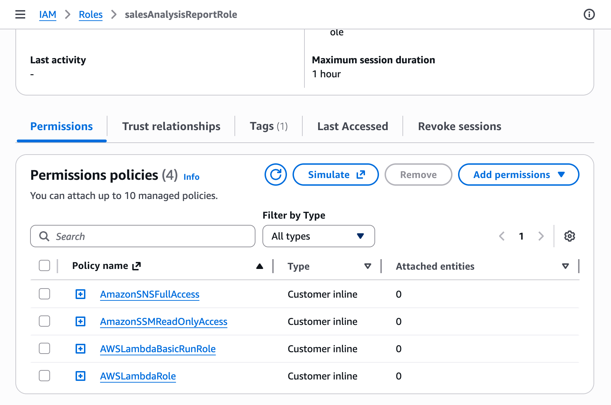

## Task 1.2: Observing the salesAnalysisReportDERole IAM Role Settings

The data extractor uses a separate, more restricted role. The key policy here is AWSLambdaVPCAccessRunRole — without it Lambda cannot create the elastic network interface it needs to join the VPC and reach the MySQL instance on the EC2 host.

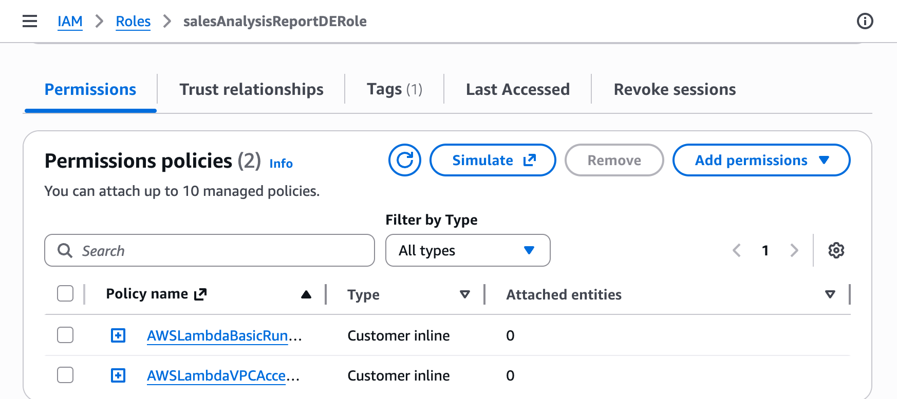

---

## Task 2.1: Creating a Lambda Layer

Lambda layers let you package library dependencies separately from your function code. I created a layer called pymysqlLibrary and uploaded pymysql-v3.zip, which packages the PyMySQL MySQL client in the directory structure Lambda expects. I selected Python 3.12 as the compatible runtime — Python 3.9 was no longer available in the console as it reached end of life in January 2026.

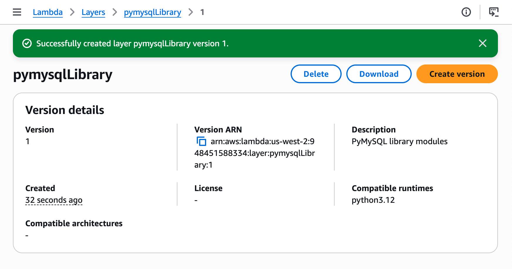

## Task 2.2: Creating a Data Extractor Lambda Function

I created the salesAnalysisReportDataExtractor function using Python 3.12 and attached the salesAnalysisReportDERole.

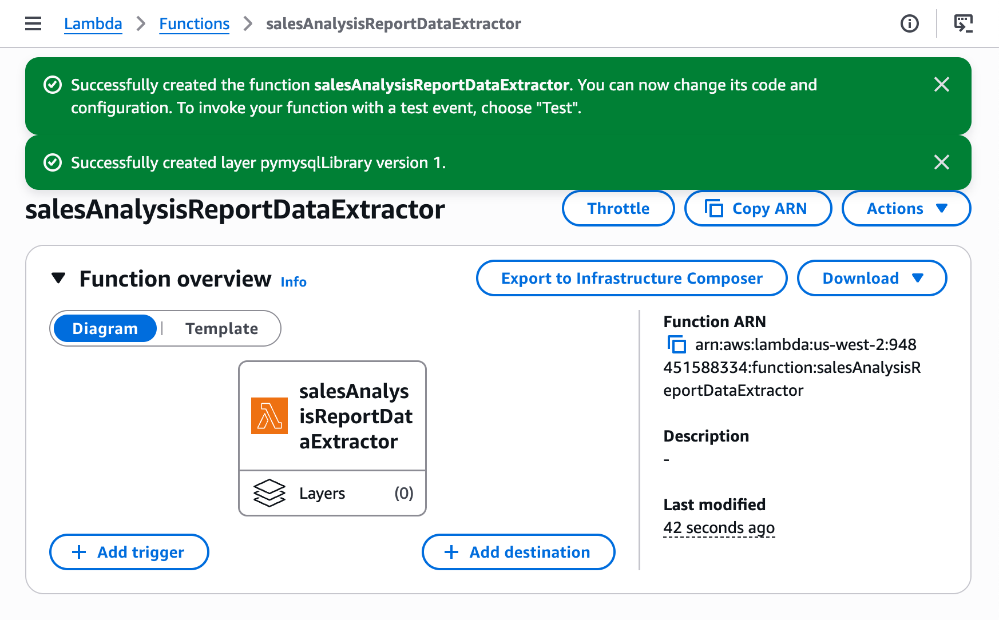

## Task 2.3: Adding the Lambda Layer to the Function

I attached pymysqlLibrary version 1 via the Layers panel. The function configuration confirmed the layer was attached with python3.12 as the compatible runtime.

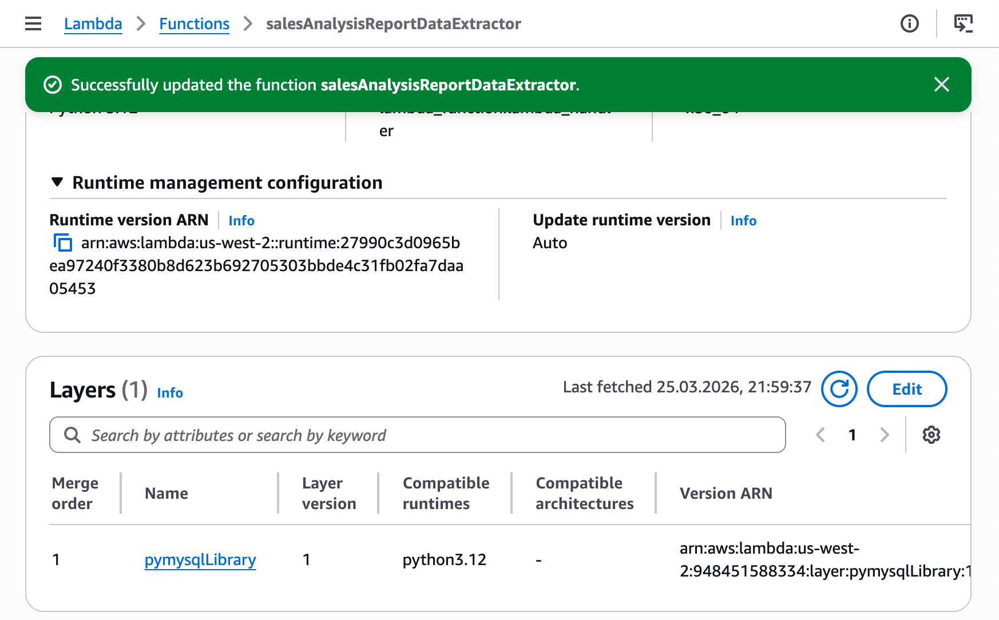

## Task 2.4: Importing the Code for the Data Extractor Lambda Function

I updated the handler to `salesAnalysisReportDataExtractor.lambda_handler` and uploaded the deployment zip. The function reads four database connection parameters from its event input — `dbUrl`, `dbName`, `dbUser`, `dbPassword` — and runs an analytical query against the café database using pymysql.

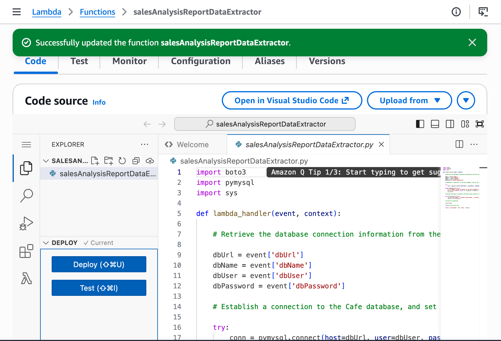

## Task 2.5: Configuring Network Settings for the Function

Because MySQL runs on a private EC2 instance inside the Cafe VPC, I configured the Lambda function to run inside the same network. I selected Cafe VPC (10.200.0.0/20), Cafe Public Subnet 1 (10.200.0.0/24, us-west-2a), and CafeSecurityGroup.

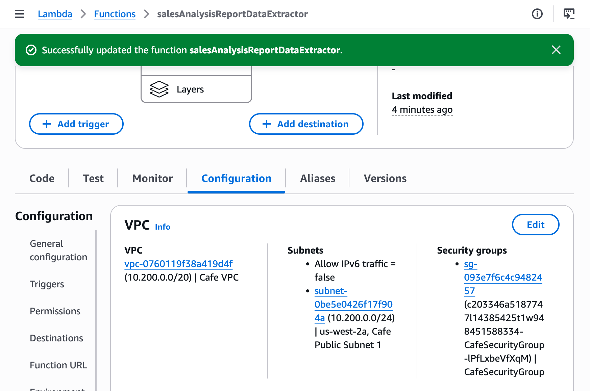

---

## Task 3.1 & 3.2: Testing and Troubleshooting the Data Extractor Function

I retrieved the four database parameters from Systems Manager Parameter Store and built the test event JSON. The first test run failed with a timeout:

```
"errorType": "Sandbox.Timedout",
"errorMessage": "Task timed out after 3.00 seconds"
```

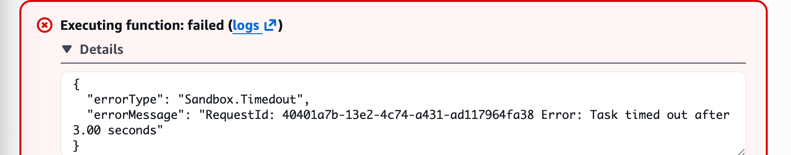

The function was trying to open a pymysql connection to the database and hanging because the TCP handshake was never completing. The default Lambda timeout is 3 seconds — exactly long enough to attempt a connection and fail silently with no useful error detail.

## Task 3.3: Fixing the Security Group

The root cause was that CafeSecurityGroup had no inbound rule for port 3306. MySQL listens on TCP/3306 and nothing was allowing that traffic in. I added an inbound rule: Type MySQL/Aurora, Protocol TCP, Port 3306, Source 0.0.0.0/0.

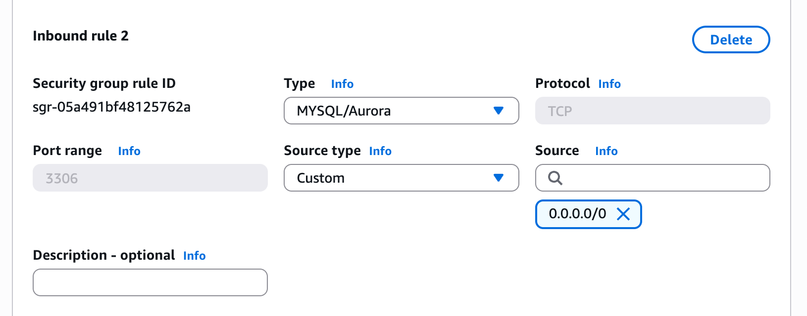

After saving the rule I re-ran the test. Clean success with an empty body array — correct, since no orders existed yet.

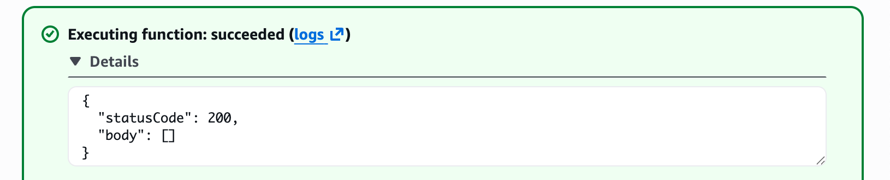

## Task 3.4: Placing Orders and Testing Again

I navigated to the café website at `http://34.221.107.31/cafe`, placed several orders across Pastries and Drinks, and ran the test again. The response body now contained real product and quantity data.

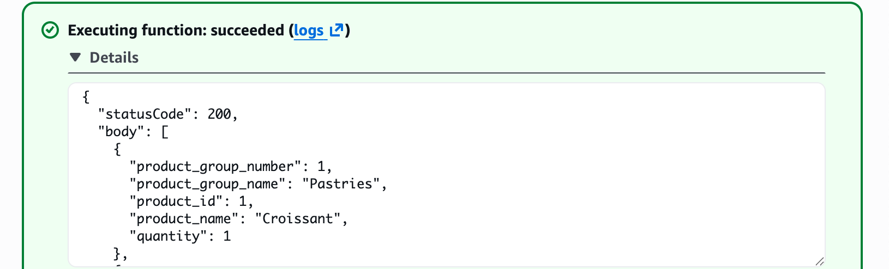

---

## Task 4.1: Creating an SNS Topic

I created a Standard SNS topic named salesAnalysisReportTopic with display name SARTopic.

```
arn:aws:sns:us-west-2:948451588334:salesAnalysisReportTopic
```

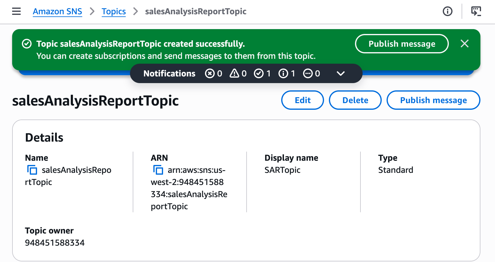

## Task 4.2: Subscribing to the SNS Topic

I subscribed my email address using the Email protocol and confirmed via the AWS notification email. The subscription status moved from Pending to Confirmed.

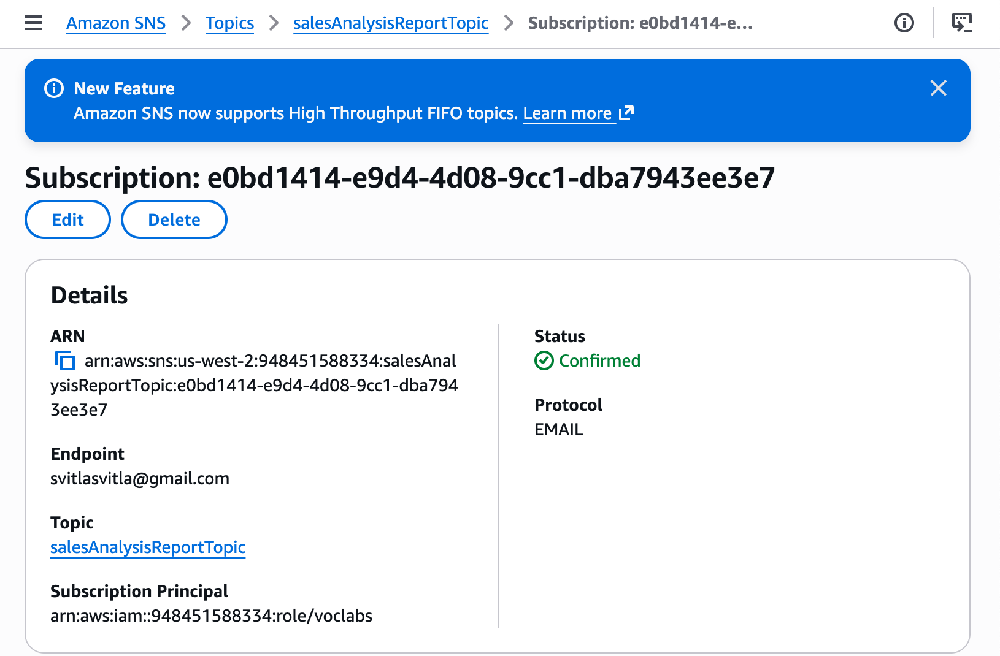

---

## Task 5.1: Connecting to the CLI Host Instance

I connected to the CLI Host (i-01958e1dd0dccd446) via EC2 Instance Connect directly in the browser — no SSH key setup required.

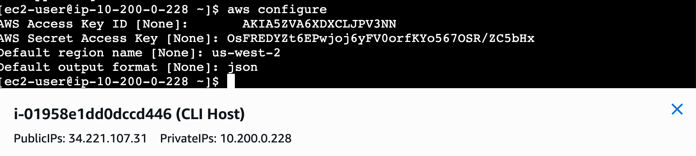

## Task 5.2: Configuring the AWS CLI

```bash
aws configure
```

Entered the lab credentials, set region to `us-west-2`, output format to `json`.

## Task 5.3: Creating the salesAnalysisReport Lambda Function via CLI

```bash
cd activity-files
ls

aws lambda create-function \
--function-name salesAnalysisReport \
--runtime python3.12 \
--zip-file fileb://salesAnalysisReport-v2.zip \
--handler salesAnalysisReport.lambda_handler \
--region us-west-2 \
--role arn:aws:iam::948451588334:role/salesAnalysisReportRole
```

The command returned a JSON object confirming the function was created with `"Runtime": "python3.12"` and `"FunctionArn": "arn:aws:lambda:us-west-2:948451588334:function:salesAnalysisReport"`.

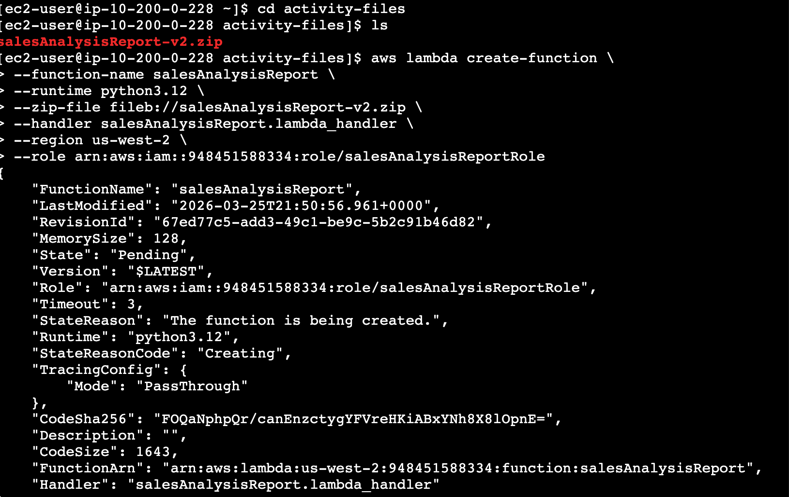

## Task 5.4: Configuring the salesAnalysisReport Lambda Function

The function reads the SNS topic ARN from an environment variable named `topicARN`. I added it under Configuration > Environment variables:

- Key: `topicARN`
- Value: `arn:aws:sns:us-west-2:948451588334:salesAnalysisReportTopic`

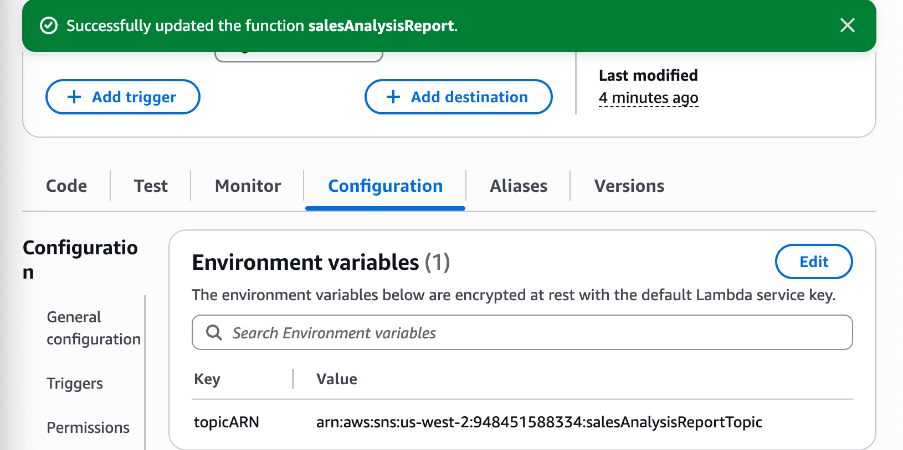

## Task 5.5: Testing the salesAnalysisReport Lambda Function

I created the SARTestEvent test event with no input parameters and ran it. The function returned success and a report email arrived from SARTopic within about a minute showing Pastries and Drinks with real quantities from my test orders.

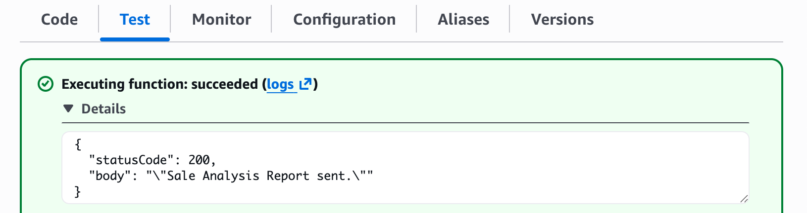

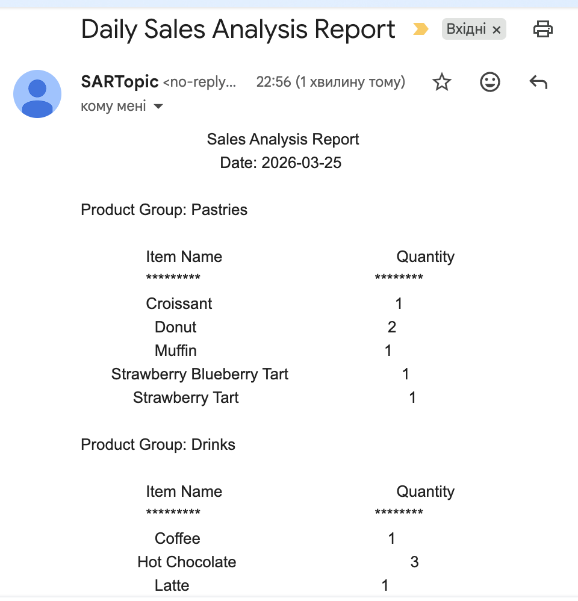

## Task 5.6: Adding a Trigger to the salesAnalysisReport Lambda Function

I added an EventBridge trigger:

- Rule name: salesAnalysisReportDailyTrigger
- Description: Initiates report generation on a daily basis
- Schedule: `cron(7 22 ? * MON-SAT *)` (set 5 minutes ahead for testing)
- Rule state: ENABLED

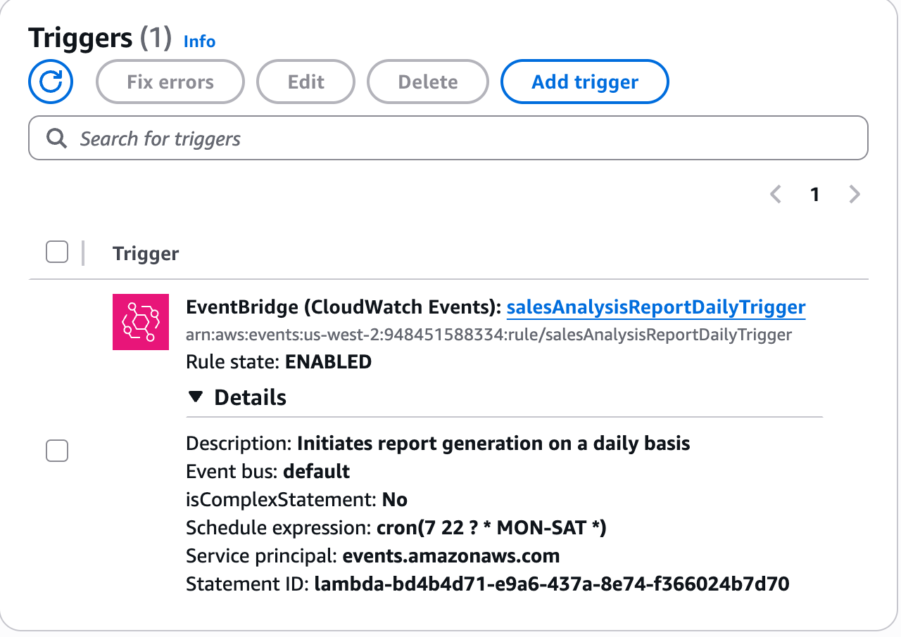

The trigger fired at the scheduled time and a second report email arrived at 23:10 local time (22:10 UTC), confirming the end-to-end pipeline was working automatically.

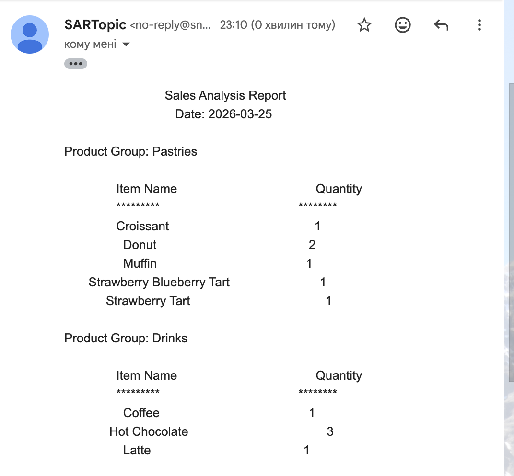

---

## Challenges I Had

The only real problem was the Task 3 timeout. The first test returned `Sandbox.Timedout` after exactly 3 seconds with no useful detail — no connection refused, no DNS failure, nothing pointing at a specific cause. I worked through it by thinking about what the function was doing at the moment it timed out: opening a TCP connection to MySQL. From there I checked CafeSecurityGroup's inbound rules and found there was no rule for port 3306 at all. Adding MySQL/Aurora TCP 3306 fixed it on the next run immediately.

The other issue was that Python 3.9 no longer appears in the Lambda runtime dropdown — it was deprecated in January 2026 and the console removes it for new function creation. The lab instructions reference it throughout, but Python 3.12 is a direct drop-in replacement and worked without any code changes.

---

## What I Learned

**Lambda functions that connect to VPC resources need network-layer access, not just IAM permissions.** Attaching AWSLambdaVPCAccessRunRole gives Lambda permission to create the elastic network interface, but you still have to select the right VPC, subnet, and security group — and the security group on the target resource has to actually allow inbound traffic on the correct port. IAM handles the API call to create the ENI; the security group handles whether the TCP connection goes through.

**A Lambda timeout with no error message usually means a network connection that never completed.** When a function hits exactly the default 3-second timeout with `Sandbox.Timedout` and no exception in the logs, the code did not crash — it sat waiting. In a function that opens a database connection as its first action, that almost always points to a blocked port rather than a bug in the code.

**Parameter Store keeps credentials out of function code and environment variables.** The extractor function reads `/cafe/dbUrl`, `/cafe/dbName`, `/cafe/dbUser`, and `/cafe/dbPassword` at runtime using the SSM API. This means credentials can be rotated in one place without redeploying the function, and access can be controlled through IAM rather than hoping no one inspects the function configuration.

**When one Lambda function invokes another, each needs its own IAM role scoped to what it actually does.** The orchestrator (salesAnalysisReport) needs AWSLambdaRole to call InvokeFunction. The extractor does not — it only runs a query and returns data. Splitting the roles keeps permissions minimal and makes it straightforward to audit what each function is allowed to do.

**EventBridge cron expressions use UTC and require `?` in either Day-of-month or Day-of-week — not both.** The expression `cron(7 22 ? * MON-SAT *)` uses `?` in Day-of-month because a day-of-week value is specified. AWS cron syntax differs from standard Unix cron here — using `*` in both fields is rejected. Everything runs in UTC regardless of where the console is accessed from, so local time conversion is always needed when setting up test schedules.

---

## Resource Names Reference

| Resource | Value |
|---|---|
| AWS Account ID | 948451588334 |
| Region | us-west-2 |
| Lambda function — main | salesAnalysisReport |
| Lambda function — extractor | salesAnalysisReportDataExtractor |
| Lambda function ARN — main | arn:aws:lambda:us-west-2:948451588334:function:salesAnalysisReport |
| Lambda function ARN — extractor | arn:aws:lambda:us-west-2:948451588334:function:salesAnalysisReportDataExtractor |
| Lambda layer | pymysqlLibrary version 1 |
| Layer ARN | arn:aws:lambda:us-west-2:948451588334:layer:pymysqlLibrary:1 |
| IAM role — main | salesAnalysisReportRole |
| IAM role ARN — main | arn:aws:iam::948451588334:role/salesAnalysisReportRole |
| IAM role — extractor | salesAnalysisReportDERole |
| SNS topic | salesAnalysisReportTopic |
| SNS topic ARN | arn:aws:sns:us-west-2:948451588334:salesAnalysisReportTopic |
| SNS display name | SARTopic |
| SNS subscription ID | e0bd1414-e9d4-4d08-9cc1-dba7943ee3e7 |
| VPC | Cafe VPC (vpc-0760119f38a419d4f, 10.200.0.0/20) |
| Subnet | Cafe Public Subnet 1 (subnet-0be5e0426f17f904a, 10.200.0.0/24, us-west-2a) |
| Security group | CafeSecurityGroup (sg-093e7f6c4c9482457) |
| CLI Host instance ID | i-01958e1dd0dccd446 |
| CLI Host public IP | 34.221.107.31 |
| Café website | http://34.221.107.31/cafe |
| EventBridge rule | salesAnalysisReportDailyTrigger |
| EventBridge rule ARN | arn:aws:events:us-west-2:948451588334:rule/salesAnalysisReportDailyTrigger |
| Test cron expression | cron(7 22 ? * MON-SAT *) |
| Production cron expression | cron(0 20 ? * MON-SAT *) |
| Runtime | Python 3.12 |
| topicARN env var | arn:aws:sns:us-west-2:948451588334:salesAnalysisReportTopic |
| Parameter — DB URL | /cafe/dbUrl |
| Parameter — DB name | /cafe/dbName |
| Parameter — DB user | /cafe/dbUser |
| Parameter — DB password | /cafe/dbPassword |

## Commands Reference

See `commands.sh` for all commands used in this lab.
