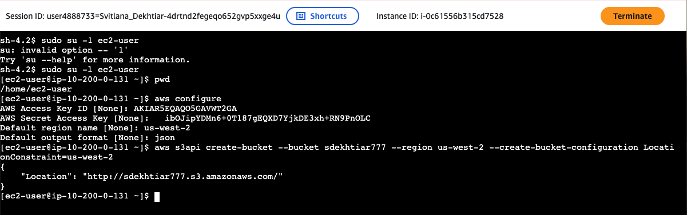
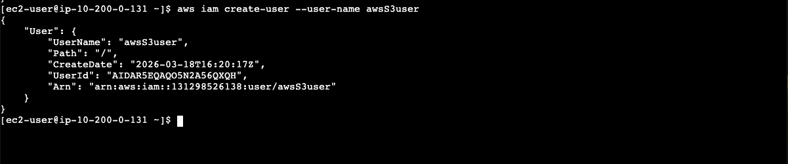
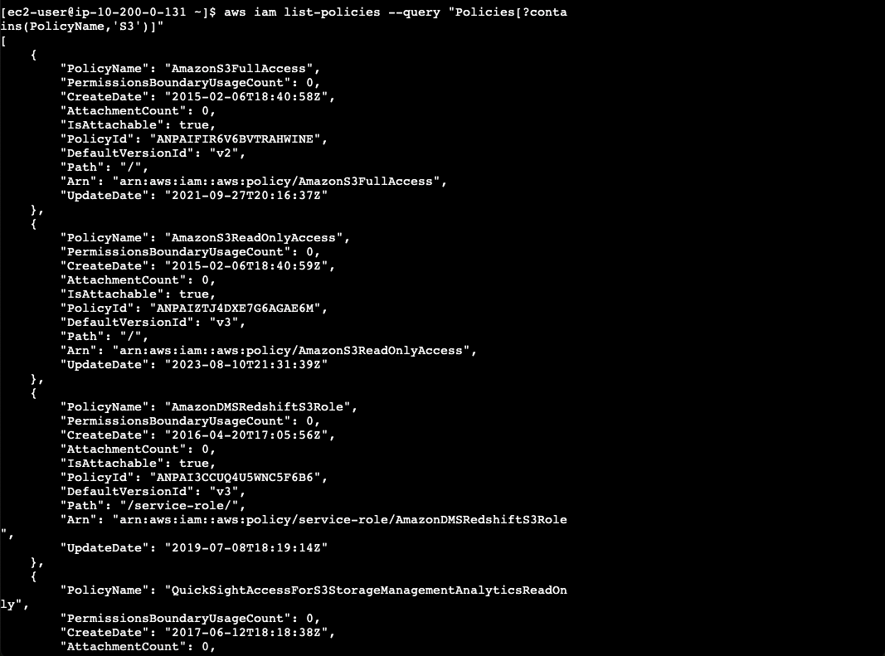
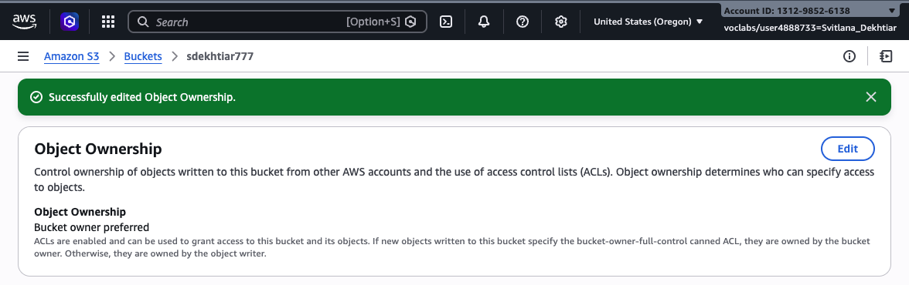
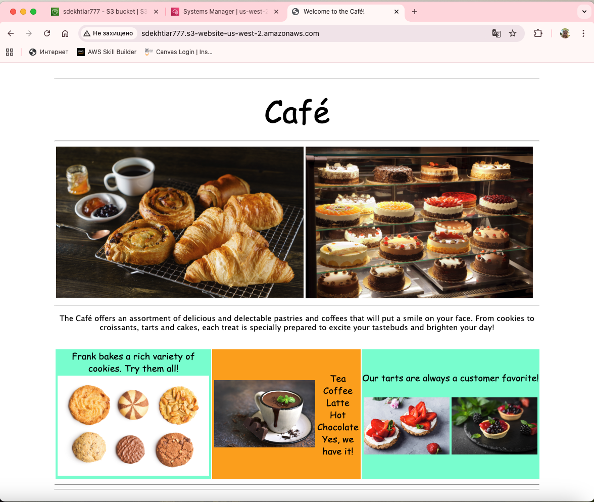
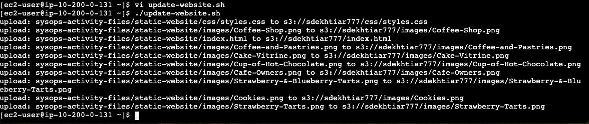
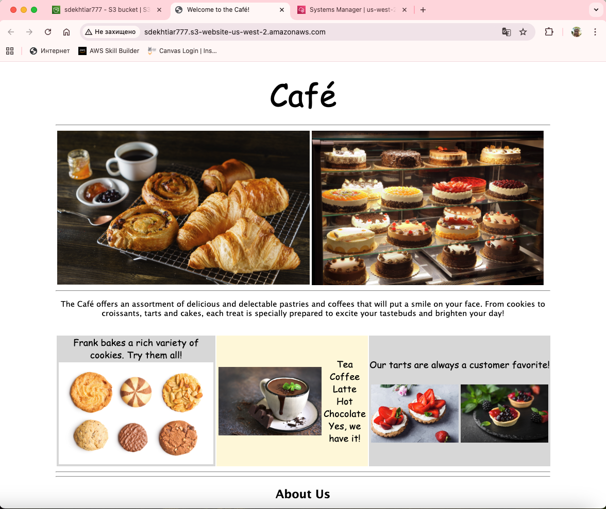
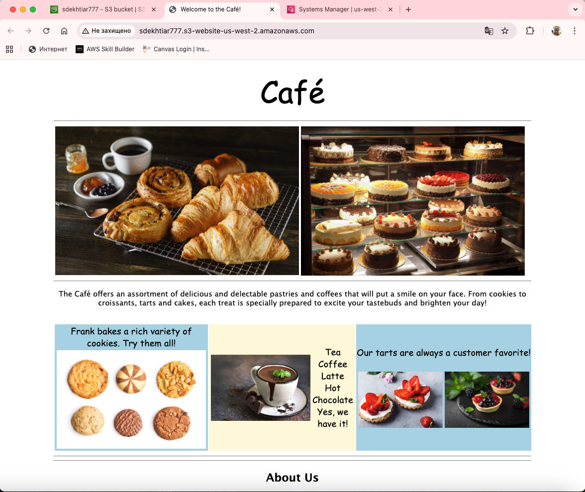

# Lab 170 – Hosting a Static Website on Amazon S3

> **My hands-on AWS lab** where I used the AWS CLI from an EC2 instance to create an S3 bucket, set up IAM permissions, deploy a static Café & Bakery website, and automate the deployment process with a bash script.

---

## What I Did

### 1. Connected to EC2 and Configured the AWS CLI

I started by connecting to my Amazon Linux EC2 instance through AWS Systems Manager Session Manager — no SSH keys needed, just a browser-based terminal. Once inside, I switched to `ec2-user` and ran `aws configure` to set up my credentials.

Then I created my S3 bucket named **sdekhtiar777** in `us-west-2` using the CLI:

```bash
aws s3api create-bucket \
  --bucket sdekhtiar777 \
  --region us-west-2 \
  --create-bucket-configuration LocationConstraint=us-west-2
```

The CLI returned a JSON confirmation with the bucket location, and I could see the bucket was live.



---

### 2. Verified the Bucket in the AWS Console

I jumped over to the S3 console and confirmed my bucket **sdekhtiar777** was visible — created on March 18, 2026, in US West (Oregon).


---

### 3. Created a New IAM User

The lab required a dedicated IAM user with S3 access. I created `awsS3user` via the CLI:

```bash
aws iam create-user --user-name awsS3user
```

The response confirmed the user was created with its own ARN under my account.



---

### 4. Set a Login Password for the New User

I then created a login profile so `awsS3user` could sign in to the AWS Console:

```bash
aws iam create-login-profile --user-name awsS3user --password Training123!
```


---

### 5. Found and Attached the Right IAM Policy

To figure out which policy to attach, I queried IAM for all policies with "S3" in the name:

```bash
aws iam list-policies --query "Policies[?contains(PolicyName,'S3')]"
```

The result came back with several options. I identified **AmazonS3FullAccess** as the right one and attached it:

```bash
aws iam attach-user-policy \
  --policy-arn arn:aws:iam::aws:policy/AmazonS3FullAccess \
  --user-name awsS3user
```



---

### 6. Logged in as awsS3user and Confirmed Bucket Access

After attaching the policy, I signed out and logged back in as `awsS3user`. The bucket was now visible, confirming the permissions were working correctly.


---

### 7. Opened Up the Bucket for Public Access

By default, S3 blocks all public access. I needed to change two settings in the console to allow the website to be publicly readable.

First, I disabled **Block all public access**:


Then I enabled **ACLs** under Object Ownership so I could control access at the object level:



---

### 8. Extracted the Website Files on the EC2 Instance

Back in the terminal, I extracted the static website package:

```bash
cd ~/sysops-activity-files
tar xvzf static-website-v2.tar.gz
cd static-website
ls
```

The archive contained everything needed: `index.html`, a `css/` folder with the stylesheet, and an `images/` folder with all the photos.


---

### 9. Uploaded the Website to S3 and Made it Live

First I configured the bucket as a static website host pointing to `index.html`:

```bash
aws s3 website s3://sdekhtiar777/ --index-document index.html
```

Then I uploaded all the files recursively with public-read access:

```bash
aws s3 cp /home/ec2-user/sysops-activity-files/static-website/ \
  s3://sdekhtiar777/ \
  --recursive \
  --acl public-read
```

I verified the upload with `aws s3 ls` — the `css/` and `images/` folders were there along with `index.html`.


---

### 10. Confirmed Static Hosting was Enabled

In the S3 console, under the **Properties** tab, I could see that Static website hosting was now **Enabled** and the public endpoint was ready:

`http://sdekhtiar777.s3-website-us-west-2.amazonaws.com`


---

### 11. The Website was Live! 🎉

I opened the bucket website endpoint in a browser and the **Café & Bakery** website was up and running — showing the full page with pastry photos, the drinks menu, and the tarts section with the original aquamarine and orange colour scheme.



---

### 12. Created a Deployment Script for Repeatable Updates

Rather than typing the upload command every time, I created a bash script to make future deployments a one-liner:

```bash
touch update-website.sh
vi update-website.sh
```

Script contents:
```bash
#!/bin/bash
aws s3 cp /home/ec2-user/sysops-activity-files/static-website/ \
  s3://sdekhtiar777/ \
  --recursive \
  --acl public-read
```

Made it executable:
```bash
chmod +x update-website.sh
```

Then I edited `index.html` to change the background colours — swapping `aquamarine` for `gainsboro` and `orange` for `cornsilk` — and ran the script:

```bash
./update-website.sh
```

All files were uploaded to S3 in one shot.



---

### 13. Website Updated with New Colours

After refreshing the browser, the page reflected the changes — the colourful aquamarine and orange panels were now a much more subtle gainsboro and cornsilk palette.



---

### 14. Optional Challenge – Switched to `aws s3 sync` for Efficiency

I noticed the script was uploading every single file every time, even if nothing had changed. So I upgraded the script to use `aws s3 sync` instead:

```bash
aws s3 sync /home/ec2-user/sysops-activity-files/static-website/ \
  s3://sdekhtiar777/ \
  --acl public-read
```

This time, only the modified `index.html` was uploaded — all the images and CSS were skipped because they hadn't changed. Much faster and more efficient for large sites.



---

## Key Takeaways

- **S3 static hosting** is a fast, serverless way to publish a website — no web server needed
- **IAM policies** must be explicitly attached; creating a user gives them no permissions by default
- **Block Public Access** and **ACL settings** are separate controls that both need to be configured for public websites
- **`aws s3 sync`** is smarter than `aws s3 cp --recursive` — it only transfers what has actually changed, making deployments faster as a project grows

---

## Resources Used

- EC2 instance: `i-0c61556b315cd7528` (Amazon Linux, us-west-2)
- S3 bucket: `sdekhtiar777` (US West Oregon, us-west-2)
- IAM user: `awsS3user` with `AmazonS3FullAccess`
- Website endpoint: `http://sdekhtiar777.s3-website-us-west-2.amazonaws.com`
