# Lab 171 — Creating Amazon EC2 Instances

> **AWS Skill Builder Lab** 

## About This Lab

In this lab I practised launching Amazon EC2 instances using two different methods — the AWS Management Console and the AWS CLI. I started by launching a **bastion host** through the console, then connected to it via EC2 Instance Connect and used it as a jumping-off point to launch a **web server** entirely from the command line. I also completed both optional challenges, troubleshooting a misconfigured instance along the way.

### Architecture I Built

```
Internet
   │
   ▼
[Public Subnet — Lab VPC (10.0.0.0/16)]
   ├── Bastion Host  (t3.micro, Amazon Linux 2)
   │     └── Security Group: Bastion-SG  (SSH port 22)
   │           └── IAM Role: Bastion-Role
   └── Web Server    (t3.micro, Amazon Linux 2)
         └── Security Group: WebSecurityGroup  (HTTP port 80)
```

---

## What I Set Out to Learn

- Launch an EC2 instance using the **AWS Management Console**
- Connect to an EC2 instance using **EC2 Instance Connect**
- Launch an EC2 instance using the **AWS CLI**
- Troubleshoot common EC2 misconfigurations (security groups, service startup)

---

## Task 1 — Launching the Bastion Host via the Console

I launched the first instance — a bastion host — manually through the AWS Management Console. Here are the settings I configured:

| Setting | Value |
|---|---|
| **Name** | `Bastion host` |
| **AMI** | Amazon Linux 2 (HVM, x86_64, gp2) |
| **Instance type** | `t3.micro` |
| **Key pair** | Proceed without key pair |
| **VPC** | Lab VPC |
| **Subnet** | Public Subnet |
| **Auto-assign public IP** | Enable |
| **Security group name** | `Bastion security group` |
| **SG description** | `Permit SSH connections` |
| **Storage** | 8 GiB (default) |
| **IAM instance profile** | `Bastion-Role` |

**Steps I followed:**

1. Navigated to **EC2 → Launch instance**
2. Set the name to `Bastion host` under Name and tags
3. Selected **Amazon Linux 2** as the AMI
4. Chose `t3.micro` as the instance type
5. Chose **Proceed without key pair** — I would be using EC2 Instance Connect instead
6. Under Network settings → Edit: selected **Lab VPC**, **Public Subnet**, and enabled auto-assign public IP
7. Created a new security group: `Bastion security group` / `Permit SSH connections`
8. Expanded Advanced details and set the IAM instance profile to `Bastion-Role`
9. Launched the instance

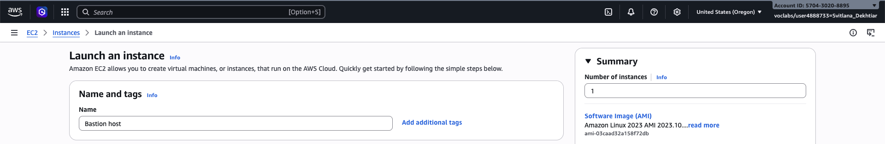

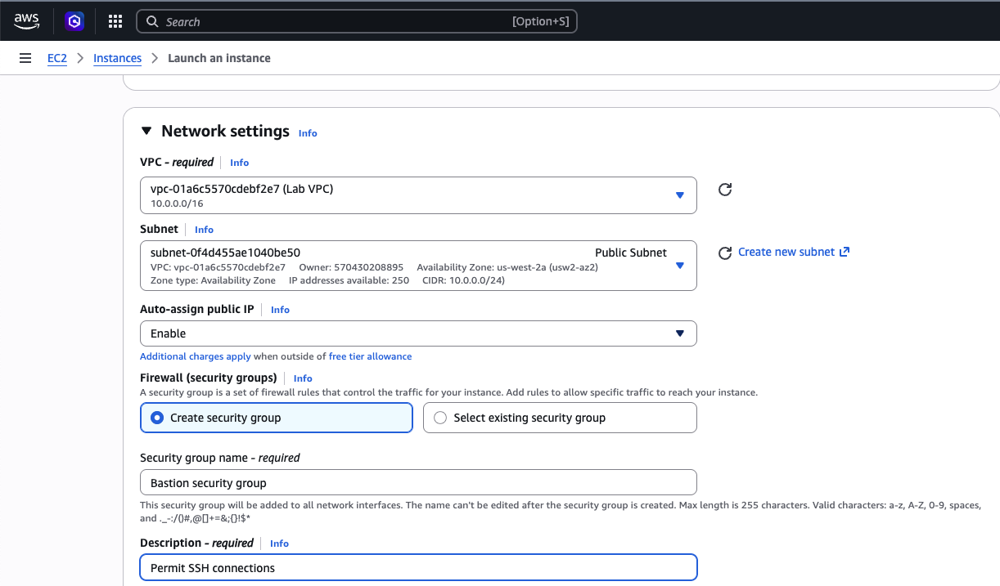

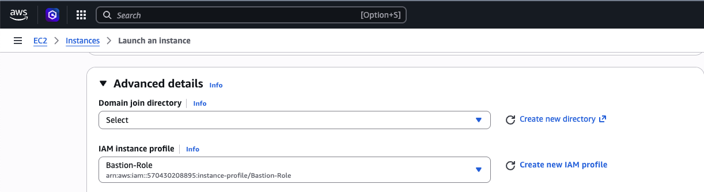

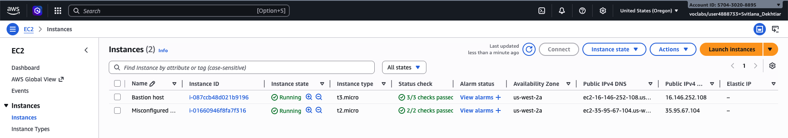

---

## Task 2 — Connecting via EC2 Instance Connect

Once the bastion host was running, I connected to it directly from the browser using EC2 Instance Connect — no SSH key needed.

1. Selected the **Bastion host** instance in the EC2 console
2. Clicked **Connect → EC2 Instance Connect → Connect**
3. A browser-based terminal opened and I was logged in as `ec2-user`

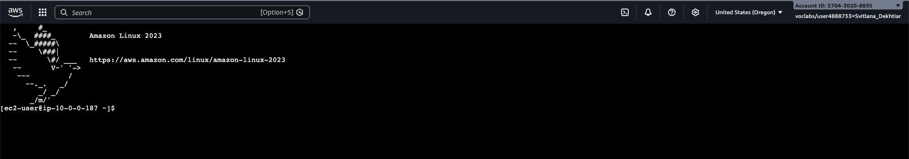

---

## Task 3 — Launching the Web Server via the AWS CLI

From inside the EC2 Instance Connect session, I used the AWS CLI to launch a second instance as a web server. I needed to retrieve several values first — the AMI ID, subnet ID, and security group ID — before running the launch command.

> ⚠️ If the session disconnects, all environment variables are lost. I'd need to reconnect and re-run from Step 1.

### Step 1 — Retrieved the latest Amazon Linux 2 AMI

I used AWS Systems Manager Parameter Store, where AWS maintains up-to-date AMI IDs, to dynamically fetch the latest AMI rather than hardcoding an ID.

```bash
# Set the Region from instance metadata
AZ=`curl -s http://169.254.169.254/latest/meta-data/placement/availability-zone`
export AWS_DEFAULT_REGION=${AZ::-1}

# Retrieve the latest AMI ID from SSM Parameter Store
AMI=$(aws ssm get-parameters \
  --names /aws/service/ami-amazon-linux-latest/amzn2-ami-hvm-x86_64-gp2 \
  --query 'Parameters[0].[Value]' \
  --output text)
echo $AMI
```

### Step 2 — Retrieved the Public Subnet ID

```bash
SUBNET=$(aws ec2 describe-subnets \
  --filters 'Name=tag:Name,Values=Public Subnet' \
  --query Subnets[].SubnetId \
  --output text)
echo $SUBNET
```

### Step 3 — Retrieved the Web Security Group ID

```bash
SG=$(aws ec2 describe-security-groups \
  --filters Name=group-name,Values=WebSecurityGroup \
  --query SecurityGroups[].GroupId \
  --output text)
echo $SG
```

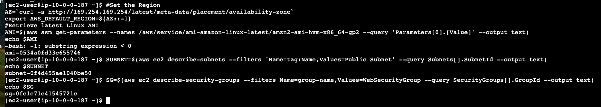

### Step 4 — Downloaded the User Data Script

The user data script automatically installs Apache, downloads the web application, and deploys it on first boot.

```bash
wget https://aws-tc-largeobjects.s3.us-west-2.amazonaws.com/CUR-TF-100-RSJAWS-1-23732/171-lab-JAWS-create-ec2/s3/UserData.txt
cat UserData.txt
```

### Step 5 — Launched the Web Server Instance

With all the required values stored in environment variables, I ran a single `run-instances` command to launch the web server:

```bash
INSTANCE=$(aws ec2 run-instances \
  --image-id $AMI \
  --subnet-id $SUBNET \
  --security-group-ids $SG \
  --user-data file:///home/ec2-user/UserData.txt \
  --instance-type t3.micro \
  --tag-specifications 'ResourceType=instance,Tags=[{Key=Name,Value=Web Server}]' \
  --query 'Instances[*].InstanceId' \
  --output text)
echo $INSTANCE
```

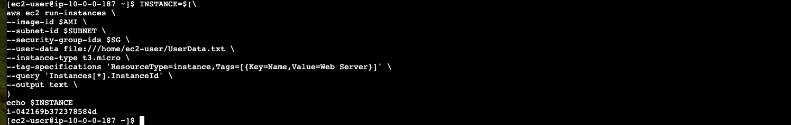

### Step 6 — Waited for the Instance to Be Running

I polled the instance state until it returned `running`:

```bash
aws ec2 describe-instances \
  --instance-ids $INSTANCE \
  --query 'Reservations[].Instances[].State.Name' \
  --output text
```

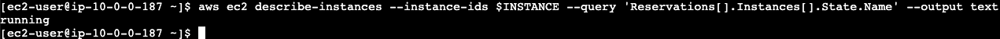

### Step 7 — Tested the Web Server

I retrieved the public DNS name and opened it in the browser:

```bash
aws ec2 describe-instances \
  --instance-ids $INSTANCE \
  --query Reservations[].Instances[].PublicDnsName \
  --output text
```

The Widget Manufacturing Dashboard loaded successfully, confirming the web server was up and the user data script had run correctly.

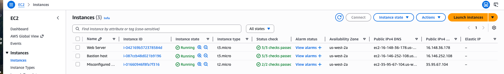

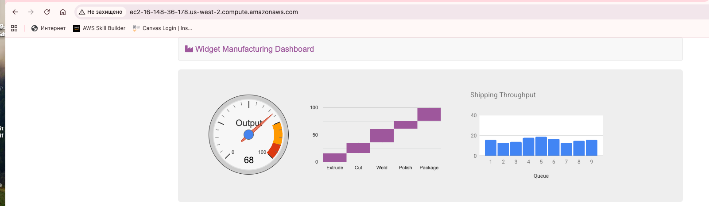

---

## Challenge 1 — Fixing EC2 Instance Connect (Missing SSH Rule)

In this challenge I had to figure out why I couldn't connect to a pre-existing `Misconfigured Web Server` instance via EC2 Instance Connect.

**What I saw:**

> `Failed to connect to your Instance — Error establishing SSH connection to your instance.`

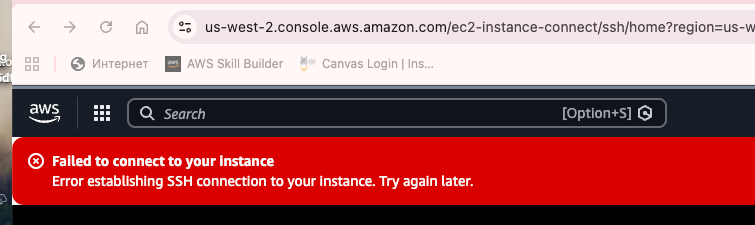

**What I found:**

After investigating the instance's security group (`Challenge-SG`), I noticed it only had an inbound rule for HTTP (port 80). The SSH rule on port 22 was completely missing, which is what EC2 Instance Connect needs to establish a connection.

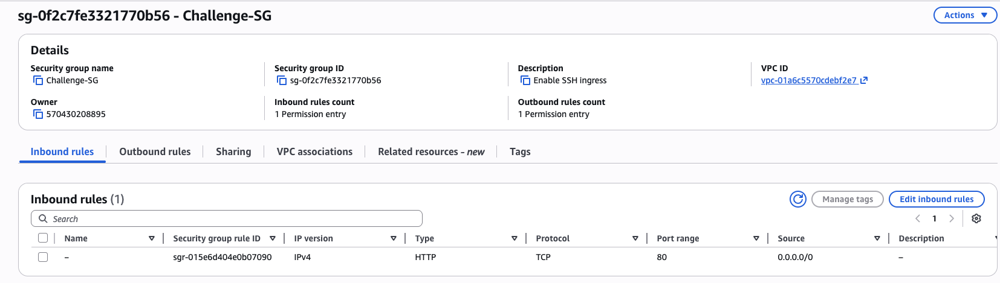

**What I did to fix it:**

1. Navigated to **EC2 → Security Groups → Challenge-SG**
2. Clicked **Edit inbound rules → Add rule**
3. Added: Type `SSH` | Protocol `TCP` | Port `22` | Source `0.0.0.0/0`
4. Saved the rules

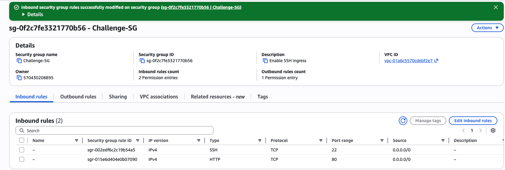

**Result:** EC2 Instance Connect worked immediately after adding the SSH rule.

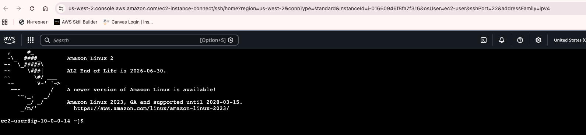

---

## Challenge 2 — Fixing the Web Server (Apache Not Started)

The second challenge was to figure out why the `Misconfigured Web Server`'s public DNS returned `ERR_CONNECTION_REFUSED` in the browser.

**What I saw:**

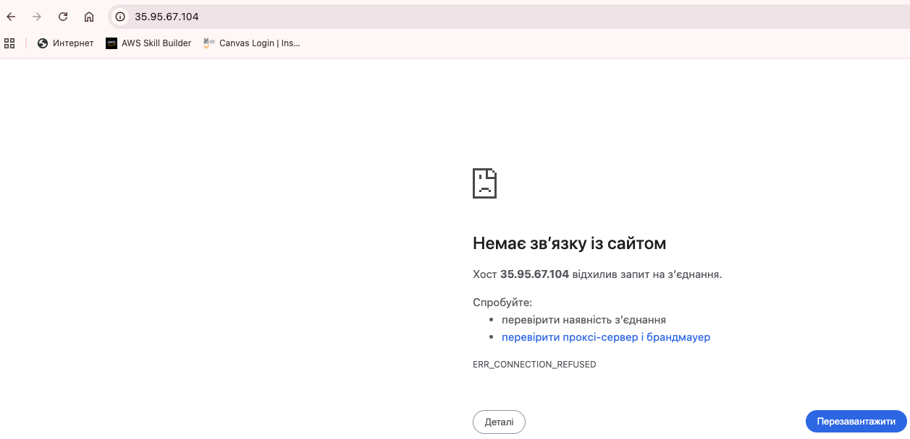

**What I found:**

After connecting to the instance (now that Challenge 1 was resolved), I checked the Apache service status:

```bash
sudo systemctl status httpd
```

Apache was installed but had never been started — its state was `inactive (dead)`.

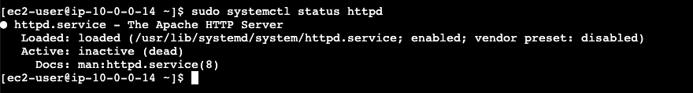

**What I did to fix it:**

```bash
sudo systemctl start httpd
sudo systemctl enable httpd   # so it survives reboots
```

**Result:** The Apache test page loaded right away in the browser.

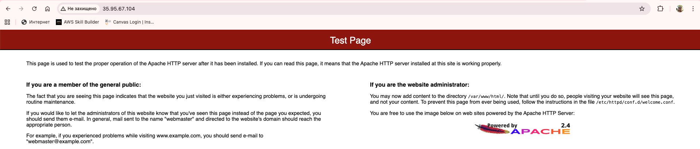

---

## What I Learned

### Core concepts I worked with

| Concept | What it means in practice |
|---|---|
| **AMI** | The template that defines what OS and software an instance starts with |
| **Instance type** | Controls the CPU, memory, and network capacity of the instance |
| **Security group** | Acts as a virtual firewall — I learned firsthand that a missing inbound rule silently blocks all access |
| **IAM instance profile** | Lets the instance itself make AWS API calls — essential for the bastion to run CLI commands |
| **User data** | A shell script that runs once on first boot, great for automated software installation |
| **EC2 Instance Connect** | Browser-based SSH with no static keys — much simpler for ad-hoc access |
| **SSM Parameter Store** | A reliable way to always get the latest AMI ID without hardcoding values |

### Choosing the right launch method

| Method | When to use it |
|---|---|
| **Management Console** | Quick, one-off, or exploratory instances |
| **AWS CLI / script** | Repeatable, automated provisioning with less room for human error |
| **CloudFormation** | When launching a set of related resources together as a stack |

### Key takeaways

- The AWS CLI is a powerful way to automate infrastructure — what I did in Task 3 with a handful of commands could easily become a reusable deployment script.
- Security groups are the first thing to check when connectivity fails. Both challenges came down to a misconfigured security group or a service that wasn't running — very common real-world issues.
- Using SSM Parameter Store to look up AMI IDs dynamically is a best practice I'll carry forward rather than hardcoding IDs.

---

## Resources

- [Launch Your Instance](https://docs.aws.amazon.com/AWSEC2/latest/UserGuide/LaunchingAndUsingInstances.html)
- [Connect via EC2 Instance Connect](https://docs.aws.amazon.com/AWSEC2/latest/UserGuide/Connect-using-EC2-Instance-Connect.html)
- [EC2 User Data and Shell Scripts](https://docs.aws.amazon.com/AWSEC2/latest/UserGuide/user-data.html)
- [AWS CLI Reference — ec2](https://awscli.amazonaws.com/v2/documentation/api/latest/reference/ec2/index.html)
