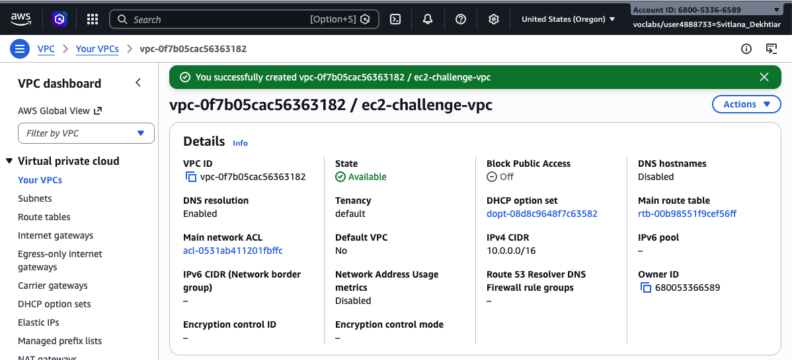
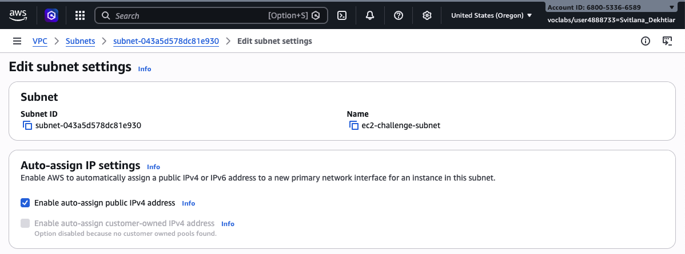
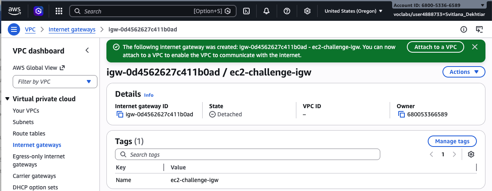
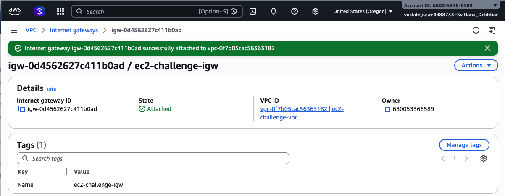
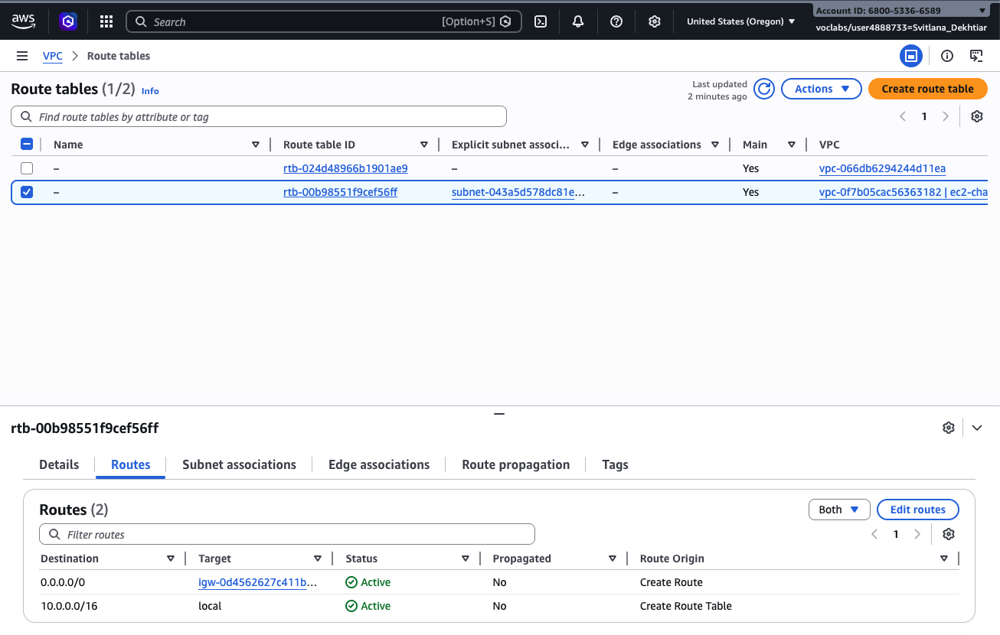
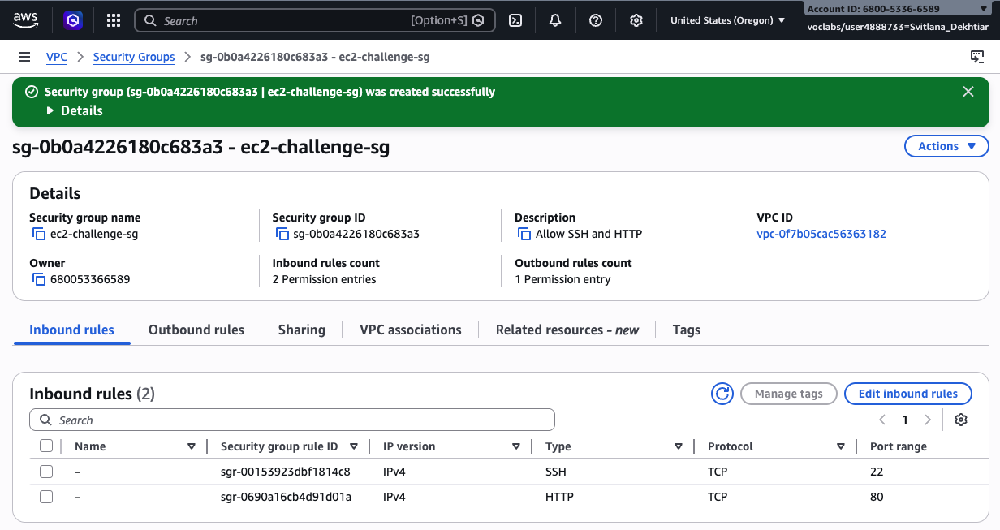
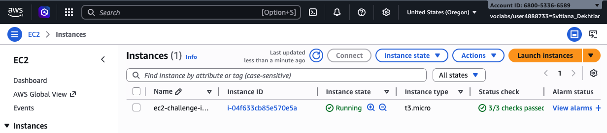
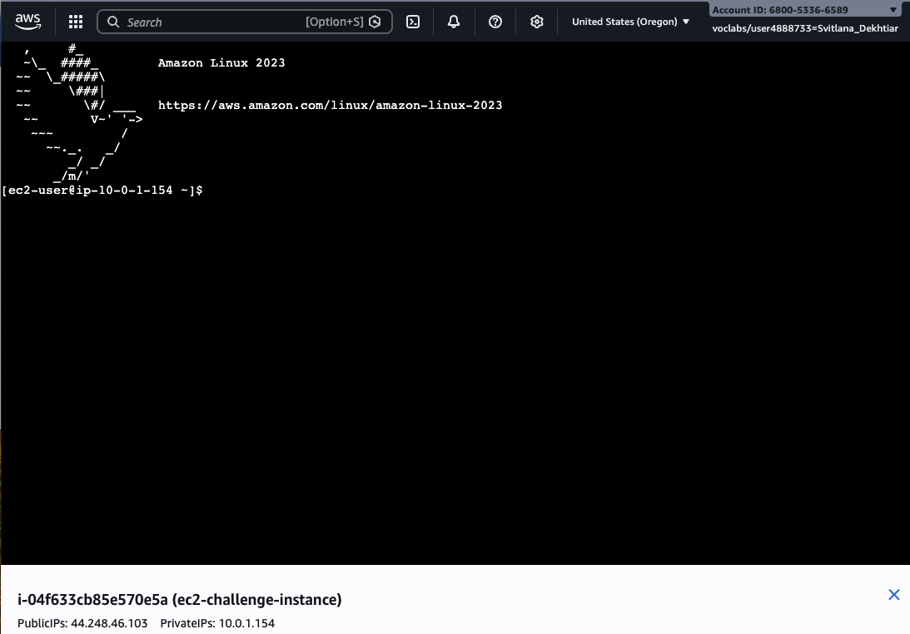
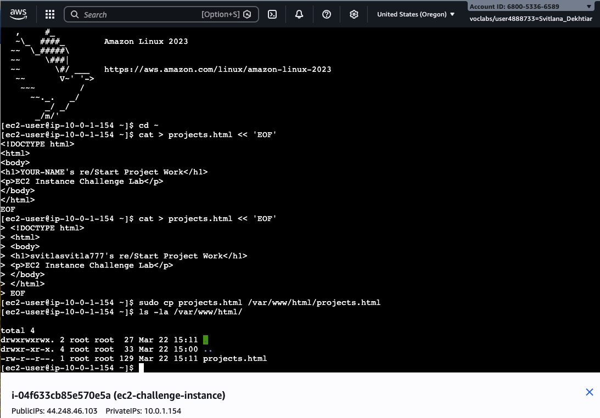
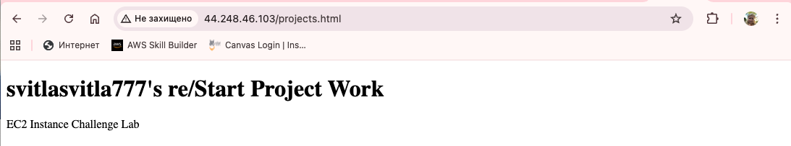

# AWS EC2 Instance Challenge Lab
### AWS re/Start Program — Project Work


---

## About This Project

This is my completed AWS EC2 Instance Challenge Lab, part of the **AWS re/Start** program. In this challenge, I independently built and deployed a working web application on an Amazon EC2 instance — configuring the entire network infrastructure from scratch, launching a virtual server, automating the web server setup, and deploying a live HTML page accessible from the internet.

This was a hands-on, open-ended challenge with no step-by-step instructions — I had to apply everything I had learned about EC2, VPC, networking, and Linux to get it working end to end.

---

## What I Built

A publicly accessible web application running on an **Amazon Linux 2023 EC2 instance** inside a custom **VPC**, with:
- A fully configured virtual network (VPC, subnet, internet gateway, route table)
- An Apache web server installed automatically via EC2 User Data on first boot
- A custom HTML page deployed via EC2 Instance Connect (browser SSH)
- Proper security group rules allowing SSH and HTTP access

---

## Architecture

```
Internet
    │
    ▼
Internet Gateway (ec2-challenge-igw)
    │
    ▼
VPC: ec2-challenge-vpc  [10.0.0.0/16]
    │
    ▼
Public Subnet: ec2-challenge-subnet  [10.0.1.0/24]
    │   Auto-assign Public IPv4: ✅ Enabled
    │
    ▼
Route Table  ──►  0.0.0.0/0 → Internet Gateway
    │
    ▼
Security Group: ec2-challenge-sg
    │   Inbound: SSH (22) + HTTP (80)
    │
    ▼
EC2 Instance: ec2-challenge-instance
    │   Amazon Linux 2023 | t3.micro | 30GB gp2
    │   User Data → installs & starts Apache httpd
    │
    ▼
http://44.248.46.103/projects.html  ✅ Live
```

---

## Step-by-Step: What I Did

### Step 1 — Created a Custom VPC

I created a new Virtual Private Cloud named `ec2-challenge-vpc` with CIDR block `10.0.0.0/16`. Using a custom VPC instead of the default one gave me full control over the network topology.



**Result:** VPC `vpc-0f7b05cac56363182` created successfully with State: **Available** ✅

---

### Step 2 — Created a Public Subnet with Auto-Assign IPv4

I created a subnet `ec2-challenge-subnet` (`10.0.1.0/24`) inside the VPC and enabled **auto-assign public IPv4** — this is critical so that any instance launched in this subnet automatically gets a public IP address reachable from the internet.



**Result:** Subnet `subnet-043a5d578dc81e930` created with auto-assign public IPv4 **enabled** ✅

---

### Step 3a — Created an Internet Gateway

I created an Internet Gateway named `ec2-challenge-igw`. At this point it was in **Detached** state — it exists but isn't connected to any VPC yet.



**Result:** Internet Gateway `igw-0d4562627c411b0ad` created ✅

---

### Step 3b — Attached the Internet Gateway to the VPC

I attached the IGW to `ec2-challenge-vpc`. This is what allows traffic to flow between the subnet and the public internet. Without this step, the instance would have no route out.



**Result:** IGW State changed to **Attached** → linked to `ec2-challenge-vpc` ✅

---

### Step 4 — Configured the Route Table

I edited the route table associated with my VPC and added a route: `0.0.0.0/0 → igw-0d4562627c411b0ad`. This tells AWS to send all outbound internet traffic through the internet gateway. I also associated the route table with my subnet.



**Result:** Route table `rtb-00b98551f9cef56ff` has two active routes:
- `10.0.0.0/16` → local (internal VPC traffic)
- `0.0.0.0/0` → Internet Gateway (**internet access**) ✅

---

### Step 5 — Created a Security Group

I created a security group `ec2-challenge-sg` with two inbound rules:
- **SSH (port 22)** — to connect to the instance via EC2 Instance Connect
- **HTTP (port 80)** — to serve web traffic from Apache



**Result:** Security group `sg-0b0a4226180c683a3` with 2 inbound rules created successfully ✅

---

### Step 6 — Launched the EC2 Instance

I launched an EC2 instance with the following configuration:
- **AMI:** Amazon Linux 2023
- **Instance type:** t3.micro
- **VPC / Subnet:** ec2-challenge-vpc / ec2-challenge-subnet
- **Storage:** 30GB gp2 *(Amazon Linux 2023 requires minimum 30GB)*
- **Security group:** ec2-challenge-sg
- **User Data:** script to automatically install and start Apache httpd

> ⚠️ **Challenge I ran into:** My first launch attempt failed with *"Volume of size 8GB is smaller than snapshot, expect size >= 30GB"*. Amazon Linux 2023 requires a minimum root volume of 30GB. I fixed this by changing the volume size from 8GB to 30GB and relaunching successfully.

**User Data script:**
```bash
#!/bin/bash
yum update -y
yum install -y httpd
systemctl start httpd
systemctl enable httpd
chmod 777 /var/www/html
```



**Result:** Instance `i-04f633cb85e570e5a` — State: **Running**, 3/3 status checks passed ✅

---

### Step 7 — Verified httpd Installation via System Log

I checked the EC2 system log to confirm that the User Data script ran successfully and that Apache httpd was installed and started during the instance's first boot.


**Result:** System log confirmed httpd was installed and the service started ✅

---

### Step 8 — Connected via EC2 Instance Connect

I used **EC2 Instance Connect** — a browser-based SSH tool built into the AWS Console — to connect directly to my instance without needing a local SSH client or key pair files. This opened a terminal running on Amazon Linux 2023.



**Result:** Successfully connected as `ec2-user` on `ip-10-0-1-154` ✅

---

### Step 9 — Deployed the HTML Page

In the terminal I created `projects.html` with my name and deployed it to the Apache web root using `sudo cp`. The sudo elevation was needed because `/var/www/html/` is owned by root.

```bash
cat > projects.html << 'EOF'
<!DOCTYPE html>
<html>
<body>
<h1>svitlasvitla777's re/Start Project Work</h1>
<p>EC2 Instance Challenge Lab</p>
</body>
</html>
EOF

sudo cp projects.html /var/www/html/projects.html
ls -la /var/www/html/
```



**Result:** `projects.html` (129 bytes) confirmed in `/var/www/html/` ✅

---

### Step 10 — Web Page Live in Browser ✅

I opened a browser and navigated to `http://44.248.46.103/projects.html`. The page loaded — my HTML was being served live from the EC2 instance over the public internet.



**Result:** Web page successfully returned and displayed 🎉

---

## Resources Created

| Resource | Name | Details |
|---|---|---|
| VPC | `ec2-challenge-vpc` | CIDR: `10.0.0.0/16`, State: Available |
| Subnet | `ec2-challenge-subnet` | `10.0.1.0/24`, auto-IPv4 enabled |
| Internet Gateway | `ec2-challenge-igw` | State: Attached to VPC |
| Route Table | `rtb-00b98551f9cef56ff` | `0.0.0.0/0` → IGW |
| Security Group | `ec2-challenge-sg` | Inbound: SSH (22), HTTP (80) |
| EC2 Instance | `ec2-challenge-instance` | Amazon Linux 2023, t3.micro, 30GB gp2 |

---

## Files in This Repository

```
aws-ec2-challenge-lab/
│
├── README.md               ← This documentation
├── user-data.sh            ← EC2 bootstrap script (Apache install)
├── projects.html           ← HTML page deployed to web server
└── screenshots/
    ├── 01_vpc_created.png
    ├── 02_subnet_created.png
    ├── 03_1_igw_created.png
    ├── 03_2_igw_attached.png
    ├── 04_route_table_configured.png
    ├── 05_security_group.png
    ├── 06_ec2_instance_running.png
    ├── 07_system_log_httpd.png
    ├── 08_ec2_instance_connect.png
    ├── 09_html_file_deployed.png
    └── 10_webpage_browser.png
```

---

## What I Learned

**AWS Networking fundamentals** — A VPC alone is isolated. You need a subnet, internet gateway, and a correctly configured route table all working together before an instance can reach the internet. Understanding how these pieces connect was a key insight from this lab.

**EC2 User Data automation** — Running a shell script at first boot to auto-install software is a foundational cloud concept. Instead of manually configuring the server after launch, I defined what it should do at creation time. This is how real infrastructure is automated at scale.

**Security Groups as stateful firewalls** — I had to explicitly open both port 22 (SSH) and port 80 (HTTP). Missing either one would have blocked either management access or user traffic — two different failure modes with the same root cause.

**EC2 Instance Connect** — Browser-based SSH is fast and practical. No `.pem` file management, no local SSH client needed. The only requirement is that port 22 is open and the instance has a public IP.

**Debugging cloud errors** — My first launch failed because Amazon Linux 2023 requires a 30GB minimum root volume — not 8GB. Reading the error message, understanding what a snapshot size requirement means, and knowing where to change the volume setting turned a failure into a learning moment.

**Linux skills practiced:**
- `cat > file << 'EOF'` — write multi-line content to a file from the terminal
- `sudo cp` — copy to root-owned directories
- `ls -la` — verify file deployment and permissions
- `systemctl start / enable` — start a service and enable it on reboot

---

## Technologies Used

- **Amazon EC2** — Virtual server in the cloud
- **Amazon VPC** — Custom isolated virtual network
- **Amazon Linux 2023** — Server operating system
- **Apache httpd** — Web server
- **EC2 User Data** — Boot-time shell script automation
- **EC2 Instance Connect** — Browser-based SSH
- **HTML / Bash** — Web page and automation script

---

## Author

**Svitlana Dekhtiar** — AWS re/Start Program Student
