# Lab 173 – Troubleshooting the Creation of an EC2 Instance

**AWS SysOps Administration | March 23, 2026**  
**Region:** us-west-2 (Oregon)  
**Account:** voclabs/user4888733=Svitlana_Dekhtiar

---

## What This Lab Was About

The goal was to launch an EC2 instance running a LAMP stack (Linux, Apache, MariaDB, PHP) using the AWS CLI — not through the console UI, but entirely through a shell script. The catch: the script had two intentional bugs that I had to find and fix myself. One was causing the instance launch to fail completely, and the other was blocking web traffic even after the instance was up.

The final result was a working Café Web Application deployed on the instance, with orders stored in a MariaDB database.

---

## Task 1 – Connecting to the CLI Host

First I connected to the CLI Host EC2 instance using EC2 Instance Connect directly from the browser. Once connected I got a shell on an Amazon Linux 2 instance. It printed a notice that AL2 reaches end of life on 2026-06-30 and suggested upgrading to Amazon Linux 2023 — not relevant for this lab, but good to know.

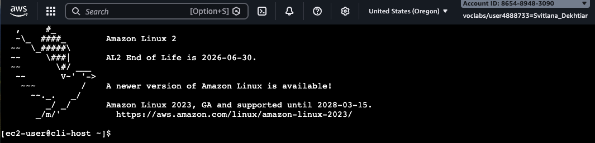

> The prompt `[ec2-user@cli-host ~]$` confirmed I was on the right machine.

---

## Task 2 – Configuring the AWS CLI

Amazon Linux comes with the AWS CLI pre-installed, but I still needed to feed it credentials. I ran `aws configure` and filled in the Access Key, Secret Key, region (`us-west-2`), and output format (`json`) from the lab's Details panel.

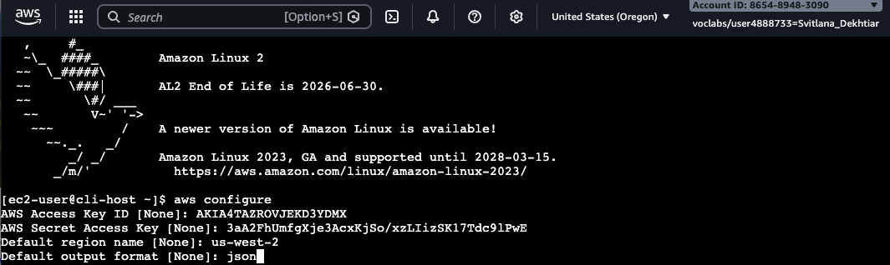

Then I verified the config actually worked by running:

```bash
aws sts get-caller-identity
```

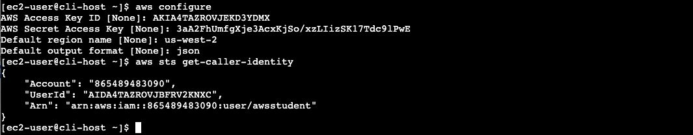

It returned my account ID `865489483090` and the ARN `arn:aws:iam::865489483090:user/awsstudent` — credentials were good.

---

## Task 3 – Running the Script (and Fixing What Was Broken)

### 3.1 – Backing Up and Reviewing the Script

Before touching anything I created a backup of the script. Good habit.

```bash
cd ~/sysops-activity-files/starters
cp create-lamp-instance-v2.sh create-lamp-instance.backup
```

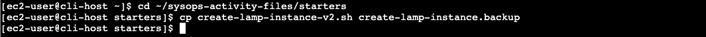

Then I opened the script in VI read-only mode to understand what it does before running it.

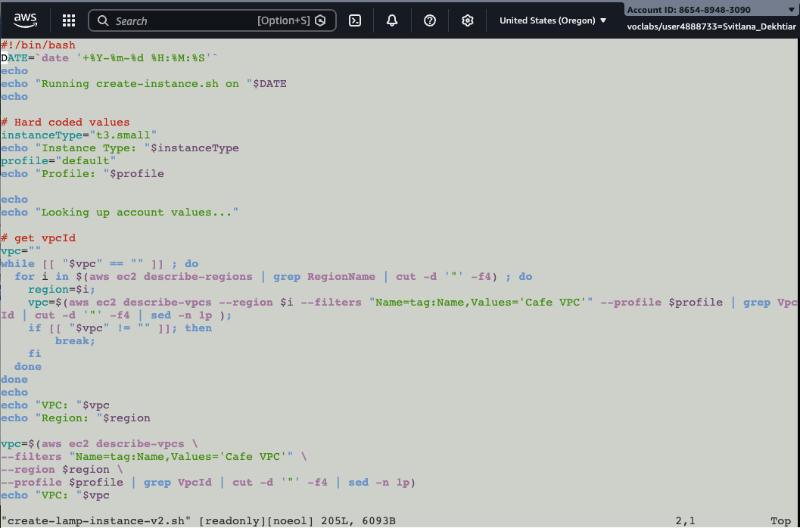

The script searches all AWS regions to find a VPC named "Cafe VPC", then collects the subnet ID, key pair name, and AMI ID from that region. After that it creates a security group and launches the instance using `run-instances`.

I also looked at the user data file to understand what gets installed on the instance:

```bash
cat create-lamp-instance-userdata-v2.txt
```

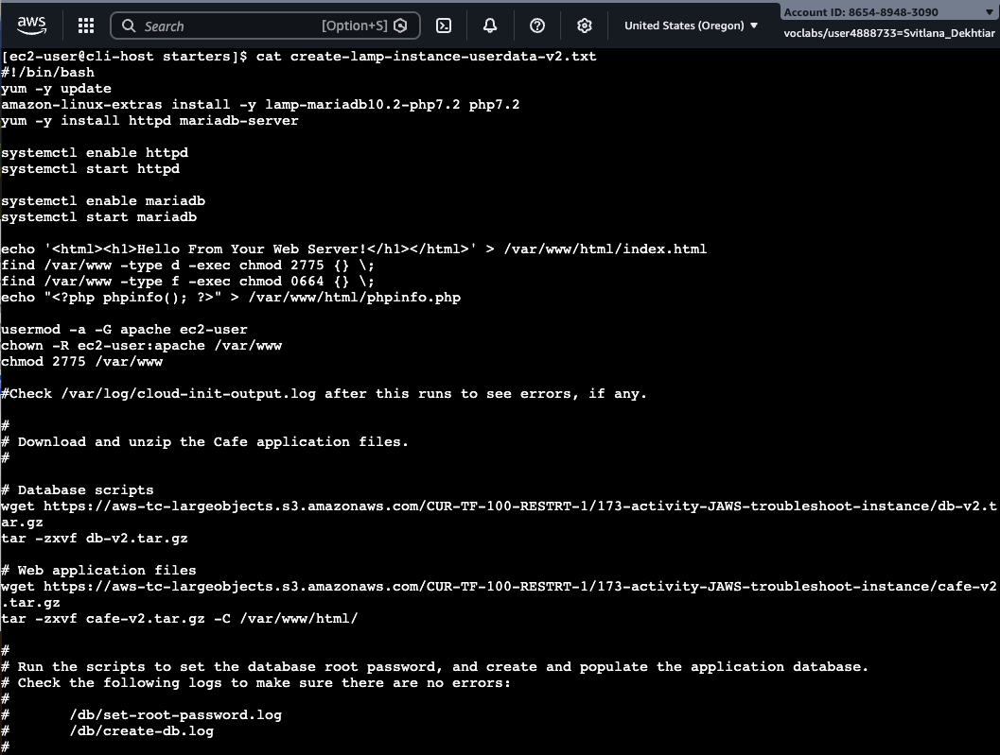

The user data script installs Apache (`httpd`), MariaDB, and PHP, starts both services, creates a test HTML page, and downloads + extracts the Café web application files from S3. It also runs database setup scripts to set the root password and create the application schema.

---

### 3.2 – First Run: InvalidAMIID Error

I ran the script and it failed:

```bash
./create-lamp-instance-v2.sh
```

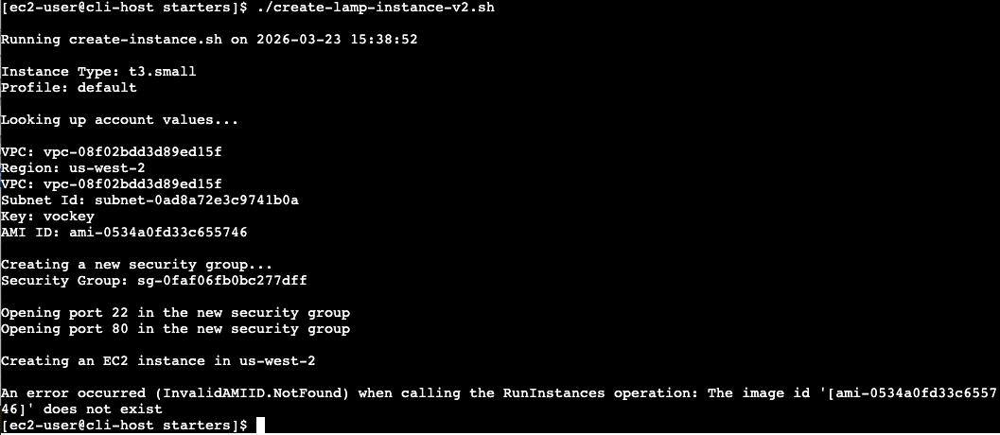

The error was:

```
An error occurred (InvalidAMIID.NotFound) when calling the RunInstances operation:
The image id '[ami-0534a0fd33c655746]' does not exist
```

The script correctly found the Cafe VPC in `us-west-2` and even created the security group successfully — but when it got to `run-instances`, it blew up.

---

### 3.3 – Issue #1: Wrong Region in run-instances

I opened the script in VI to investigate. Looking at the `run-instances` block, I found the problem on line 160:

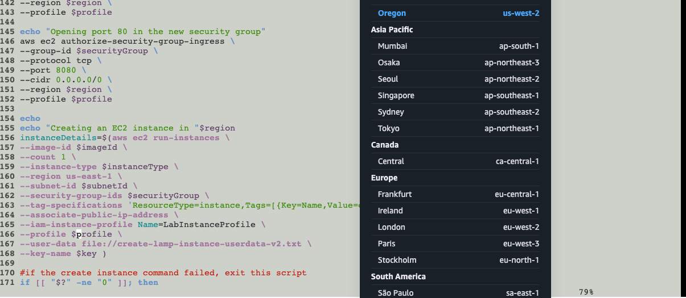

The `run-instances` command had `--region us-east-1` hardcoded, but the Cafe VPC — and the AMI — were in `us-west-2`. AMI IDs are region-specific, so `ami-0534a0fd33c655746` simply didn't exist in `us-east-1`.

While I was in that section I also noticed line 149 had the security group opening port **8080** instead of port 80. The echo message above it said "Opening port 80" but the actual command said `--port 8080`. That was going to be Issue #2.

I fixed line 160 by replacing `us-east-1` with `$region`:

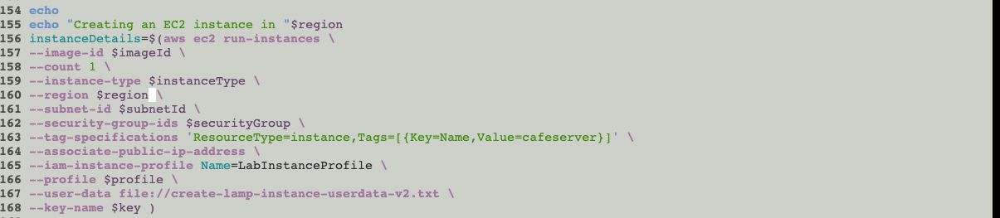

Ran the script again and this time it got all the way through. The instance launched and after a short wait I got the public IP:

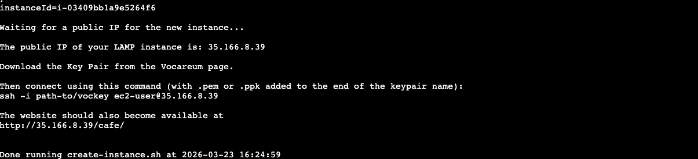

```
The public IP of your LAMP instance is: 35.166.8.39
```

The script even printed that the website should be accessible at `http://35.166.8.39/cafe/`. Spoiler: it wasn't yet.

---

### 3.4 – Issue #2: Port 80 Not Open

I tried opening `http://35.166.8.39` in the browser.

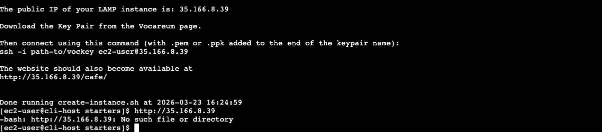

Nothing loaded. The page just timed out.

I installed nmap on the CLI host and scanned the instance:

```bash
sudo yum install -y nmap
nmap -Pn 35.166.8.39
```

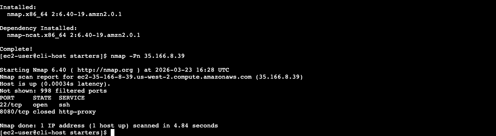

nmap showed port **22 open** and port **8080 closed**. Port 80 wasn't listed at all — it wasn't blocked, it just wasn't in the security group rules. That confirmed what I saw in the script: the `authorize-security-group-ingress` call had used `--port 8080` by mistake.

I connected to the LAMP instance directly to check whether Apache was actually running at all:

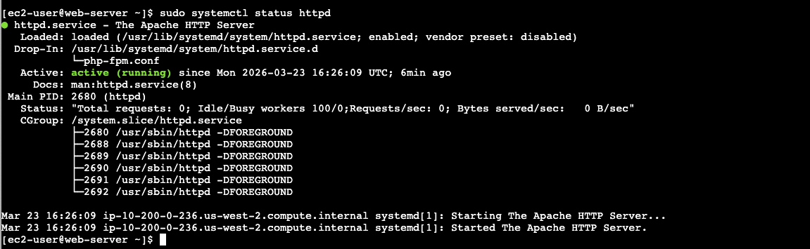

Apache was running fine — started at 16:26:09 UTC. The problem was purely the security group, not the web server.

I queried the security group ID:

```bash
aws ec2 describe-security-groups \
  --filters Name=group-name,Values='*cafeSG*' \
  --query 'SecurityGroups[*].[GroupId,GroupName]' \
  --output table
```

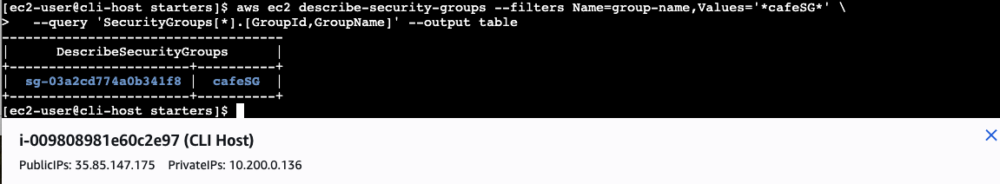

The group ID was `sg-03a2cd774a0b341f8`. Then I added the correct inbound rule:

```bash
aws ec2 authorize-security-group-ingress \
  --group-id sg-03a2cd774a0b341f8 \
  --protocol tcp \
  --port 80 \
  --cidr 0.0.0.0/0
```

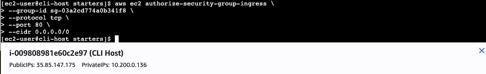

Ran nmap one more time to confirm:

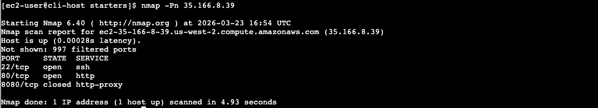

Now both 22/tcp (ssh) and 80/tcp (http) were open.

---

## Task 4 – Verifying the Website

### The Hello World Check

First basic test — just hit the root IP to confirm Apache was serving content:


`http://35.166.8.39` returned "Hello From Your Web Server!" — the simple HTML file the user data script had written to `/var/www/html/index.html`. Good sign.

---

### Checking the Cloud-Init Log

Before opening the full app I checked the cloud-init log on the LAMP instance to make sure all the install steps ran cleanly:

```bash
sudo tail -f /var/log/cloud-init-output.log
```

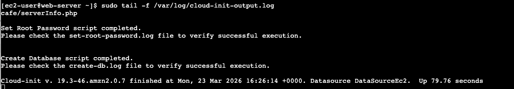

The log showed:
- `Set Root Password script completed.`
- `Create Database script completed.`
- `Cloud-init v. 19.3-46.amzn2.0.7 finished at Mon, 23 Mar 2026 16:26:14 +0000. Up 79.76 seconds`

Everything finished in under 80 seconds from launch with no errors. The database was set up and populated while I was still debugging the security group.

---

### The Café Web Application

Navigated to `http://35.166.8.39/cafe/`:

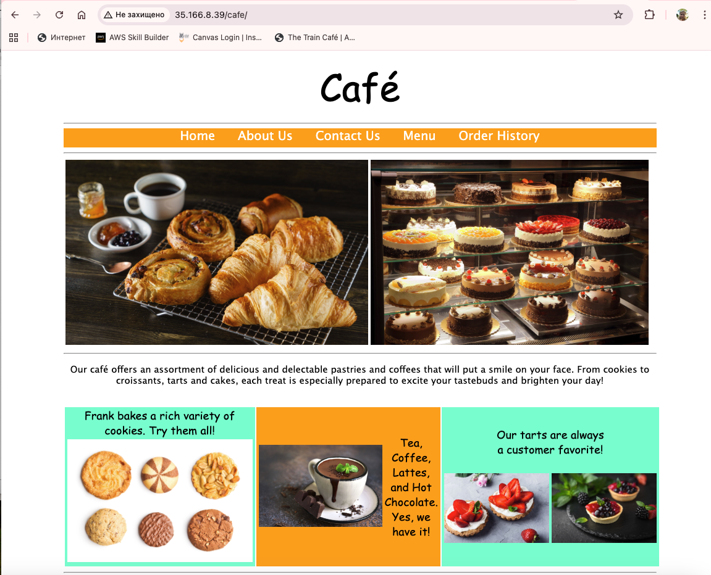

The full application loaded — home page with food photos, navigation bar (Home, About Us, Contact Us, Menu, Order History), and the café description. Completely deployed automatically by the user data script pulling files from S3.

Clicked through to the Menu:

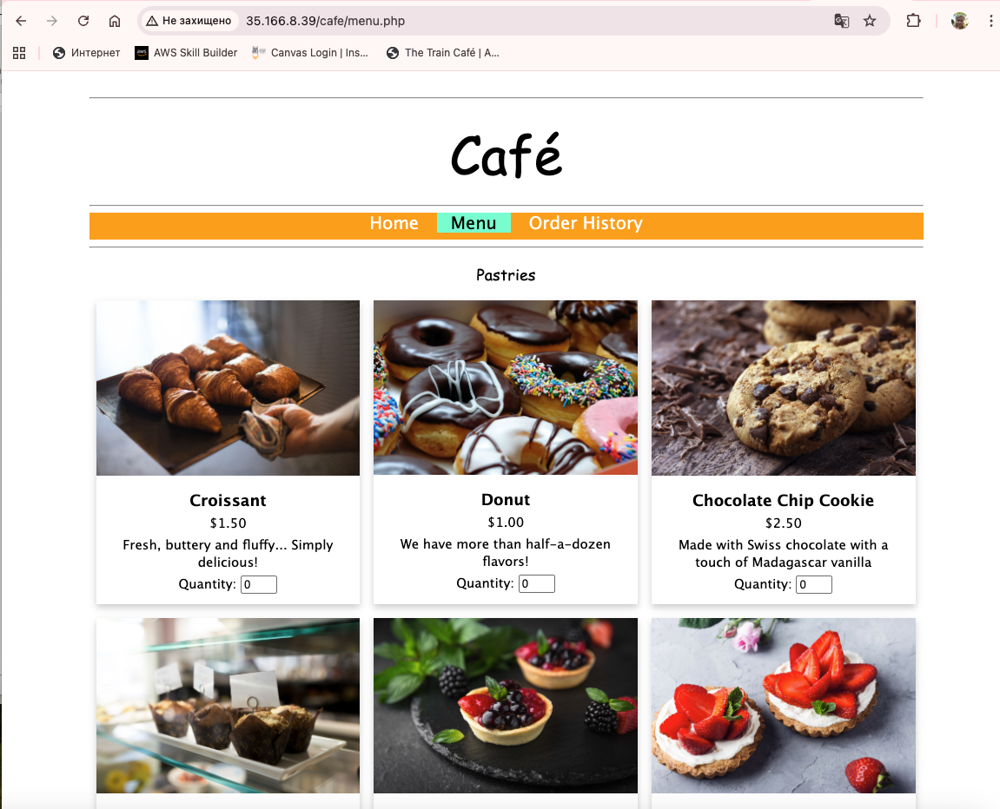

The menu showed pastries with photos and prices — Croissant $1.50, Donut $1.00, Chocolate Chip Cookie $2.50, and more. I ordered a Croissant and a Donut for order #1.

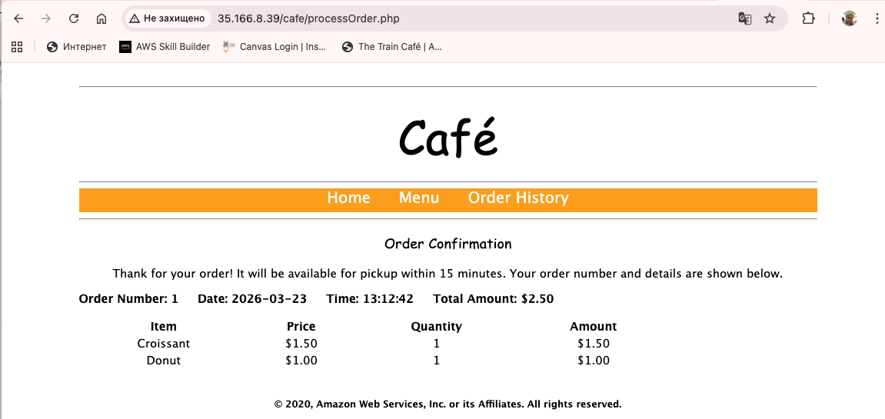

Order #1 confirmed: Croissant + Donut, total $2.50, placed at 13:12:42. The page said pickup in 15 minutes.

Went back and placed a second order — Strawberry Blueberry Tart and Strawberry Tart, $3.50 each. Then opened Order History:

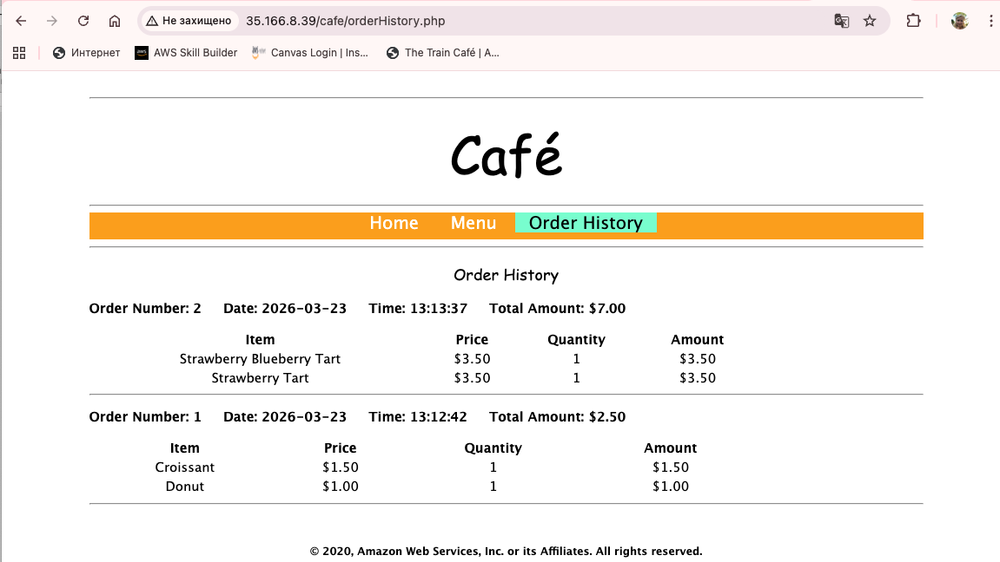

Both orders were there:
- Order #2 — $7.00 (Strawberry Blueberry Tart + Strawberry Tart) at 13:13:37
- Order #1 — $2.50 (Croissant + Donut) at 13:12:42

The database was working. Everything the user data script set up — MariaDB install, root password, schema creation, app deployment — had run correctly in the background.

---

## Summary of Bugs Fixed

| # | What Was Wrong | Where | Fix |
|---|---------------|--------|-----|
| 1 | `--region us-east-1` hardcoded in `run-instances` | Line 160 of script | Changed to `$region` variable |
| 2 | Security group opening port `8080` instead of `80` | Line 149 of script | Added port 80 inbound rule manually via `authorize-security-group-ingress` |

---

## Challenges I Ran Into

The first error (`InvalidAMIID.NotFound`) was misleading — it looked like a broken AMI ID, but the real cause was the wrong region. The AMI itself was valid, just not in `us-east-1`. Once I read the script carefully with line numbers in VI, the hardcoded region jumped out.

The port 8080 issue was sneaky. The script printed "Opening port 80 in the new security group" as an echo message, which looked fine — but the actual command had `--port 8080`. Classic case of the log not matching the code. nmap caught it in seconds.

---

## What I Learned

Before this lab I'd mostly been clicking through the EC2 console. Running everything through the AWS CLI felt more deliberate — you see every parameter you're setting instead of having the UI fill in defaults behind the scenes.

The two bugs reinforced something I'll probably remember for a while: **always check what your script is actually doing, not just what it says it's doing**. The echo messages were misleading, and just reading the terminal output wouldn't have caught either bug. You have to look at the code itself.

nmap turned out to be a genuinely useful diagnostic tool. Checking which ports are reachable from outside took seconds and pointed straight at the problem — no guessing whether it was the web server, the instance, or the network.

The broader workflow — launch with user data, verify with cloud-init logs, check connectivity with nmap, fix security groups via CLI — feels like something that comes up constantly in real AWS environments, not just in labs.

---

## Files in This Folder

```
docs/lab173/
  README.md
  lab173-ec2-troubleshooting-guide.docx
  screenshots/
    01_cli_host_terminal_connected.png
    02_aws_configure_complete.png
    03_sts_get_caller_identity.png
    04_backup_created.png
    09_script_open_vi.png
    10_userdata_script_content.png
    11_script_first_run_error.png
    12_vi_wrong_region_highlighted.png
    13_vi_fixed_region_variable.png
    14_public_ip_assigned.png
    15_browser_connection_failed.png
    16_nmap_scan_result.png
    17_httpd_status_active.png
    18_sg_id_found.png
    19_authorize_sg_ingress.png
    20_nmap_scan_port80_open.png
    21_hello_from_web_server.png
    22_cloud_init_log_mariadb_php_database_script.png
    23_cafe_home_page.png
    24_cafe_menu_page.png
    25_order_confirmation.png
    26_order_history_two_orders.png
```
