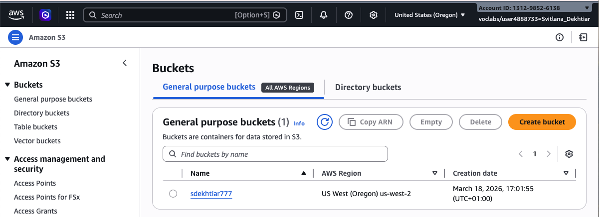
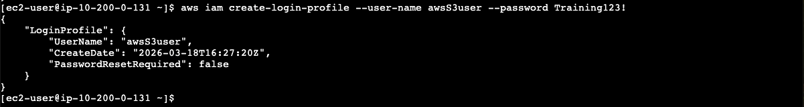
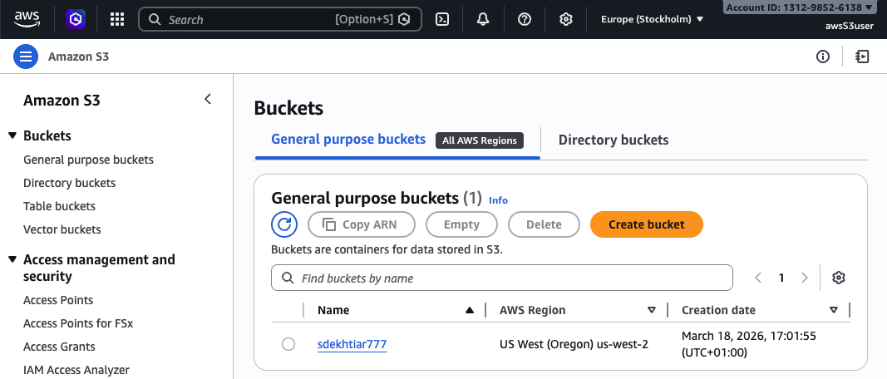
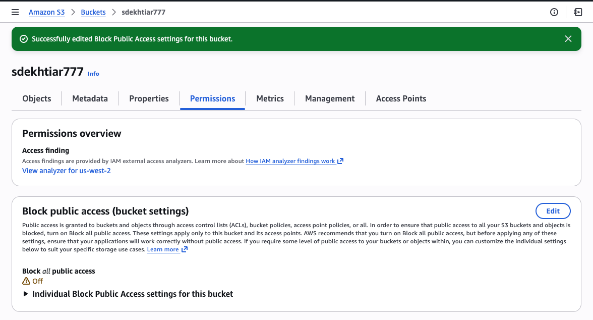
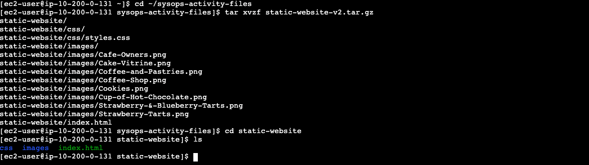
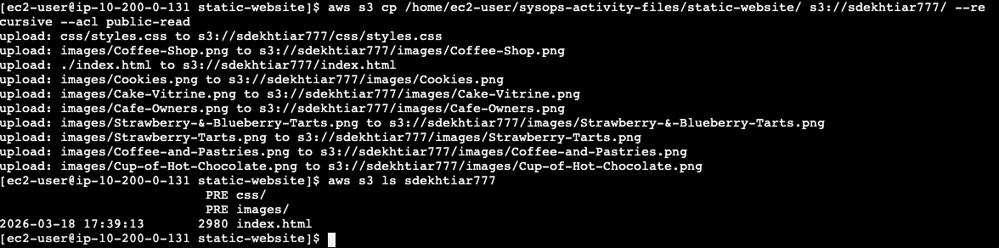
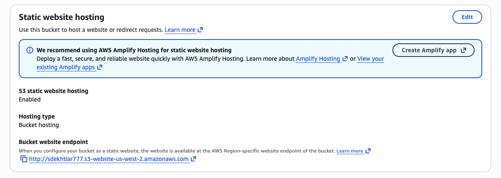

# Lab: Creating a Website on S3

## Overview

In this lab I used AWS CLI commands from an Amazon EC2 instance to host a static website on Amazon S3. The goal was to get comfortable working with S3 and IAM entirely from the command line, rather than clicking through the console.

**Services used:** Amazon S3, IAM, Amazon EC2, AWS CLI, AWS Systems Manager

---

## Objectives

- Run AWS CLI commands for IAM and Amazon S3
- Deploy a static website to an S3 bucket
- Create a shell script to automate website updates using the AWS CLI

---

## Architecture

```
EC2 Instance (Amazon Linux)
    └── AWS CLI
          ├── IAM → create user + attach S3 policy
          └── S3  → create bucket → upload files → enable static hosting
                          |
                          v
              http://<bucket-name>.s3-website-us-west-2.amazonaws.com
```

---

## Tasks

### Task 1 — Connect to EC2 via SSM Session Manager

Connected to the Amazon Linux EC2 instance through AWS Systems Manager — no SSH key required.

```bash
sudo su -l ec2-user
pwd
```

---

### Task 2 — Configure AWS CLI

```bash
aws configure
```

| Prompt | Value |
|---|---|
| AWS Access Key ID | `<AccessKey from lab>` |
| AWS Secret Access Key | `<SecretKey from lab>` |
| Default region | `us-west-2` |
| Default output format | `json` |

---

### Task 3 — Create an S3 Bucket

Bucket names have to be globally unique across all of AWS. I used my initials + last name + a few random numbers to make it unique.

```bash
aws s3api create-bucket \
  --bucket <my-bucket-name> \
  --region us-west-2 \
  --create-bucket-configuration LocationConstraint=us-west-2
```

Successful response:
```json
{
  "Location": "http://<my-bucket-name>.s3.amazonaws.com/"
}
```

> Note: The `--create-bucket-configuration LocationConstraint` flag is required for any region other than `us-east-1`. The command fails without it.

---

### Task 4 — Create an IAM User with S3 Full Access

```bash
# Create the user
aws iam create-user --user-name awsS3user

# Set a login password
aws iam create-login-profile --user-name awsS3user --password Training123!
```

To find the right managed policy:
```bash
aws iam list-policies --query "Policies[?contains(PolicyName,'S3')]"
```

The policy to use is `AmazonS3FullAccess`.

```bash
aws iam attach-user-policy \
  --policy-arn arn:aws:iam::aws:policy/AmazonS3FullAccess \
  --user-name awsS3user
```

> What I learned here: a brand new IAM user has zero permissions by default. When I first logged in as `awsS3user`, I could not even see the bucket I just created. The policy has to be explicitly attached.

---

### Task 5 — Adjust S3 Bucket Permissions

Done through the AWS Management Console:

1. Open the bucket > Permissions tab
2. Block public access > Edit > uncheck "Block all public access" > Save
3. Object Ownership > Edit > enable ACLs > acknowledge > Save

> Public access is blocked by default on every new S3 bucket. You have to actively turn it off before the static website will be reachable from a browser.

---

### Task 6 — Extract Website Files

```bash
cd ~/sysops-activity-files
tar xvzf static-website-v2.tar.gz
cd static-website
ls
```

Expected output:
```
index.html   css/   images/
```

---

### Task 7 — Upload Files and Enable Static Hosting

First, tell S3 which file to use as the index:
```bash
aws s3 website s3://<my-bucket>/ --index-document index.html
```

Then upload everything with public-read access:
```bash
aws s3 cp /home/ec2-user/sysops-activity-files/static-website/ \
  s3://<my-bucket>/ \
  --recursive \
  --acl public-read
```

Verify the upload:
```bash
aws s3 ls <my-bucket>
```

Website URL:
```
http://<my-bucket>.s3-website-us-west-2.amazonaws.com
```

---

### Task 8 — Create a Deployment Script

Rather than retyping the upload command every time, I created a small shell script to handle it.

```bash
cd ~
touch update-website.sh
vi update-website.sh
```

Contents of `update-website.sh`:
```bash
#!/bin/bash
aws s3 cp /home/ec2-user/sysops-activity-files/static-website/ \
  s3://<my-bucket>/ \
  --recursive \
  --acl public-read
```

Make it executable:
```bash
chmod +x update-website.sh
```

To test it, I edited `index.html` and changed the background colors:

| Before | After |
|---|---|
| `bgcolor="aquamarine"` | `bgcolor="gainsboro"` |
| `bgcolor="orange"` | `bgcolor="cornsilk"` |

Then ran the script:
```bash
./update-website.sh
```

Refreshed the browser and the changes showed up right away.

---

## Optional Challenge — s3 sync vs s3 cp

I replaced the `aws s3 cp` command with `aws s3 sync`:

```bash
aws s3 sync /home/ec2-user/sysops-activity-files/static-website/ \
  s3://<my-bucket>/ \
  --acl public-read
```

| Command | Behavior |
|---|---|
| `s3 cp --recursive` | Uploads all files every time |
| `s3 sync` | Uploads only files that have changed |

The difference was clear — `s3 sync` only pushed the one file I actually modified, while `s3 cp` was reuploading everything each time. For a small site it does not matter much, but at scale it would save a lot of time and transfer cost.

---

## Screenshots

All screenshots are in the [`screenshots/`](./screenshots/) folder.

### Task 3 — S3 Bucket Created
| Description | Screenshot |
|---|---|
| Terminal: JSON response confirming bucket creation |  |
| S3 console: new bucket listed |  |

### Task 4 — IAM User and Policy
| Description | Screenshot |
|---|---|
| Terminal: `aws iam create-user` success response |  |
| Terminal: `aws iam create-login-profile` success response |  |
| Terminal: `aws iam list-policies` showing S3 policies |  |
| S3 console: bucket visible while logged in as awsS3user |  |

### Task 5 — Bucket Permissions
| Description | Screenshot |
|---|---|
| S3 Permissions tab: Block all public access is off |  |
| S3 Permissions tab: Object Ownership — ACLs enabled |  |

### Task 6 — Extract Files
| Description | Screenshot |
|---|---|
| Terminal: `ls` output showing index.html, css/ and images/ |  |

### Task 7 — Upload and Website Live
| Description | Screenshot |
|---|---|
| Terminal: `aws s3 cp` upload output |  |
| S3 Properties tab: Static website hosting enabled |  |
| The live Cafe and Bakery website in the browser |  |

### Task 8 — Deployment Script and Color Changes
| Description | Screenshot |
|---|---|
| Terminal: `cat update-website.sh` showing script contents with bucket name |  |
| Browser: website after the color update |  |

### Optional Challenge — s3 sync
| Description | Screenshot |
|---|---|
| Terminal: `aws s3 sync` output showing only the changed file uploaded |  |

---

## Key Takeaways

- S3 can serve a static website on its own — no EC2, no web server needed
- AWS CLI gives you full control over S3 and IAM without touching the console
- New IAM users start with zero permissions — everything has to be explicitly granted
- ACLs need to be enabled on the bucket before `--acl public-read` works on uploads
- `aws s3 sync` is much more practical than `aws s3 cp` for ongoing deployments — it only moves what changed
- Wrapping repetitive CLI commands into a shell script is a good habit from the start

---

## Resources

- [AWS S3 API Reference](https://docs.aws.amazon.com/cli/latest/reference/s3api/)
- [AWS CLI Installation Guide](https://docs.aws.amazon.com/cli/latest/userguide/install-cliv2.html)
- [S3 Static Website Hosting Docs](https://docs.aws.amazon.com/AmazonS3/latest/userguide/WebsiteHosting.html)

---

*Part of my AWS re/Start study documentation*
