# AWS Lab 178 — Amazon EBS

This is one of the labs I did while going through AWS training. The topic is EBS — Elastic Block Store — which is basically extra hard drives you can attach to your EC2 instances.

I'm documenting it here mostly for myself, so I can come back and remember what I did. But also because I think it's useful to have a real record of what actually happened — including the parts that didn't work on the first try.

---

## What this lab is about

The idea is straightforward: create an EBS volume, attach it to a running EC2 instance, put a file on it, take a snapshot, delete the file, and then restore it from the snapshot. Simple enough in theory. In practice I ran into a couple of things that slowed me down.

---

## What I actually did

### Checking the instance and existing volumes

Before creating anything, I opened the EC2 console and went to Instances to check which Availability Zone the Lab instance was running in — EBS volumes are AZ-specific, so the volume has to be in the same zone as the instance you want to attach it to.

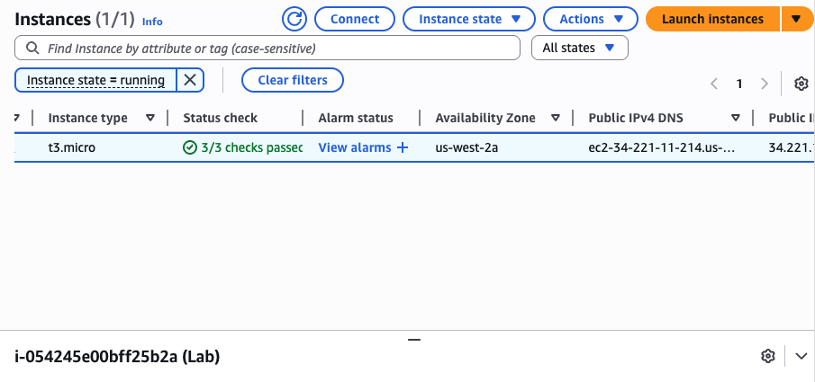

Then I navigated to Elastic Block Store → Volumes to see what was already there. Just the one 8 GiB root volume the instance was using.

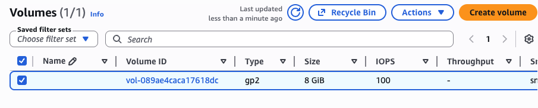

### Creating and attaching the volume

Created a new 1 GiB gp2 volume in the same AZ, tagged it "My Volume". The form looked like this before submitting:

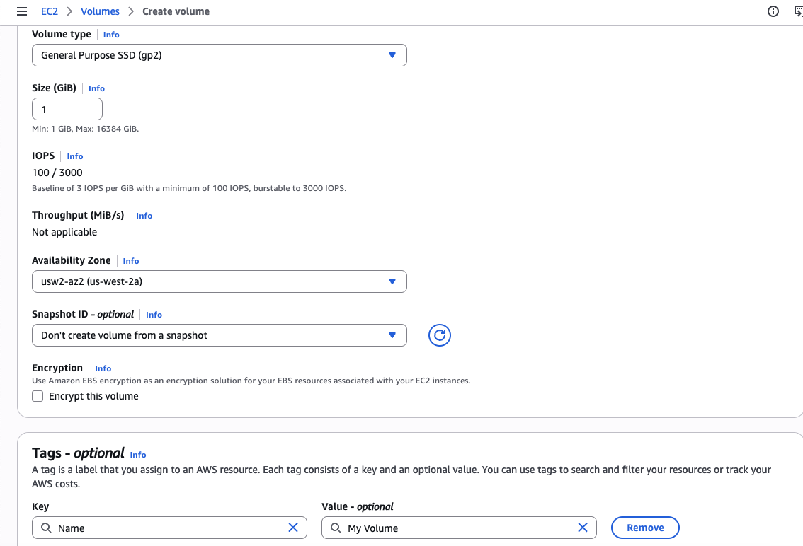

After a few seconds it showed up as Available.

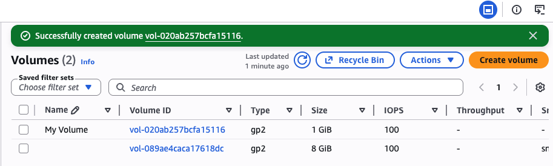

Selected it, went to Actions → Attach volume, picked the Lab instance and `/dev/sdb` as the device name.

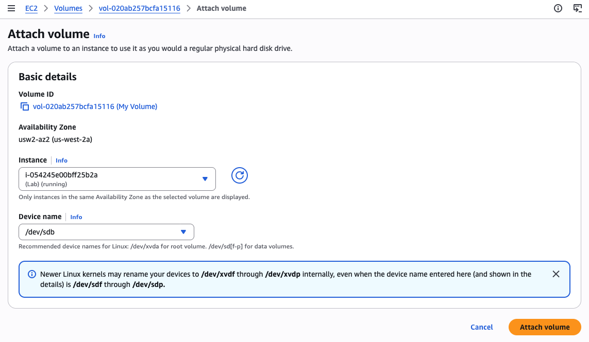

Status changed to In-use straight away.

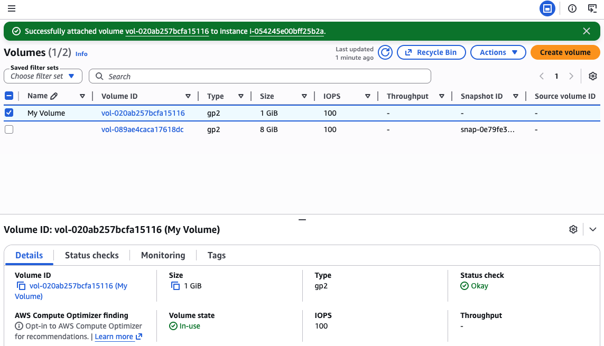

### Connecting to the instance

Used EC2 Instance Connect — no SSH keys, just opens a terminal in the browser. Straightforward.

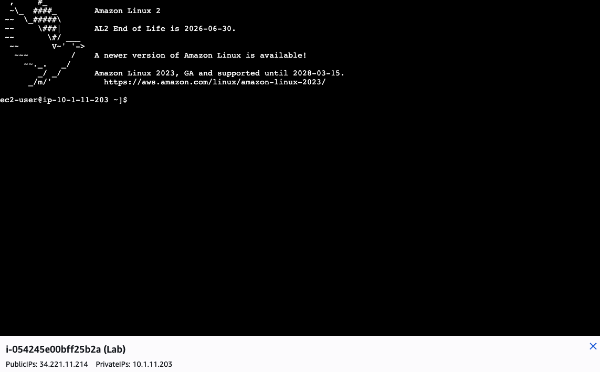

### Setting up the file system

First checked what storage was visible with `df -h`. The new volume is attached but doesn't show up yet because it hasn't been formatted or mounted.

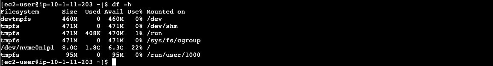

Formatted it as ext3:

```bash
sudo mkfs -t ext3 /dev/sdb
```

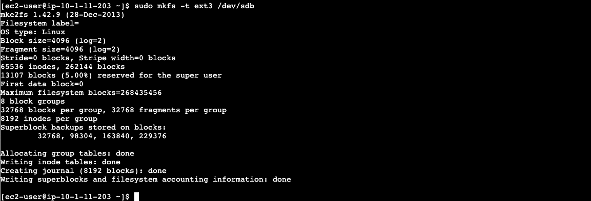

Then mounted it:

```bash
sudo mkdir /mnt/data-store
sudo mount /dev/sdb /mnt/data-store
```

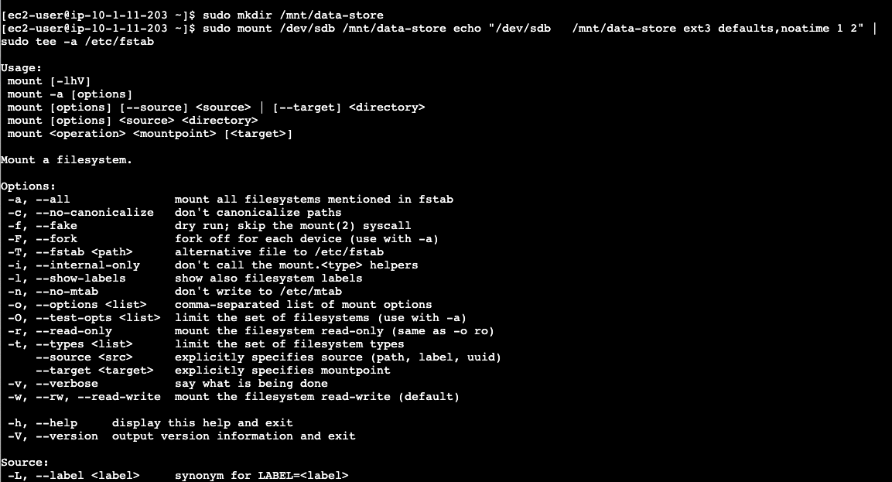

And added it to `/etc/fstab` so it remounts automatically after a reboot:

```bash
echo "/dev/sdb   /mnt/data-store ext3 defaults,noatime 1 2" | sudo tee -a /etc/fstab
```

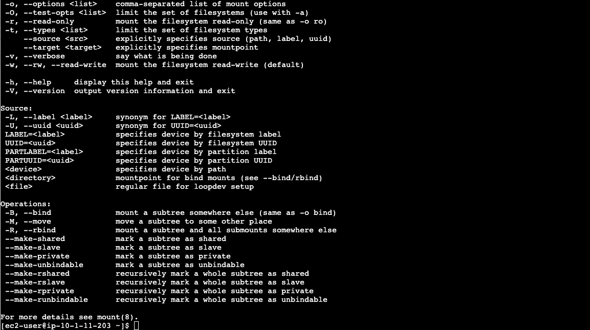

Ran `df -h` again — now the 1 GiB volume shows up mounted at `/mnt/data-store`.

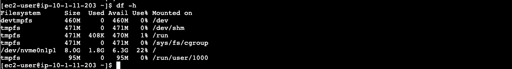

Wrote a test file and read it back:

```bash
sudo sh -c "echo some text has been written > /mnt/data-store/file.txt"
cat /mnt/data-store/file.txt
```

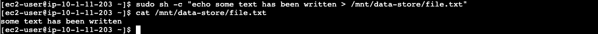

### Taking the snapshot

Back in the AWS console — Volumes → select My Volume → Actions → Create snapshot. Tagged it "My Snapshot".

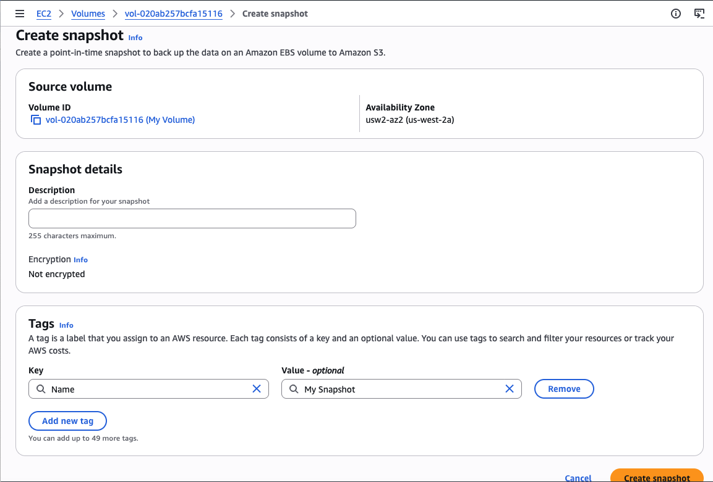

It starts in Pending state:

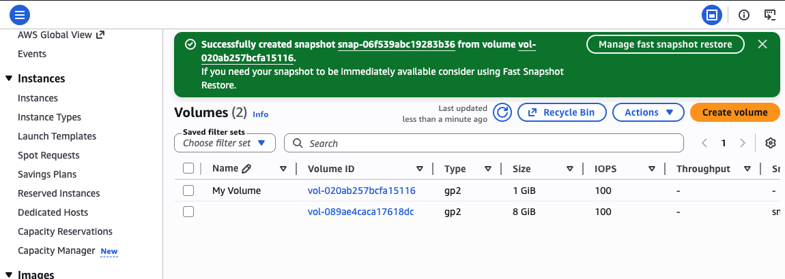

Waited until it changed to Completed. This matters — don't skip ahead while it's still Pending (I learned this the hard way, see below).

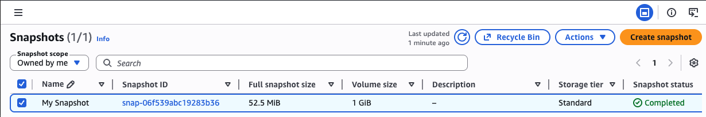

### Deleting the file

Once the snapshot was Completed, deleted the file from the original volume to simulate losing it:

```bash
sudo rm /mnt/data-store/file.txt
ls /mnt/data-store/file.txt
```

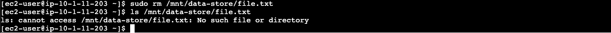

### Restoring from the snapshot

Created a new volume from the snapshot (Actions → Create volume from snapshot), same AZ, tagged it "Restored Volume". Once it showed Available:

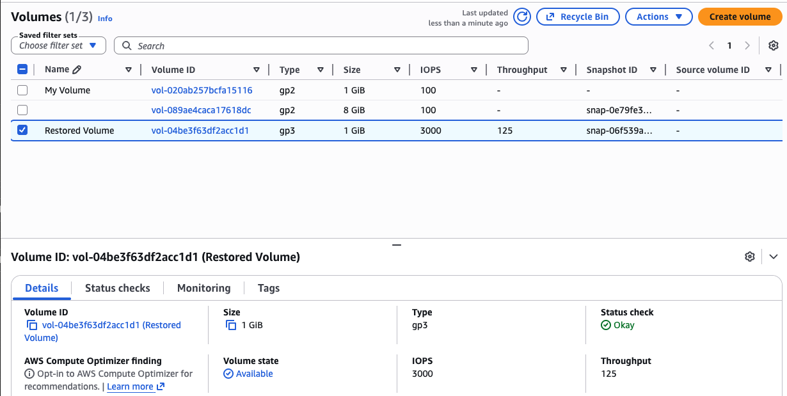

Attached it to the instance. Status went In-use:

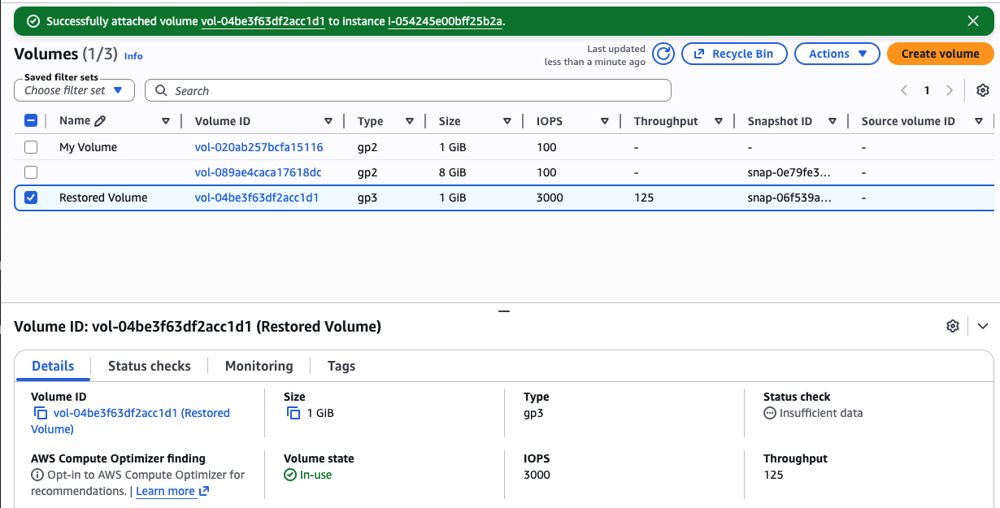

Back in the terminal, mounted the restored volume and checked for the file:

```bash
sudo mkdir /mnt/data-store4
sudo mount /dev/nvme5n1 /mnt/data-store4
ls /mnt/data-store4/file.txt
cat /mnt/data-store4/file.txt
```

File was there.

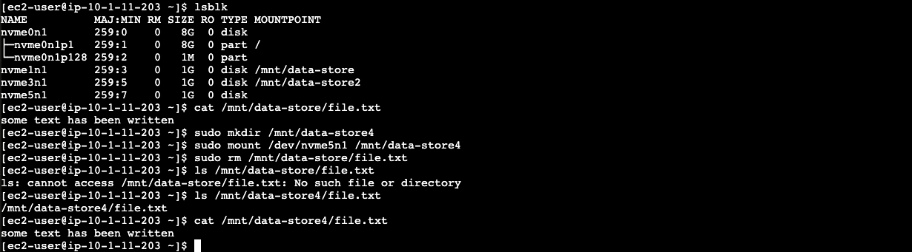

---

## What went wrong

The snapshot restore didn't work on the first attempt. Or the second.

When I mounted the restored volume and checked for the file, it wasn't there — just an empty `lost+found` directory. I ran `ls -la` to make sure I wasn't missing something hidden, but the volume was genuinely empty. The problem was ordering — I had either created the snapshot before writing the file, or deleted the file before the snapshot finished completing.

I also kept running into the `/dev/sdb` vs `/dev/nvme1n1` confusion. In the AWS console you pick `/dev/sdb` as the device name, but inside Linux it shows up as an NVMe device. By the end of the lab I had four 1 GiB volumes attached simultaneously from all the failed attempts. Running `lsblk` became essential for tracking what was actually there.

The correct order that finally worked:
1. Write the file
2. Create snapshot — wait for **Completed**, not just Pending
3. Create new volume from that snapshot
4. Attach it to the instance
5. Only then delete the file from the original
6. Mount the restored volume and verify

---

## Things I didn't know before this lab

**Snapshots are point-in-time.** Sounds obvious but I didn't really think about what that means until the restore came back empty. The snapshot captures the volume exactly as it is when the snapshot completes — nothing before, nothing after.

**EBS volumes don't move between Availability Zones directly.** If you need to move data to another AZ you have to go through a snapshot. The snapshot lives in S3 and you can create a new volume from it in any AZ in the same region.

**lsblk is more useful than df for seeing attached volumes.** `df` only shows mounted filesystems. `lsblk` shows everything attached, mounted or not, with a clean tree view. Much more useful when you're trying to figure out what device name something actually got.

**The fstab entry matters in real life.** In a lab you probably won't reboot the instance, but in production you would. Skipping fstab means your data volume disappears on the next restart.

---

## Repo structure

```
aws-lab-178-ebs/
├── README.md
├── Lab178_EBS_StepByStep_Guide.docx
└── screenshots/
    ├── 01_lab_instance_availability_zone.png
    ├── 02_existing_ebs_volumes.png
    ├── 03_create_volume_settings.png
    ├── 04_volume_created_available.png
    ├── 05_attach_volume_dialog.png
    ├── 06_volume_in_use.png
    ├── 07_terminal_connected.png
    ├── 08_df_before_mount.png
    ├── 09_mkfs_output.png
    ├── 10_1_mount_and_fstab.png
    ├── 10_2_mount_and_fstab.png
    ├── 11_df_after_mount.png
    ├── 12_file_written_verified.png
    ├── 13_create_snapshot_form.png
    ├── 14_snapshot_created.png
    ├── 15_snapshot_completed.png
    ├── 16_file_deleted_verified.png
    ├── 17_restored_volume_available.png
    ├── 18_restored_volume_in_use.png
    └── 19_file_restored_verified.png
```
