# Lab 183: Managing Storage on AWS

## About This Lab

This lab is part of an AWS cloud practitioner curriculum and focuses on storage management — one of the most practical skills for anyone working with cloud infrastructure.

The lab covers three core areas:

**EBS Snapshot Management** — Amazon Elastic Block Store (EBS) provides persistent block storage for EC2 instances, similar to a hard drive attached to a virtual machine. In this lab I learned how to create point-in-time backups of an EBS volume using snapshots, how to automate snapshot creation using Linux cron scheduling, and how to use a Python script to enforce a retention policy that keeps only the two most recent snapshots — automatically deleting older ones to control storage costs.

**Amazon S3 Sync** — Amazon S3 is AWS's object storage service. The lab demonstrates how to use the AWS CLI to synchronize a local directory on an EC2 instance with an S3 bucket, including how the `--delete` flag works to mirror local deletions to the cloud.

**S3 Versioning and File Recovery** — Versioning is an S3 feature that preserves every version of every object even after deletion. The lab shows how to enable versioning, how deleted files can be recovered from a previous version, and why the order of operations matters — versioning must be enabled before files are uploaded for recovery to work.

**AWS Services Used:** EC2, EBS, S3, IAM, AWS CLI, Python (boto3)

---

## What I Did

The environment had two EC2 instances pre-created in a VPC in AWS US West Oregon: a Command Host (t3.medium) used to run all CLI commands, and a Processor (t3.micro) with an EBS volume attached. I connected to both instances through EC2 Instance Connect — a browser-based terminal, no SSH client needed.

The lab was structured into three tasks. Task 1 was setup — creating the S3 bucket and attaching an IAM role to give the Processor permission to interact with S3. Task 2 was the full EBS snapshot workflow. Task 3 was the S3 sync and versioning challenge.

---

## Task 1: Creating and Configuring Resources

### Task 1.1: Create an S3 Bucket

Created a bucket called `lab183-storage` in the S3 console. Bucket names in AWS must be globally unique across all accounts worldwide. The region defaulted to US West Oregon (us-west-2), which matches the EC2 instances, keeping all data transfer within the same region.


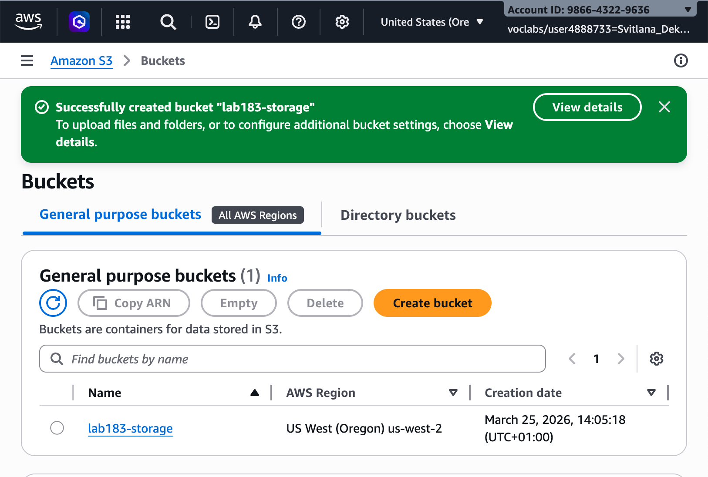

### Task 1.2: Attach Instance Profile to Processor

Attached the pre-created IAM role `S3BucketAccess` to the Processor instance. This is how AWS handles permissions for EC2 instances — instead of storing access keys on the instance (which is a security risk), you attach an IAM role and the instance automatically receives temporary credentials scoped to exactly what the role allows.


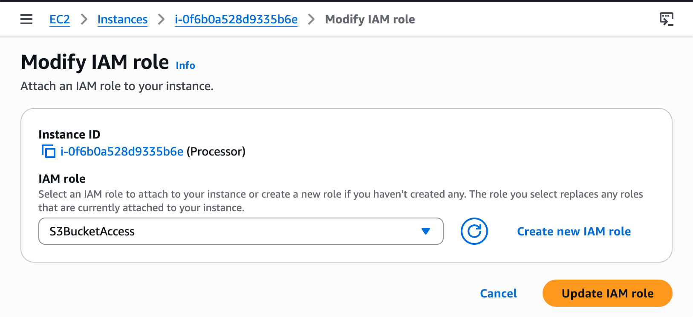

---

## Task 2: Taking Snapshots of Your Instance

### Task 2.1: Connecting to the Command Host EC2 Instance

Connected to the Command Host via EC2 Instance Connect. The terminal opened on Amazon Linux 2 at IP 10.5.0.75. All snapshot commands in Task 2 run from here — the Command Host acts as the administrative entry point for managing the Processor.


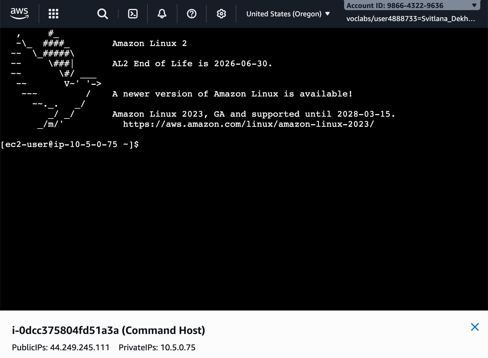

### Task 2.2: Taking an Initial Snapshot

Retrieved the Processor's EBS volume ID and EC2 instance ID using AWS CLI queries:

```bash
aws ec2 describe-instances --filter 'Name=tag:Name,Values=Processor' \
  --query 'Reservations[0].Instances[0].BlockDeviceMappings[0].Ebs.{VolumeId:VolumeId}'
# "VolumeId": "vol-0b222992521185d43"

aws ec2 describe-instances --filters 'Name=tag:Name,Values=Processor' \
  --query 'Reservations[0].Instances[0].InstanceId'
# "i-0f6b0a528d9335b6e"
```


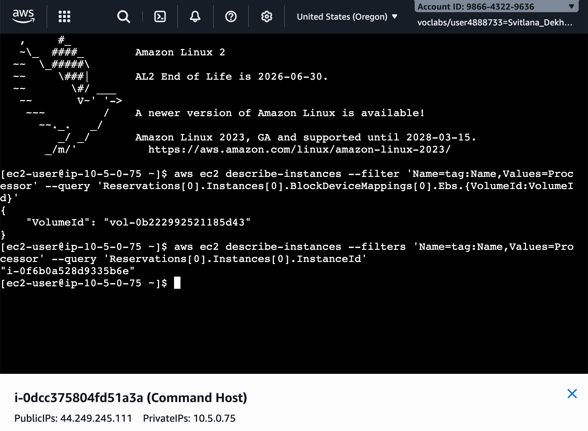

Stopped the Processor before taking the snapshot. Stopping the instance first ensures no data is being written to the volume at snapshot time, which guarantees a consistent backup. The `wait` command blocks silently until the instance is fully stopped — no output, just the prompt returning when done.


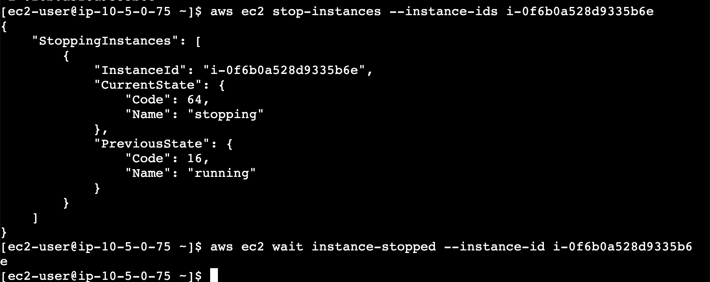

The EC2 console confirmed the Processor moved to Stopped state while the Command Host remained Running.


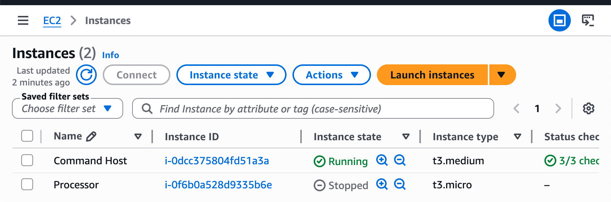

Created the snapshot with a descriptive name:

```bash
aws ec2 create-snapshot --volume-id vol-0b222992521185d43 --description "lab183-processor-snapshot"
```

The CLI returned `snap-00006882d3afb4b3f` with State `pending` — snapshot creation starts immediately in the background.


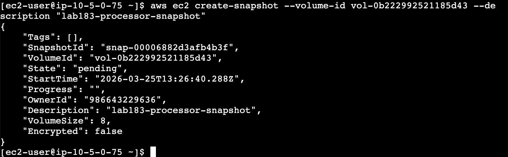

After waiting, the EC2 Snapshots console showed the snapshot as Completed — 1.95 GiB actual data stored from an 8 GiB volume. EBS snapshots are incremental, so they only store the blocks that have data, not the full volume size.


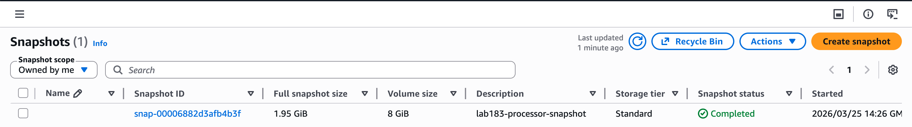

### Task 2.3: Scheduling the Creation of Subsequent Snapshots

Set up a Linux cron job to create a new snapshot automatically every minute:

```bash
echo "* * * * *  aws ec2 create-snapshot --volume-id vol-0b222992521185d43 2>&1 >> /tmp/cronlog" > cronjob
crontab cronjob
```

`crontab -l` confirmed the job was registered. After a few minutes, `describe-snapshots --output table` showed multiple snapshots accumulating with different timestamps.


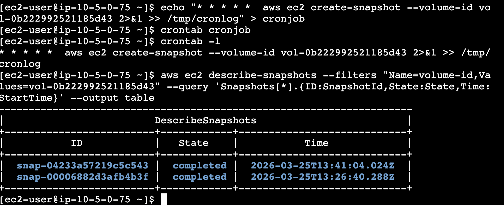

### Task 2.4: Retaining the Last Two Snapshots

Stopped the cron job with `crontab -r`. By this point there were 6 snapshots for the volume. The `snapshotter_v2.py` script uses Python and boto3 to find all volumes, create a fresh snapshot of each, sort existing snapshots by `start_time`, and delete everything except the two most recent.


Running `python3.8 snapshotter_v2.py` deleted 5 snapshots and left only two. The surviving IDs were different from what I expected — the script creates a brand new snapshot first before deleting, so the two kept were the one it just created plus the next most recent.


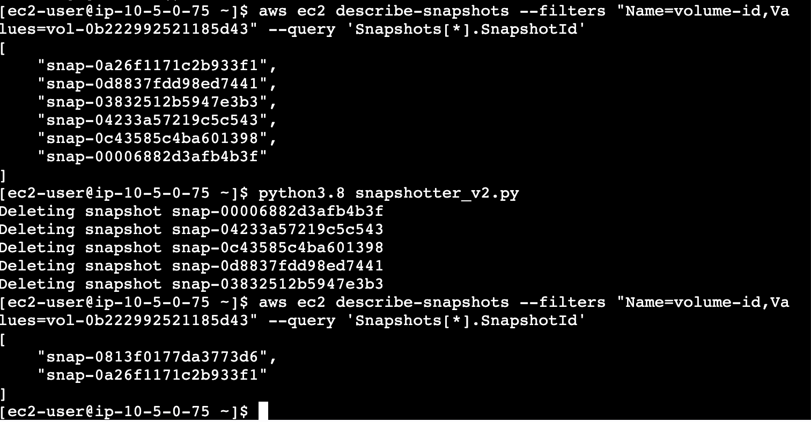

---

## Task 3: Challenge: Synchronize Files with Amazon S3

### Task 3.1: Downloading and Unzipping Sample Files

Opened a second EC2 Instance Connect session for the Processor at IP 10.5.0.21. The Processor is where the files live and where the S3 sync commands run — it has the `S3BucketAccess` role attached so its CLI commands have the right permissions.


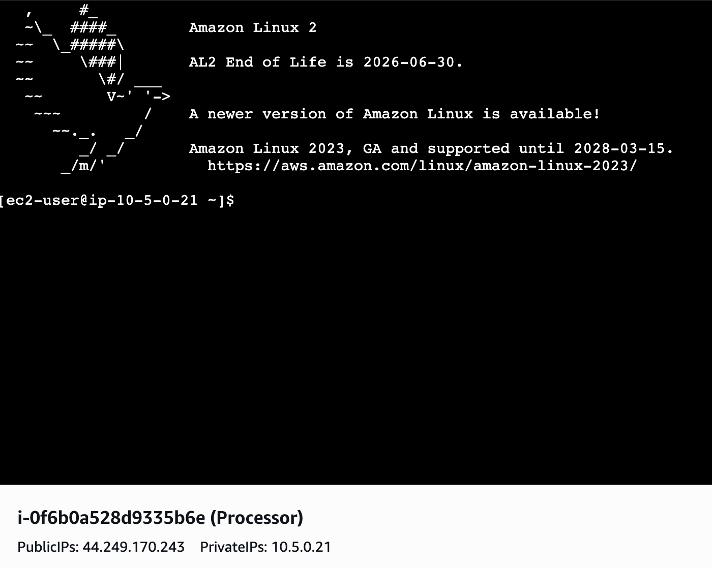

Downloaded a sample file package and unzipped it. The download completed in 0.002 seconds at 38.3 MB/s — fast because the source bucket and the Processor are in the same AWS region, keeping traffic on AWS's internal network.


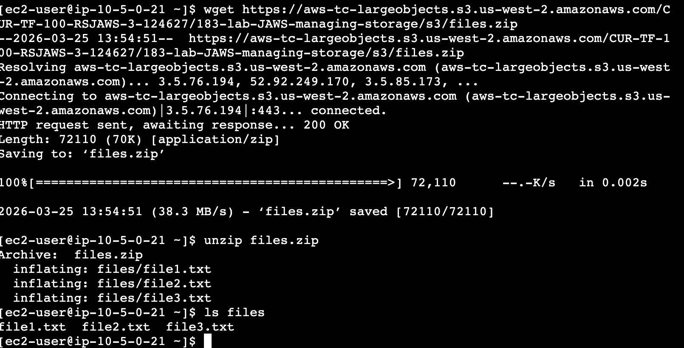

### Task 3.2: Syncing Files

Enabled versioning on `lab183-storage` before uploading anything. This step is critical — versioning must be on before the first upload, otherwise the initial files have no recoverable version history.

```bash
aws s3api put-bucket-versioning --bucket lab183-storage --versioning-configuration Status=Enabled
aws s3 sync files s3://lab183-storage/lab183-files/
```


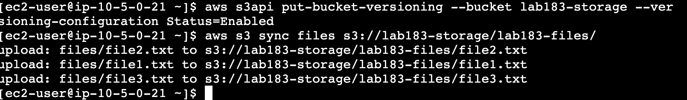

`s3 ls` confirmed all three files in the bucket at 13:56:39 — file1.txt at 30,318 bytes, file2.txt at 43,784, file3.txt at 96,675.


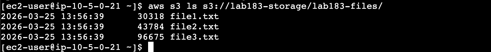

Deleted file1.txt locally, then re-synced with `--delete`. Without this flag, `s3 sync` is additive only and never removes objects from S3. The flag makes it mirror local deletions.

```bash
rm files/file1.txt
aws s3 sync files s3://lab183-storage/lab183-files/ --delete
```

`s3 ls` confirmed only file2 and file3 remained.


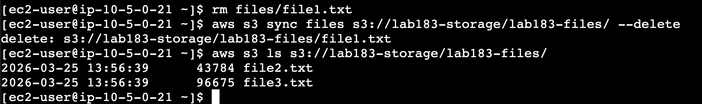

To recover the deleted file, listed the object versions. The Versions block showed VersionId `xghJn4jRPsgw2BuRncCUO06MSVriQSfx` — this is the version of file1.txt that existed before deletion. The delete marker S3 placed on top is a separate entry and is not the one you want here.


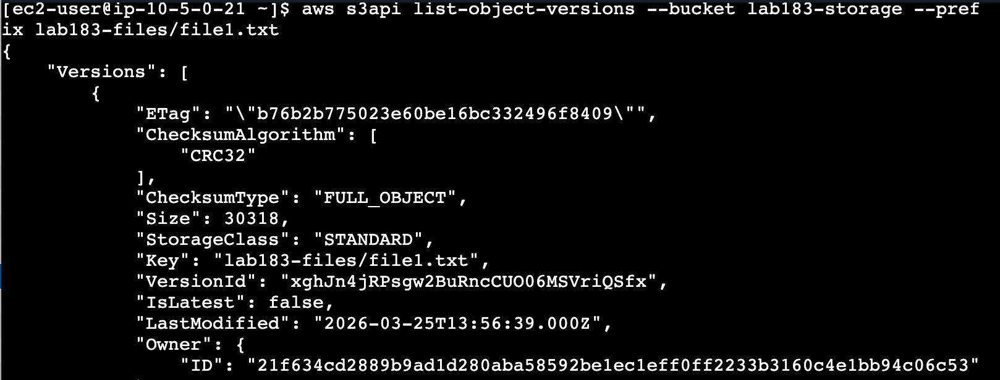

Downloaded that specific version back:

```bash
aws s3api get-object --bucket lab183-storage --key lab183-files/file1.txt \
  --version-id xghJn4jRPsgw2BuRncCUO06MSVriQSfx files/file1.txt
```

The response confirmed ContentLength 30,318 bytes. `ls files` showed all three files restored locally.


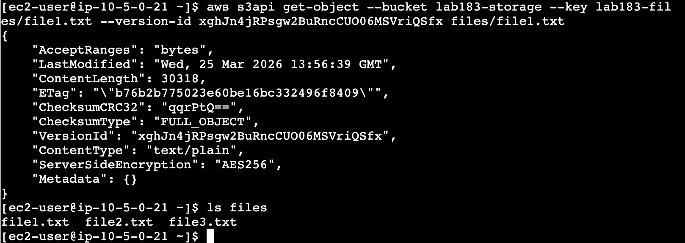

Re-synced to push the restored file back to S3. The final `s3 ls` showed all three files — file1.txt now at 14:04:31 because it was re-uploaded as a new version after recovery.


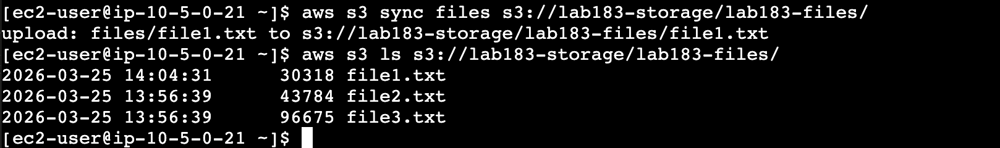

---

## Challenges I Had

The first problem appeared in Task 2.2 when running `create-snapshot`. I copied the command from a formatted document and the quote characters around the description were silently converted to typographic curly quotes. The CLI returned `Unknown options: lab183-processor-snapshot` because it could not parse the description value. The fix was typing the quotes manually as straight ASCII characters. This is a subtle but common trap when working from formatted documents — the characters look identical on screen but are entirely different bytes.

A consistent issue across the whole lab was accidentally pasting explanatory text from the guide into the terminal along with commands. The terminal tries to execute everything as bash, so English sentences produce a wall of `bash: command not found` errors. Harmless but wastes time and looks alarming the first time it happens.

The versioning recovery had a specific ordering trap. At one point `list-object-versions` returned only `RequestCharged: null` with no Versions block. This happened because versioning was not enabled before the first sync, so the files had no version history. Had to enable versioning, remove all files from S3, re-sync from scratch, then repeat the delete and recovery workflow. Once versioning was in place before the upload, everything worked correctly.

---

## What I Learned

**EBS snapshots are incremental.** The first snapshot stores all used blocks on the volume. Each subsequent one only stores blocks that changed since the last. This is why the snapshot showed 1.95 GiB of actual data on an 8 GiB volume. In a real environment this makes regular snapshotting cost-efficient.

**The Python cleanup script creates before it deletes.** I expected it to keep two from the existing list. Instead it creates a brand new snapshot first, then sorts everything by timestamp and keeps the two most recent. In production this pattern is typically handled by AWS Data Lifecycle Manager, but understanding the boto3 logic manually is useful for writing custom retention policies.

**S3 versioning does not actually delete data.** When you delete a versioned object via `sync --delete`, S3 places a delete marker on top — the data is still there and fully accessible through `get-object` with the correct VersionId. To permanently remove a versioned object you need to explicitly delete every version and every delete marker individually. This distinction matters for compliance and audit requirements.

**`s3 sync` is additive by default.** Without `--delete`, sync will never remove anything from the S3 destination even if local files are gone. The flag must be added intentionally, and with care — running `sync --delete` when you did not mean to can silently remove a lot of objects from S3.

---

## Resource Names Reference

| Resource | Value |
|---|---|
| S3 Bucket | `lab183-storage` |
| S3 Folder Prefix | `lab183-files/` |
| Snapshot Description | `lab183-processor-snapshot` |
| IAM Role | `S3BucketAccess` |
| EBS Volume ID | `vol-0b222992521185d43` |
| Processor Instance ID | `i-0f6b0a528d9335b6e` |
| Command Host Instance ID | `i-0dcc375804fd51a3a` |
| Initial Snapshot ID | `snap-00006882d3afb4b3f` |
| S3 file1.txt VersionId | `xghJn4jRPsgw2BuRncCUO06MSVriQSfx` |
| AWS Region | US West (Oregon) us-west-2 |

---

## Commands Reference

All CLI commands used in this lab are in `commands.sh`.

---

## Repository Structure

```
lab-183-managing-storage/
  README.md
  commands.sh
  screenshots/
    01_s3_bucket_created.png
    02_processor_iam_role.png
    03_command_host_connected.png
    04_volume_id_instance_id.png
    05_stopping_processor_instance.png
    06_processor_instance_stopped.png
    07_creating_first_snapshot.png
    08_initial_snapshot_created.png
    09_multiple_snapshots.png
    10_snapshots_before_cleanup_.png
    11_snapshots_after_cleanup.png
    12_processor_connected.png
    13_files_unzipped.png
    14_s3_sync_upload.png
    15_s3_files_listed.png
    16_file_deleted_from_s3.png
    17_list_object_versions.png
    18_file_restored_locally.png
    19_s3_all_files_restored.png
```
