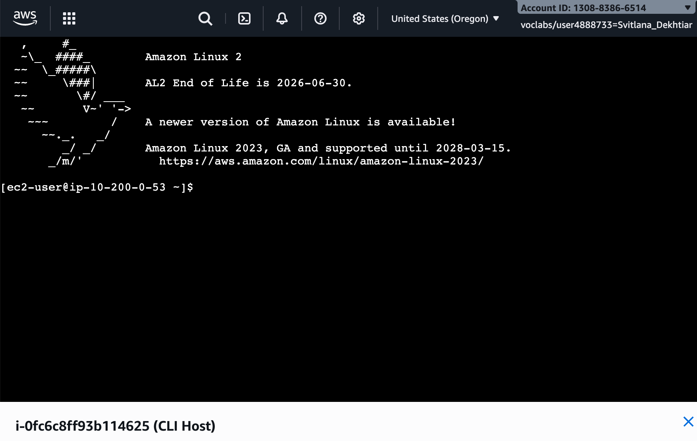
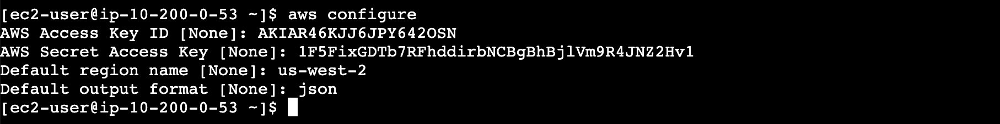
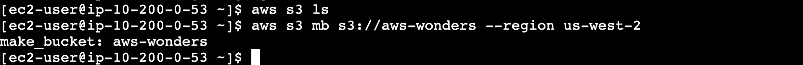
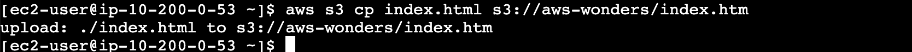
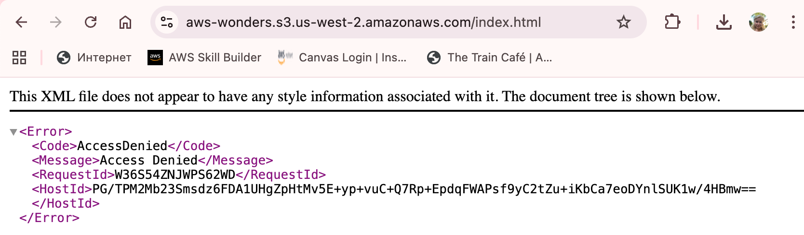
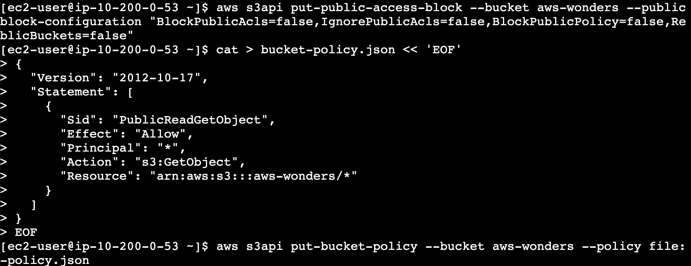
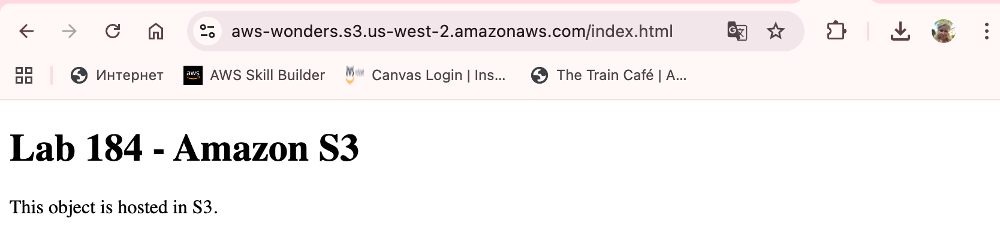
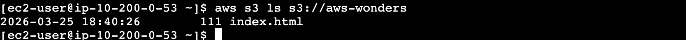

# Lab 184 — Amazon S3 Challenge Lab

## About This Lab

This lab covers Amazon Simple Storage Service (S3), AWS's object storage service. S3 is one of the most widely used services in the AWS ecosystem — it stores everything from static website files to application backups to data pipeline outputs. Understanding how S3 works is foundational to almost any role that touches cloud infrastructure.

The lab focuses on three core capabilities: creating a storage bucket, uploading files into it, and controlling who can access those files. That last part is where most people run into trouble when they're starting out. S3 buckets are completely private by default, and AWS has added multiple layers of access controls over the years — Block Public Access settings, bucket policies, and ACLs — which interact in ways that aren't always obvious. Getting something publicly accessible requires understanding all of them.

I also used the AWS Command Line Interface (AWS CLI) throughout this lab instead of clicking through the console for everything. The CLI is how you interact with AWS in real-world environments: in scripts, automation pipelines, and CI/CD workflows. Being comfortable with it matters more than knowing where to click in the console.

The services used were Amazon S3 and Amazon EC2 (a pre-provisioned Linux instance called CLI Host, used as the terminal environment).

## What I Did

The environment gave me a pre-provisioned EC2 instance called CLI Host, which I connected to via EC2 Instance Connect in the browser — no SSH key setup required. From there I configured the AWS CLI with temporary credentials from the lab panel, then worked entirely from the command line to create a bucket, upload a file, troubleshoot access issues, and finally make the object publicly reachable via a URL.

---

## Task 1: Connecting to the CLI Host Instance

I opened the EC2 console, selected the CLI Host instance, and connected using the EC2 Instance Connect tab. This opens a browser-based terminal session — no local SSH client or key pair needed.



---

## Task 2: Configuring the AWS CLI

I retrieved my temporary credentials from the lab Details panel (AccessKey, SecretKey, and the CLI Host PublicIP), then ran:

```bash
aws configure
```

I entered the access key, secret key, set the region to `us-west-2`, and the output format to `json`.



---

## Task 3: Finishing the Challenge

### Task 3.1 — Create an S3 Bucket

```bash
aws s3 mb s3://aws-wonders --region us-west-2
```

Output:
```
make_bucket: aws-wonders
```



### Task 3.2 — Upload an Object into the Bucket

I created a simple HTML file and uploaded it:

```bash
cat > index.html << 'EOF'
<!DOCTYPE html>
<html>
<body>
<h1>Lab 184 - Amazon S3</h1>
<p>This object is hosted in S3.</p>
</body>
</html>
EOF

aws s3 cp index.html s3://aws-wonders/index.html
```

Output:
```
upload: ./index.html to s3://aws-wonders/index.html
```



### Task 3.3 — Attempt to Access the Object (Expected Failure)

I opened the object URL in a browser:

```
https://aws-wonders.s3.us-west-2.amazonaws.com/index.html
```

The browser returned an `AccessDenied` XML error — expected, because S3 buckets are private by default.



### Task 3.4 — Make the Object Publicly Accessible

Getting S3 objects public requires two steps. First I disabled Block Public Access on the bucket:

```bash
aws s3api put-public-access-block \
  --bucket aws-wonders \
  --public-access-block-configuration "BlockPublicAcls=false,IgnorePublicAcls=false,BlockPublicPolicy=false,RestrictPublicBuckets=false"
```

Then I created a bucket policy and applied it:

```bash
cat > bucket-policy.json << 'EOF'
{
  "Version": "2012-10-17",
  "Statement": [
    {
      "Sid": "PublicReadGetObject",
      "Effect": "Allow",
      "Principal": "*",
      "Action": "s3:GetObject",
      "Resource": "arn:aws:s3:::aws-wonders/*"
    }
  ]
}
EOF

aws s3api put-bucket-policy --bucket aws-wonders --policy file://bucket-policy.json
```

Both commands produce no output on success.



### Task 3.5 — Access the Object via Web Browser

After applying the policy, I reloaded the URL:

```
https://aws-wonders.s3.us-west-2.amazonaws.com/index.html
```

The HTML page rendered correctly in the browser.



### Task 3.6 — List S3 Bucket Contents Using the AWS CLI

```bash
aws s3 ls s3://aws-wonders
aws s3 ls s3://aws-wonders --recursive --human-readable
```

Output:
```
2026-03-25 18:40:26    111 index.html
```



---

## Challenges I Had

The first issue was accidentally uploading the file as `index.htm` instead of `index.html` — a typo in the CLI command. The file landed in the bucket with the wrong name, so the URL did not resolve correctly. I deleted the wrong object with `aws s3 rm s3://aws-wonders/index.htm` and re-uploaded with the correct filename.

The second issue was with the bucket policy JSON. When I first tried to apply it, the AWS CLI returned a malformed JSON error. The quotes had been converted to curly (typographic) quotes from a formatted source. I rewrote the file using the heredoc directly in the terminal, typing the quotes manually, and it applied cleanly.

The third thing that caught me was the ordering of the public access steps. Applying the bucket policy before disabling Block Public Access produced an error saying the bucket's BPA settings were blocking the policy. The two steps have to happen in order: disable BPA first, then attach the policy.

---

## What I Learned

**S3 Block Public Access is a bucket-level override.** Even if a bucket policy grants public access, Block Public Access settings can silently prevent the policy from working. AWS added BPA as a safeguard after high-profile data leaks, and it defaults to on for all new buckets. You have to explicitly turn it off before a public bucket policy will have any effect.

**Bucket policies use the ARN wildcard to cover all objects.** The `Resource` field in a bucket policy that ends in `/*` applies to every object in the bucket, not the bucket itself. The bucket ARN without the wildcard controls bucket-level operations like listing; the `/*` version controls object-level operations like `GetObject`. Mixing them up is a common mistake.

**AWS CLI `put-*` commands produce no output on success.** This is consistent AWS CLI behaviour — if there is no error, there is no output. It looks like nothing happened, but the operation succeeded. The way to verify is to run a corresponding `get-*` or `describe-*` command afterward.

**S3 bucket names are globally unique across all AWS accounts.** Unlike most AWS resources which are scoped to a region or account, S3 bucket names exist in a global namespace. Two different AWS accounts cannot have a bucket with the same name, and names cannot be reused immediately after deletion.

**The heredoc syntax with a quoted delimiter prevents variable expansion.** Using `<< 'EOF'` rather than `<< EOF` tells the shell not to expand `$` variables or backticks inside the block — essential when writing JSON or scripts that contain special characters.

---

## Resource Names Reference

| Resource | Name / Value |
|---|---|
| S3 Bucket | aws-wonders |
| AWS Region | us-west-2 |
| Uploaded Object | index.html |
| EC2 Instance | CLI Host (i-0fc6c8ff93b114625) |
| Object URL | https://aws-wonders.s3.us-west-2.amazonaws.com/index.html |

---

## Commands Reference

All commands used in this lab are collected in [`commands.sh`](commands.sh).
